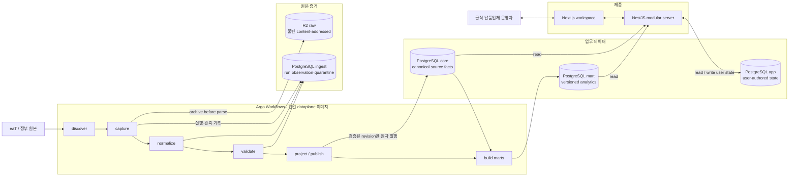
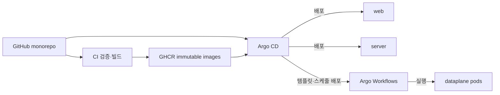

# eatbid 목표 아키텍처

> **정언명령:** 원본 증거는 보존하고, 정체성은 코드와 내부 ID로 표현하며, 해석은 버전과
> 근거를 남기고, 파생 데이터는 언제든 다시 만들 수 있게 하라.

이 문서는 모든 Claude/Codex/사람 세션이 처음 여는 아키텍처 진입점이다. eatbid는
**정부 원본에 기반한 입찰 분석 엔진과, 그 분석을 공고 발견·다사업자 투찰 준비·결과 복기에
연결하는 급식 입찰 운영 워크스페이스**다. 분석이 제품의 두뇌이고 워크스페이스가 이를
실제 업무 흐름으로 만든다.

## 한눈에 보는 결정

| 관심사 | 확정 방향 |
|---|---|
| 저장소 | `eat-bid-service` 단일 모노레포. Python 데이터플레인은 `apps/dataplane`으로 흡수 |
| 업무 중심 단위 | `Workspace × legal SupplierParty × AuctionAttempt` |
| 원본 증거 | R2 content-addressed 불변 객체 |
| canonical 사실 | PostgreSQL `core` |
| 사용자 상태 | PostgreSQL `app` |
| 분석 | PostgreSQL `mart`, 버전이 있는 재생성 가능 파생물 |
| 외부 식별자 | `(source_system, code_scheme, code)`; 내부 관계는 bigint ID |
| 값·계약 | Temporal/exact 의미 타입, Zod portable contract hub, generated Pydantic bridge |
| API | NestJS 모듈러 모놀리스, framework-neutral operation에서 path/OpenAPI 파생 |
| Web | Next.js 모듈러 애플리케이션, browser-safe contract subpath, resource API/Query Options |
| 수집 실행 | 단일 dataplane 이미지 + Argo Workflows |
| 배포 | GitOps + Argo CD, 이미지 digest/Git SHA 고정 |
| DDL | Drizzle schema → 커밋된 SQL migration |
| secret/config | secret 값은 Infisical, 비밀이 아닌 topology는 Git 환경 manifest |
| 명시적 비목표 | 추천 투찰가, 예정가 예측, 자동 NeaT 투찰, 조기 마이크로서비스화 |

## 목표 시스템 지도

## 공급망과 실행 책임

같은 사실을 두 저장소에서 각각 권위 있게 유지하지 않는다. raw는 “소스가 무엇을 보냈는가”,
`core`는 “그 관측을 현재 어떤 규칙으로 해석했는가”, `app`은 “사용자가 무엇을 기록했는가”에
각각 답한다. `mart`는 그 셋을 대신하지 않는다.

## 계약 권위와 강제 경로

`packages/domain`은 의미와 불변식, `packages/contracts`는 canonical/public Zod wire,
`packages/db`는 Drizzle DDL, reviewed source parser/fingerprint와 known-column Pydantic은 eaT 원본 shape의 권위다. normalized Pydantic만
versioned JSON Schema에서 생성한다. application `AuctionRecord`는 DB row와 public JSON 사이의 내부
port이고, 공개 응답은 Zod에서 추론한 `AuctionV1Response`다. Argo Workflows의 dataplane은 generated
ingestion contract를 검증한 뒤 product server HTTP를 거치지 않고 제한된 DB role로 PostgreSQL에
직접 발행한다.

정적 topology/semantic gate와 양 언어 생성 drift는 `pnpm architecture:check`가 한 번에 검증한다.
개별 생성물은 `pnpm contracts:check`, `pnpm contracts:python:check`로 check mode에서 확인한다.
Hosted Ubuntu publication CI와 hosted Windows portability CI는 모두 frozen install 뒤 이 gate를 실행하고,
CRLF/LF 차이는 논리 drift에서 정규화하며 추적 artifact를 다시 쓰지 않는다.
public HTTP method/version/path/schema는 operation registry가 한 번 소유하고 Nest adapter, OpenAPI와 Web
request builder가 파생한다. Web은 browser-safe resource subpath만 import한다. Web contract 전환은 ADR
0023에 따라 canonical vertical slice 단위로 진행한다. 이름 lookup 기반 좌표
backfill은 여전히 이 foundation의 비목표이며 CRS/provenance가 있는 별도 Argo enrichment 계획 뒤에만
진행한다.

## 문서 지도

- [전체 지식 지도와 문서 권위](docs/README.md)
- [제품 방향과 outcome-gated 로드맵](docs/product/roadmap.md)
- [AI-driven 문서·기능 실행 workflow](docs/governance/ai-driven-documentation.md)
- [아키텍처 문서 운영 규칙](docs/architecture/README.md)
- [제품 범위와 품질 속성](docs/architecture/product-and-quality.md)
- [도메인·데이터·코드 체계](docs/architecture/domain-and-data.md)
- [시간·정량 값·Zod 계약](docs/architecture/time-and-value-contracts.md)
- [Frontend application foundation](docs/architecture/frontend-application-foundation.md)
- [C4 모델](docs/architecture/c4.md)
- [런타임·Argo·배포·운영](docs/architecture/runtime-and-deployment.md)
- [arc42 전체 서술](docs/architecture/arc42.md)
- [레거시 폐기와 전환 경계](docs/architecture/legacy-disposition.md)
- [용어집](docs/architecture/glossary.md)
- [스택 거버넌스 감사](docs/architecture/stack/README.md)
- [Architecture Decision Records](docs/adr/README.md)
- [승인된 그린필드 설계 스펙](docs/superpowers/specs/2026-08-29-eatbid-greenfield-architecture-design.md)
- [전체 기반 통합 실행 설계](docs/superpowers/specs/2026-08-31-eatbid-foundation-integration-design.md)
- [1단계 data-foundation 구현 계획](docs/superpowers/plans/2026-08-29-eatbid-data-foundation.md)

## 상태

이 문서 집합은 **목표 상태(Target Architecture)**다. 현재 코드·DB·Kubernetes 리소스와
다른 부분은 구현 누락이지 문서의 오류가 아니다. 단, 새로운 사실이나 제약이 드러나면 코드에
맞춰 문서를 조용히 바꾸지 말고 ADR로 결정을 갱신한다.
