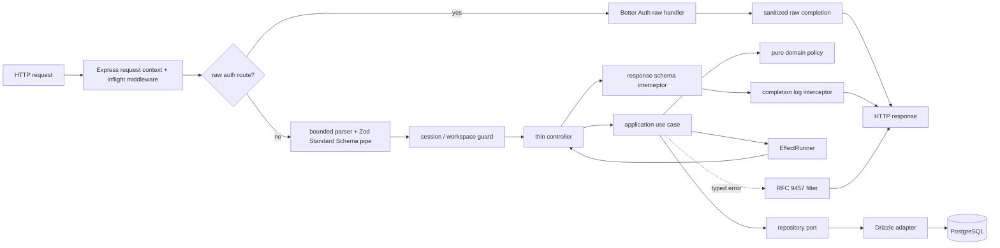

# Backend application foundation

이 문서는 `apps/server`를 입찰분석 제품의 신뢰 가능한 application boundary로 다시 세우는 목표
구조다. 현재 server는 조사 자료일 뿐 보존해야 할 설계가 아니다. 지배 결정은
[ADR 0016](../adr/0016-nest-effect-application-boundary.md)과
[ADR 0017](../adr/0017-greenfield-server-composition-reset.md),
[ADR 0018](../adr/0018-application-identity-and-id-wire-format.md),
[ADR 0019](../adr/0019-nest12-runtime-without-cli.md)이다.

## 1. 목표와 비목표

서버의 목표는 canonical `core`/`mart`를 안전하게 읽고 `app` command를 수행하며, 사용자에게
근거와 권한이 명확한 versioned HTTP contract를 제공하는 것이다. 데이터 수집·정규화·발행은
dataplane/Argo의 책임이고, 서버가 crawler나 별도 scheduler를 품지 않는다.

foundation에서 하지 않는 것:

- 마이크로서비스, Kafka, GraphQL, generic event bus
- 모든 command/query를 위한 형식적 CQRS class
- DB row를 그대로 반환하는 CRUD generator
- 근거 없이 Redis, Elasticsearch, PostGIS, OpenTelemetry collector를 추가
- legacy endpoint를 새 이름으로 일괄 복사

### 1.1 2026-08-30 dependency research snapshot

아래 버전은 설계 시점의 registry/official documentation 조사 결과다. 실제 권위는 구현 commit의 exact
`package.json`과 frozen lockfile이며, 범위 지정자는 사용하지 않는다.

| Package | 조사 버전 | 결정 |
|---|---:|---|
| `@nestjs/common`, `core`, `platform-express`, `testing` | 12.0.1 | 같은 patch lane으로 채택 후보 |
| `@nestjs/config` | 12.0.0 | Standard Schema 기반 fail-fast config 후보 |
| `@nestjs/cli`, `@nestjs/schematics` | 12.0.0 | schematics가 TypeScript `>=6`을 요구하므로 보류; ADR 0019의 `tsc` build 사용 |
| `@nestjs/swagger` | 12.0.1 | Standard Schema/OpenAPI artifact에 채택 후보 |
| `effect` | 4.0.0-rc.112 | exact pin compatibility candidate; stable tag 3.22.1은 Drizzle v1 optional Effect peer와 맞지 않음 |
| `zod`, `zod-openapi` | 4.5.2, 6.0.1 | bounded contract와 Nest 공식 converter 경로의 후보 |
| `helmet`, `supertest` | 8.3.0, 7.2.2 | security middleware와 HTTP e2e 후보 |
| `concurrently` | 10.0.5 | Nest CLI 없는 `tsc --watch` + compiled Node watch 개발 경로 |
| `@nestjs/terminus` | 11.1.1 | 현재 peer가 Nest 10/11뿐이므로 보류; 작은 명시적 health module 사용 |
| `@nestjs/throttler` | 6.5.0 | 현재 peer가 Nest 11까지이므로 override 설치 금지 |
| `nestjs-pino` | 4.6.1 | 현재 peer가 Nest 11까지; Nest 12 built-in JSON logger 사용 |
| `@thallesp/nestjs-better-auth` | 2.7.0 | 현재 peer가 Nest 11만 허용; 자체 raw transport module 사용 |

런타임은 Node `24.20.0` LTS patch를 repository/CI/container에 동일하게 고정한다. TypeScript는 이
foundation에서 `5.9.3`에 고정하고, registry 최신 major인 TypeScript 7은 module resolution·decorator·
Nest toolchain을 함께 검증하는 별도 compiler migration으로 보류한다. Nest 12 core가 ESM-only여도
Node 24의 `require(esm)` 경로를 compiled bootstrap으로 검증하므로 application 전체의 ESM 전환을 이
변경에 묶지 않는다. `apps/server/.npmrc`와 CI의 filtered server dependency-closure install은 strict peer
dependency 검사를 사용하며 CLI/schematics peer warning을 override하지 않는다. root strict install은 기존
frontend의 React 19/`kbar`→`react-virtual` peer 불일치 때문에 Task 17 전까지 합격으로 표현하지 않는다.
대신 normal frozen root install과 전체 test/build를 유지한다. 개발 실행은 선행 `tsc` build 뒤 `tsc --watch`와
`node --watch dist/main.js`를 함께 실행해 CLI 없이도 재컴파일/재시작이 가능해야 한다.

Nest 12 migration guide, Standard Schema/OpenAPI, logging과 request lifecycle의 근거는
[공식 migration guide](https://docs.nestjs.com/migration-guide),
[OpenAPI 문서](https://docs.nestjs.com/openapi/introduction),
[logger 문서](https://docs.nestjs.com/techniques/logger),
[request lifecycle 문서](https://docs.nestjs.com/faq/request-lifecycle)를 따른다.

## 2. 현재 구조에서 제거할 위험

2026-08-30 기준 `apps/server/src/app.module.ts`는 1,046줄이며 controller 13개, 직접 DB operation
61개, process-local `Map` 10개를 한 파일에 둔다. 오류를 HTTP 상태 대신 `{ ok: false }` body로
200 반환하는 경로, `any`, 문자열 split 기반 관계, unrestricted CORS, 개발용 secret/DB URL fallback,
module-import 시점 singleton DB/Auth도 존재한다.

이 상태에서 decorator와 toolkit만 추가하는 것은 개선이 아니다. 첫 server foundation task는 새
구조의 vertical slice와 architecture test를 만든다. 현재 worktree는 그린필드 전환이 가능하므로
legacy handler를 새 composition root에 싣지 않는다. 기존 route는 기계 판독 가능한 inventory와 Git
이력으로만 보존하고, 실행 중인 사용자 로컬 서비스는 변경하지 않는다.

## 3. 목표 디렉터리

빈 계층을 미리 대량 생성하지 않는다. 첫 use case가 필요한 파일부터 아래 규칙으로 만든다.

```text
apps/server/src/
├─ main.ts
├─ app.module.ts
├─ bootstrap/
│  ├─ create-app.ts
│  └─ openapi.ts
├─ platform/
│  ├─ config/
│  ├─ database/
│  ├─ effect/
│  ├─ health/
│  ├─ http/
│  ├─ identity/
│  ├─ logging/
│  ├─ request-context/
│  └─ shutdown/
├─ modules/
│  ├─ procurement/
│  ├─ identity/         # internal principal and provider-subject mapping
│  ├─ institutions/     # Organization aggregate; school is only an organization type
│  ├─ suppliers/
│  ├─ eligibility/
│  ├─ workspace/
│  ├─ intelligence/
│  ├─ operations/
└─ testing/

packages/contracts/src/<bounded-context>/
packages/db/src/schema/{ingest,core,app,mart}/
```

각 feature는 실제 복잡도에 따라 다음 일부 또는 전부를 가진다.

```text
<feature>/
├─ presentation/http/    # controller, route schema mapping
├─ application/          # use case, port, application error
├─ domain/               # entity/value/policy; framework-free
└─ infrastructure/drizzle/ # repository implementation
```

## 4. 한 요청의 책임 흐름



Nest request lifecycle의 실행 순서를 이용하되 각 extension point를 업무 로직의 은신처로 쓰지 않는다.

| 경계 | 해야 하는 일 | 하면 안 되는 일 |
|---|---|---|
| Middleware | request ID 수신/생성, ALS context 초기화, 모든 transport의 inflight lease | DB query, session authorization |
| Pipe | route 입력 검증·coercion | tenant 조회, 업무 규칙 |
| Guard | 인증, workspace membership, permission | 응답 변환, command 실행 |
| Controller | transport mapping, use case 한 번 호출 | Drizzle, cache, env, transaction |
| Use case | orchestration, policy, UoW, typed expected failure | HTTP status/decorator |
| Interceptor | timing, 완료 로그, response serialization | authentication, 핵심 업무 분기 |
| Filter | error taxonomy → Problem Details | 오류를 성공 body로 숨김 |
| Repository | 목적별 query/command와 DB error translation | HTTP DTO 반환, 다른 module table 임의 수정 |

## 5. Effect 사용 계약

Effect는 “모든 코드를 functional style로 바꾸기”가 아니다. 다음 문제에서만 우선 사용한다.

- 예상 가능한 application failure를 typed error channel로 표현
- idempotent 외부 호출의 제한된 retry/backoff
- timeout, cancellation, bounded concurrency
- 여러 실패 결과를 구분해 Problem Details와 운영 로그로 매핑

```ts
type FindAuction = (
  input: FindAuctionInput,
) => Effect.Effect<AuctionView, AuctionNotFound | RepositoryUnavailable, never>;
```

use case의 환경 type은 controller에 도달할 때 `never`여야 한다. 요청마다 runtime/layer를 만들지 않고,
한 singleton runner가 실행과 defect logging을 책임진다. `catchAll`로 모든 defect를 domain error로
위장하거나 모든 DB 오류를 retry하지 않는다. retry는 typed transient error + idempotent operation +
명시적 max attempts/deadline을 모두 만족할 때만 허용한다.

## 6. Database와 transaction

- `DatabaseModule`이 config를 받아 client를 만들고 shutdown에서 닫는다.
- server DB role은 `core`/`mart` read, `app`의 module-owned table write만 가진다.
- bootstrap owner, migrator, API, dormant dataplane은 서로 다른 Kubernetes Secret/DB credential을 사용한다.
  API process는 owner/migrator/dataplane credential을 받지 않는다.
- migration은 server 시작 시 실행하지 않는다. PreSync migration image가 수행하며 server readiness는
  기대 migration version을 확인한다.
- `UnitOfWork`는 callback 안에서 같은 transaction handle을 사용하는 명시적 port다.
- repository 결과는 domain/application 값으로 mapping한다. `InferSelectModel`은 infrastructure 밖으로
  나오지 않는다.
- optimistic concurrency나 idempotency가 필요한 command는 DB constraint/version column을 근거로
  삼는다. process-local `Map`은 정합성이나 rate limit의 권위가 아니다.

`DatabaseModule`은 postgres-js client와 Drizzle instance의 생성/종료를 소유하되 DI 밖으로 query builder를
export하지 않는다. 현재 공개 provider는 database readiness, explicit UnitOfWork, procurement
`AuctionReader`처럼 목적이 정해진 port뿐이다. readiness는 exact committed journal row와 API role의
필수/금지 권한을 read-only query 하나로 확인한다. server startup은 migration, role 생성, grant, seed를
수행하지 않는다. 검사는 database `CONNECT`만 허용하고 `CREATE`/`TEMP`를 금지하며, 여섯 schema의
`CREATE`, protected/application/migration object ownership, `TRUNCATE`/`REFERENCES`/`TRIGGER`, 모든
sequence ACL, role flag와 direct/transitive `SET ROLE` 경로를 fail-closed로 거부한다. PostgreSQL의
기본 `PUBLIC TEMPORARY` grant도 provisioning에서 명시적으로 revoke해야 한다.

운영 credential은 `eatbid-postgres-bootstrap`, `eatbid-database-migrator`,
`eatbid-database-api`, dormant `eatbid-database-dataplane`으로 분리한다. API credential은 DB/schema owner가
아니며 `core`/`mart` SELECT와 module-owned `app` DML만 허용한다. disposable integration setup의 admin만
테스트 role/grant를 만들고, 같은 테스트에서 DDL/core·mart write/ingest/role change/migration journal write
공격이 거부되는지 검증한다. `app` PK는 PostgreSQL 16 `GENERATED ALWAYS AS IDENTITY`라 default insert에
sequence grant가 필요하지 않으므로 API role은 sequence `USAGE`/`SELECT`/`UPDATE`를 하나도 받지 않는다.

## 7. HTTP와 OpenAPI

- canonical resource URL은 문자열 이름이 아니라 bigint stable ID를 사용한다. JSON/path에서는
  `^[1-9][0-9]*$` decimal string으로 무손실 인코딩하고 presentation boundary에서 bigint로 변환한다.
  값은 PostgreSQL signed bigint 최대값 `9223372036854775807` 이하이고, `Number`를 거치지 않으며
  `MAX_SAFE_INTEGER` 초과 ID도 동일하게 왕복해야 한다.
- `/api/v1`은 새 계약, `/api/auth/*`와 `/health/*`는 version-neutral이다.
- request와 response를 각각 Zod schema로 검증한다. output schema는 secret/internal column을 제거하는
  security boundary다.
- 모든 supported route에 stable `operationId`, 성공 response, RFC 9457 error response가 있다.
- CI는 동일 source에서 `openapi.json`을 재생성해 diff가 없음을 확인하고, artifact가 모든 route와
  operation ID를 유일하게 포함하는지 검사한다.
- 개발 Swagger UI는 명시적 config에서만 연다. production raw JSON/UI는 기본 off다.

Nest 12 native Standard Schema 경로는 현재 공식 Zod converter의 OpenAPI 3.0 출력을 따른다.
OpenAPI 3.1로 올릴 때는 nullable/union/JSON Schema dialect와 client generator conformance test가
먼저 통과해야 한다.

## 8. Authentication과 authorization

- Better Auth의 raw handler는 body parser보다 먼저 `/api/auth/*`에 연결해 원본 request semantics를
  보존한다. 공유 Express request-context/inflight middleware는 raw handler보다 먼저 실행되고, bounded
  body parser와 Nest route는 raw handler 뒤에 실행된다. JSON body를 다시 만들어 Fetch `Request`로 흉내
  내지 않는다.
- `better-auth`와 `auth` CLI를 같은 exact version으로 고정하고, CLI가 생성한 Drizzle schema와 committed
  modular auth schema를 table/column/index/relation 수준에서 비교한다. CLI가 migration을 적용하지 않는다.
- provider subject는 `IdentitySubject`에서 내부 bigint `Principal`로 해소한 뒤에만 workspace query에 쓴다.
  검증된 session의 subject가 처음 등장하면 application-owned transaction이 principal+mapping을 원자적으로
  만들고 unique conflict에서 같은 mapping을 다시 읽는다. email/이름 일치로 principal을 합치지 않는다.
- authentication 실패와 provider 장애를 모두 guest로 삼키지 않는다. optional-auth route만 guest를
  허용하고, dependency failure는 503 계열 typed problem이다.
- `@Public`, `@OptionalAuth`, permission metadata와 global session guard를 사용한다.
- workspace/supplier 소유권은 application policy와 DB query constraint로 함께 강제한다.
- `trustedOrigins`, secure cookie, CSRF/origin validation을 production config에서 검증한다.
- foundation의 실제 client-facing auth endpoint는 Better Auth의 database-backed rate limiter와 generated
  rate-limit table을 사용한다. 두 application instance가 같은 PostgreSQL counter를 소비하는 e2e로 429와
  retry header를 검증한다. 이후 share/public expensive endpoint는 배포 토폴로지와 저장소가 정해진
  adapter/ingress 정책을 추가한다. 현재 Nest 12 peer가 없는 `@nestjs/throttler`를 override 설치하거나
  process-local memory를 multi-replica 권위로 표현하지 않는다.

## 9. Error contract

canonical `/api/v1` 실패를 RFC 9457 Problem Details로 통일한다. body/cookie/header semantics를 보존해야
하는 `/api/auth/*` raw provider transport는 Better Auth error contract를 그대로 사용하며 canonical OpenAPI
artifact에 포함하지 않는다.

```json
{
  "type": "https://eatbid.dev/problems/auction-not-found",
  "title": "Auction not found",
  "status": 404,
  "code": "AUCTION_NOT_FOUND",
  "requestId": "01..."
}
```

- `code`는 클라이언트가 분기하는 안정된 machine code다.
- validation 400, unauthenticated 401, forbidden 403, missing 404, conflict 409, rate limit 429,
  transient dependency 503을 구분한다.
- internal exception name, SQL, stack, Effect cause, credential은 response에 넣지 않는다.
- unexpected defect는 500 problem으로 줄이고 full cause는 redacted server log에서 request ID로 찾는다.

## 10. Logging과 request context

Nest 12 built-in JSON logger를 baseline으로 사용한다. Nest 12 peer range가 확인되지 않은 logger wrapper를
기초 dependency로 넣지 않는다. AsyncLocalStorage에는 request ID, trace parent, authenticated principal의
비민감 reference만 둔다. service locator나 hidden transaction context로 쓰지 않는다.

요청 완료 로그의 최소 필드는 timestamp, level, service, Git SHA, request ID, method, route template,
status, duration_ms, error code다. raw URL/query/body, Authorization, Cookie, share token, email,
사업자등록번호는 기본 수집하지 않는다. redaction test가 이 금지 목록을 fixture로 검증한다.
Nest completion interceptor는 Nest-managed route만 담당한다. `/api/auth/*`는 동일 ALS request ID와
inflight lease를 사용하는 전용 raw completion adapter가 route를 `/api/auth/*`로 고정해 정확히 한 번
기록한다. 이 adapter는 provider의 status/header/body를 변형하지 않는다.

## 11. Bootstrap, health, shutdown

bootstrap 순서는 config validation → logger → Express request-context/inflight middleware → security
middleware/raw auth transport → bounded body parser → Nest global boundary → OpenAPI(dev only) → listen이다.
production config validation 실패는 process start 실패다.

- `GET /health/live`: event loop/process가 응답할 수 있는지만 확인
- `GET /health/ready`: DB 연결과 exact expected migration version 확인
- termination: readiness false → listener가 신규 연결 수락 중단 → bounded inflight drain → Nest resource
  shutdown → DB close. Nest route와 raw auth route 모두 같은 inflight tracker에 등록한다. grace deadline을
  넘은 요청은 기록하고 강제 종료한다.

현재 `@nestjs/terminus`의 peer range는 Nest 12를 포함하지 않으므로 override 설치하지 않고 이 두
indicator를 작은 명시적 health module로 구현한다. readiness에 eaT, R2, Argo, mart freshness를 넣지
않는다. 이들은 `/operations`와 metric에서 degraded 상태로 관측한다.

## 12. Verification gates

server foundation은 다음 증거 없이는 완료가 아니다.

- Nest 12 runtime, TypeScript 5.9.3과 exact Node 24.20.0의 frozen install/`tsc` build
- exact Node 24.20.0 container에서 compiled CommonJS bootstrap/close와 runtime version assertion
- environment schema의 missing/malformed/production-fallback rejection tests
- resolved import graph architecture rule: controller→Drizzle/DB schema, domain→Nest/Effect/Drizzle/Zod/HTTP,
  application→infrastructure/presentation, cross-module internal import, direct Effect runner call, cycle 0건
- Standard Schema request/response test와 deterministic OpenAPI artifact test
- 400/401/403/404/409/429/503/500 Problem Details mapping tests
- Nest/raw-auth correlation propagation, exactly-once completion, shared shutdown drain과 sensitive-field
  redaction tests
- pinned Better Auth CLI schema conformance, raw transport, trusted origin, optional/required session과
  PostgreSQL-backed multi-instance rate-limit tests
- Testcontainers PostgreSQL repository/UoW rollback/idempotency tests
- API role의 `core`/`mart` read + `app` write 최소권한 공격 테스트
- bootstrap/migrator/API/dataplane Secret 분리와 rendered-manifest consumer test
- liveness/readiness/migration mismatch와 bounded inflight graceful shutdown tests
- `@nestjs/testing` + Supertest canonical vertical slice e2e
- legacy route와 canonical route 사이 dual-write 없음

기존 Bun test runner는 유지할 수 있다. Nest가 관례적으로 Jest를 생성한다는 이유만으로 두 번째 TS
test runner를 추가하지 않는다. Oxlint/dependency-cruiser는 각각 server lint와 architecture rule의
후보다. 사용하지 않는 코드 탐지 도구는 frontend/code-smell 감사와 함께 실제 noise 수준을 본 뒤 고른다.

## 13. 단계적 전환

1. exact Node/Nest runtime/TypeScript/Effect compatibility spike와 clean composition root
2. request context, Problem Details, health/shutdown, OpenAPI artifact
3. DatabaseModule, repository/UoW와 한 read-only canonical vertical slice
4. raw Better Auth transport와 global authorization policy
5. route inventory와 canonical contract를 Task 17의 사용자 공동 frontend 기획 입력으로 제공
6. 승인된 frontend cutover에서 필요한 bounded use case만 새 module로 구현

각 단계는 새 구조로 한 기능을 끝까지 통과시킨 뒤 확장한다. 1,046줄 파일을 여러 파일로 기계적으로
나누는 것만으로 완료 처리하지 않는다.
