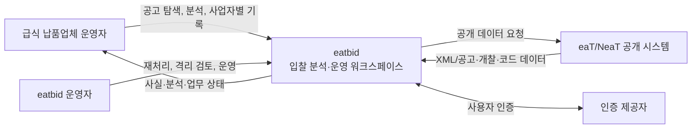
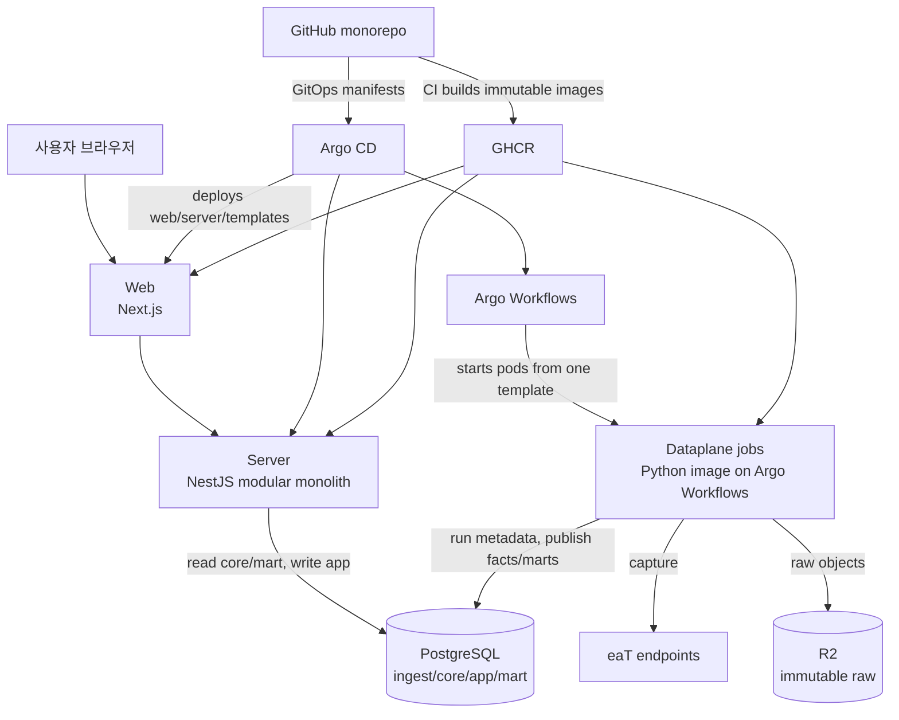
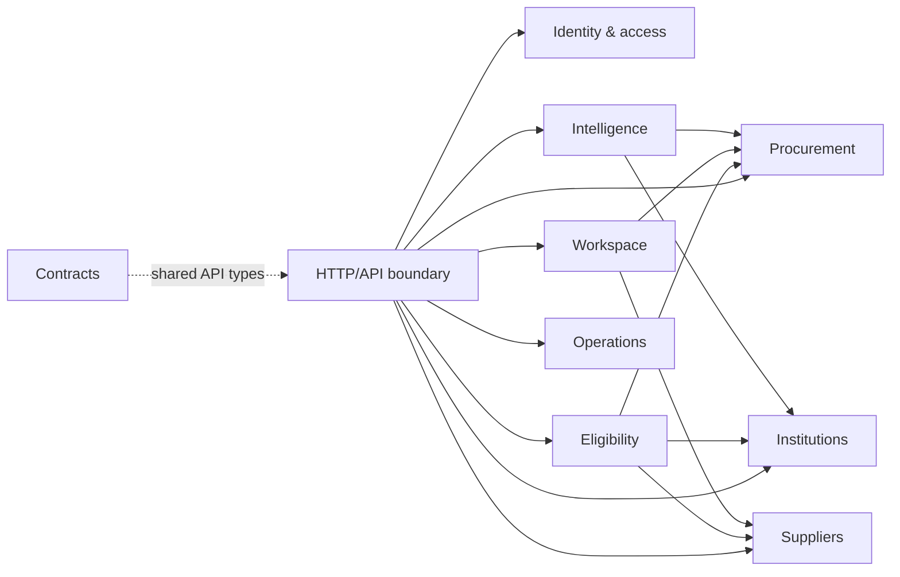
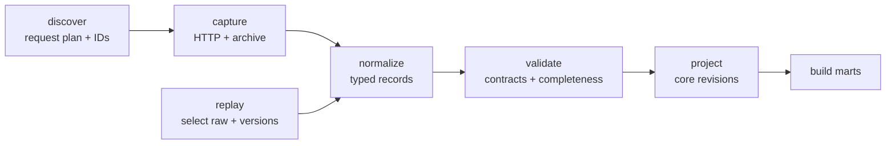
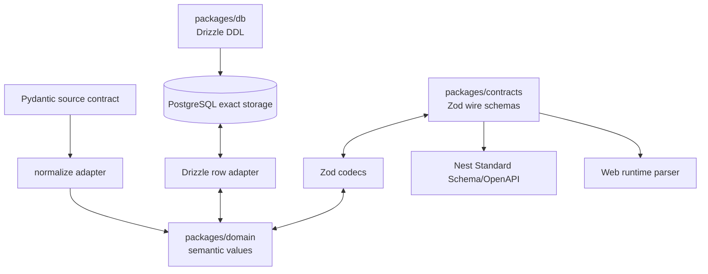

# C4 모델

이 문서는 목표 아키텍처의 경계를 C4의 Context, Container, Component, Deployment 관점으로
기록한다. 실제 배치 흐름은 [runtime-and-deployment.md](runtime-and-deployment.md)를 따른다.

## Level 1 — System Context

시스템 경계 밖의 NeaT 투찰 화면에서 사용자가 직접 제출한다. eatbid는 투찰 자동화 시스템이
아니며 사용자 자격을 정부를 대신해 확정하지 않는다.

## Level 2 — Containers

| 컨테이너 | 책임 | 쓰기 권한 |
|---|---|---|
| Web | 화면 구성, 사용자 상호작용, API 소비 | DB 직접 접근 없음 |
| Server | 인증/권한, 업무 규칙, query facade, app command | `app`; `core`/`mart` read-only |
| Dataplane | discover/capture/normalize/validate/project/replay | R2 raw, `ingest`, 제한된 `core`/`mart` |
| PostgreSQL | canonical facts, user state, derived analytics | 역할별 분리 |
| R2 | source response evidence와 backup/export | append-only service credential |
| Argo Workflows | 데이터 작업 DAG, 재시도, 동시성, 이력 | Kubernetes workflow resources |
| Argo CD | 선언된 배포 상태 동기화 | 앱 데이터 작업 실행 안 함 |

## Level 3 — Server components

- **Procurement:** AuctionAttempt/revision/relation/submission/award 읽기 모델
- **Institutions:** Organization, 외부 식별자, 코드/지역 관계
- **Suppliers:** legal SupplierParty와 source account
- **Eligibility:** 확인 가능한 조건의 tri-state 평가와 근거
- **Workspace:** 사업자별 BidWorkItem, 사용자 기록/확인/복기
- **Intelligence:** 버전된 mart query와 근거 설명
- **Contracts:** DB와 독립적인 HTTP/event DTO
- **Operations:** ingestion freshness, quarantine, mart build 상태의 운영용 read surface

모듈은 한 프로세스 안에서 명시적 application interface로 협력한다. 다른 모듈 테이블을
임의 SQL로 수정하지 않는다. 독립 배포가 필요한 근거가 생기기 전에는 네트워크 경계를 만들지 않는다.
각 module의 HTTP controller는 application use case만 호출하고, Drizzle adapter는 infrastructure
경계 뒤에 둔다. Nest가 DI/lifecycle을 소유하며 Effect 실행과 HTTP 횡단 관심사의 상세 경계는
[backend-application-foundation.md](backend-application-foundation.md)를 따른다.

## Level 3 — Dataplane components

단일 immutable 이미지가 `eatbid discover|capture|normalize|validate|project|replay` 명령을
제공한다. 단계별 이미지나 임시 파일 계약을 만들지 않고 DB run/observation ID로 연결한다.

## Level 3 — 의미 값과 계약 components

`packages/domain`은 시간·금액·비율·수량·좌표의 framework-free 의미와 불변식을 소유한다.
`packages/contracts`는 JSON으로 직렬화 가능한 Zod wire schema를 소유한다. `packages/db`는 저장
형식과 migration을, Pydantic은 source ingress 형식을 소유한다. 이 네 권위는 서로를 생성하지 않고
adapter와 cross-language fixture로 의미 보존을 검증한다. “하나의 진실 원천”은 모든 것을 한 파일에
모으는 것이 아니라 같은 질문의 소유자를 하나로 유지한다는 뜻이다. 상세 규칙은
[time-and-value-contracts.md](time-and-value-contracts.md)를 따른다.

## Level 4 사용 원칙

클래스 다이어그램을 전역 문서로 고정하지 않는다. 복잡한 aggregate나 알고리즘을 구현할 때만
해당 모듈 문서에서 Level 4를 추가한다. 핵심 불변식은 코드가 아니라
[domain-and-data.md](domain-and-data.md)의 모델과 DB 제약이 기준이다.
