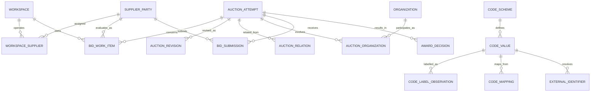

# 도메인·데이터·코드 체계

## 1. 데이터 권위와 스키마 소유권

| 계층 | 저장소 | 권위가 있는 질문 | 변경 방식 |
|---|---|---|---|
| source evidence | R2 `raw/` | 소스가 언제 어떤 바이트를 보냈는가? | append-only, content-addressed |
| ingestion control | PostgreSQL `ingest` | 어떤 실행·관측·격리가 있었는가? | dataplane 기록 |
| canonical facts | PostgreSQL `core` | 원본을 현재 규칙으로 해석한 업무 사실은 무엇인가? | 검증된 projector만 발행 |
| user state | PostgreSQL `app` | 사용자가 무엇을 선택·기록·확인했는가? | API만 쓰기 |
| analytics | PostgreSQL `mart` | 특정 기준시점/버전의 파생 분석은 무엇인가? | projector가 교체 가능하게 생성 |

각 사실의 권위 저장소는 하나다. R2 raw는 canonical 검색 모델이 아니고, `core`는 사용자 메모를
소유하지 않으며, `mart`는 원본 사실을 대신하지 않는다.

권장 DB 역할은 `migrator`, `ingestor`, `projector`, `api`다. API는 `core`/`mart`를 읽고
`app`만 쓴다. ingestor는 `ingest`만, projector는 검증된 `ingest`를 읽어 `core`/`mart`를 쓴다.

## 2. 식별자 원칙

문자열을 모두 제거하는 것이 목표가 아니다. **문자열이 정체성과 관계를 암묵적으로 결정하는
상태를 제거하는 것**이 목표다.

문자열이 남는 곳:

- 정부/외부 코드의 원문 값: 선행 0을 보존하는 `text`
- 이름, 주소, 원본 라벨, 설명, 사용자 메모
- content hash, object key처럼 계약으로 정의된 기술 식별자

문자열을 쓰지 않는 곳:

- 내부 PK/FK와 엔터티 간 조인
- 이름·주소를 합친 복합 키
- URL의 기관/지역/공고 식별자
- 지역·기관·사업자 동등성 비교

외부 경계의 식별자는 다음 3항으로 유일하다.

```text
(source_system, code_scheme, code)
```

예: `('eat', 'eat:organization', '00001234')`. 수신 후 `code_value_id bigint` 또는 해당
도메인 엔터티의 내부 bigint ID로 해소한다. 화면 URL은 `/organizations/4821`,
`/auction-attempts/918244`처럼 내부 ID를 쓴다.

## 3. 핵심 도메인 모델



### 3.1 AuctionAttempt

입찰 업무 사실의 중심이다.

- 내부 PK: `auction_attempt_id bigint`
- 외부 유일성: `(source_system, ELCTRN_BID_ID)`
- 화면용 공고번호 `ELCTRN_BID_NO`는 별도 속성이고 PK가 아니다.
- 변경된 소스 내용은 `AuctionRevision`으로 append-only 기록한다.
- 공고 상태, 공고 변경, 취소, 마감, 금액, 방식의 시간 변화를 보존한다.
- 재입찰/상위 공고 관계는 `AuctionRelation`과 원본 `UP_ELCTRN_BID_ID`로 연결한다.
- 공고번호 접미사나 제목을 파싱해 차수를 만들지 않는다.

### 3.2 Organization

`School`이 아니라 보편 `Organization`을 기준정보로 둔다.

- 기관 유형: 학교, 유치원, 어린이집, 교육청, 공공기관 등
- `OrganizationIdentifier`: eaT `PURR_CD`, 필요한 경우 `PURR_ID`, 향후 NEIS 코드 등
- `AuctionOrganization`: 구매기관, 대표기관, 수요기관, 배송지 등 role을 가진 관계
- 공동구매는 공고 하나에 N개 대상 기관을 연결한다.

기관명·주소는 속성/관측값이다. 이름이 같거나 바뀌어도 기관 정체성이 바뀌지 않는다.

### 3.3 SupplierParty

법적 사업자와 소스 계정을 분리한다.

- `SupplierParty`: 사업자등록번호 등 법적 정체성
- `SourceSupplierAccount`: eaT `SHIPPER_CD` 같은 소스별 참여 계정
- 한 법적 사업자에 여러 소스 계정이 있을 수 있고 그 반대 관계는 명시적으로 검증한다.
- 워크스페이스는 `WorkspaceSupplier`로 자신이 운영하는 법적 사업자를 연결한다.

### 3.4 BidSubmission과 AwardDecision

`won boolean`으로 개찰 사실을 축약하지 않는다.

- `BidSubmission`: 업체, 제출/취소/무효 상태, 제출 시각, 금액, 투찰률, 순위, source status
- `AwardDecision`: 낙찰/유찰/재공고 등 결정, 결정 시각, 선택된 submission/업체, 원본 근거
- withdrawal과 무효는 낙찰 실패와 다른 상태다.
- 동일 공고의 source revision에 따라 결과가 정정될 수 있으므로 관측 이력을 보존한다.

### 3.5 BidWorkItem

사용자 운영 모델의 grain은 다음 unique constraint로 보호한다.

```text
unique(workspace_id, supplier_party_id, auction_attempt_id)
```

`recorded_value`는 사용자가 eatbid에 적어둔 판단이고, 실제 제출은 `BidSubmission`에서만
관측한다. “NeaT 입력 확인” 역시 사용자 확인 이벤트이지 source-observed submission이 아니다.

## 4. 코드 체계

### 4.1 범용 구조

- `CodeScheme`: 소유기관, namespace, 설명, 버전 정책, 유효기간 정책
- `CodeValue`: scheme 내 원본 code, 활성 기간, 내부 ID
- `CodeLabelObservation`: 시점·출처별 라벨. 라벨 변경을 정체성 변경으로 보지 않는다.
- `CodeMapping`: 서로 다른 scheme 값 간의 명시적 관계와 근거·유효기간·확신 상태
- `ExternalIdentifier`: 도메인 엔터티와 source-scoped code를 연결

`CodeMapping`은 동등성뿐 아니라 `broader`, `narrower`, `overlaps`, `successor` 같은 관계를
표현할 수 있어야 한다. 행정구역 개편을 문자열 치환으로 처리하지 않는다.

### 4.2 반드시 분리할 scheme

| scheme | 의미 | 직접 비교 가능한 범위 |
|---|---|---|
| `eat:auction-location-sido` | eaT 공고 소재 시도 | 같은 scheme/버전 |
| `eat:auction-location-sigungu` | eaT 공고 소재 시군구 | 같은 scheme/버전 |
| `eat:eligibility-area` | eaT 참가제한 `PDLC_CD` | 같은 scheme/버전 |
| `mois:administrative-region` | 행정안전부 법정/행정구역 | 동일 하위 scheme/버전 |
| `neis:school` | NEIS 학교 식별자 | 같은 scheme/버전 |

`SIDO_CD`/`SIGUNGU_CD`와 `PDLC_CD`가 같은 지역처럼 보여도 직접 조인하지 않는다. 소유기관과
의미가 다른 코드 체계이므로 근거가 있는 `CodeMapping`을 통해서만 eligibility에 사용한다.

### 4.3 정부 코드가 없는 분류

품목처럼 공식 코드가 없는 개념에는 가짜 정부 코드를 만들지 않는다.

- `Taxonomy`: eatbid가 소유하는 분류 체계와 버전
- `TaxonomyTerm`: 내부 분류 항목
- `ClassificationRule`: 규칙/모델 버전과 유효기간
- `AuctionClassification`: 대상, term, 출처 필드, rule version, confidence/검토 상태

공고명에서 추정했다면 그 사실을 숨기지 않고 `source = inferred_from_title`로 남긴다.

## 5. 원본 관측과 revision

R2 객체 키:

```text
raw/{source}/{endpoint}/{sha256}.xml.gz
```

동일 바이트는 같은 객체를 공유할 수 있지만 HTTP 요청 관측은 매번 별도 행이다.
`ingest.raw_observation`은 최소한 다음을 가진다.

- `observation_id`, `run_id`, source, endpoint
- 정규화한 request parameters, 요청/응답 시각, HTTP status
- content hash, object key, byte length, compression
- source entity identifier(알 수 있을 때), schema fingerprint
- parser 상태/버전, quarantine reason

처리 순서는 `HTTP response → hash → R2 write 확인 → observation commit → parse`다.
파싱 실패는 raw를 잃지 않으며 quarantine으로 남는다.

소스 엔터티 내용이 변할 때만 새 `AuctionRevision`을 만든다. revision은 observation과 parser
버전을 가리키고, 현행 뷰는 검증된 최신 revision을 선택한다. 이 선택은 이력 삭제가 아니다.

## 6. 발행과 멱등성

- 수집 실행은 요청 단위 계획과 기대 `TOT_CNT`를 먼저 기록한다.
- 관측 중복 방지 키와 source entity/revision content hash unique constraint를 DB로 강제한다.
- 모든 요청 단위가 검증된 뒤에만 publication을 활성화한다.
- 실패/불완전 실행은 원인과 raw를 보존하지만 현재 canonical snapshot을 바꾸지 않는다.
- mart는 영향받은 partition/cohort를 새 build ID로 만든 뒤 원자적으로 활성화한다.
- 재처리는 raw observation 집합과 parser/projector version을 명시한다.

## 7. 분석 모델

분석은 `core`의 사실을 소비하되 별도 `mart` 테이블에 저장한다.

권장 mart:

- institution/category/floor outcome cohort
- supplier participation and award history
- market thickness by time/region/category
- workspace-owned supplier history
- auction replay snapshot
- procurement cadence/calendar

모든 mart 행/빌드는 `mart_build_id`, `computation_version`, `source_release/run set`, `as_of`,
`built_at`, `sample_n`을 가진다. 대규모 JSON 결과를 Organization/Auction master 행에 넣지 않는다.

## 8. DDL과 계약

`packages/db`의 Drizzle schema가 DDL 작성의 유일한 원천이다. 생성된 SQL migration을 검토·
커밋하고 같은 Git SHA의 migration image가 배포 전에 적용한다. `schema.sql`과 `db:push`는
목표 구조에서 제거한다.

HTTP/API 계약은 `packages/contracts`에서 별도로 정의한다. DB 테이블을 그대로 외부 응답으로
노출하지 않으며, Python Pydantic 모델과 TypeScript 계약은 source payload 및 공개 API라는
서로 다른 경계를 담당한다.
