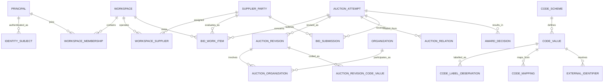

# 도메인·데이터·코드 체계

## 1. 데이터 권위와 스키마 소유권

| 계층 | 저장소 | 권위가 있는 질문 | 변경 방식 |
|---|---|---|---|
| source evidence | R2 `raw/` | 소스가 언제 어떤 바이트를 보냈는가? | append-only, content-addressed |
| ingestion control | PostgreSQL `ingest` | 어떤 실행·관측·격리가 있었는가? | dataplane 기록 |
| canonical facts | PostgreSQL `core` | 원본을 현재 규칙으로 해석한 업무 사실은 무엇인가? | 검증된 projector만 발행 |
| user state | PostgreSQL `app` | 사용자가 무엇을 선택·기록·확인했는가? | API만 쓰기 |
| analytics | PostgreSQL `mart` | 특정 기준시점/버전의 파생 분석은 무엇인가? | projector가 교체 가능하게 생성 |
| operations shape | PostgreSQL `monitoring` | 감시 회차마다 시스템이 어떤 모양이었는가? | check-expectations가 회차당 한 행 append |

각 사실의 권위 저장소는 하나다. `monitoring`은 권위 계층이 아니라 관측의 기록이다 — 위 넷을 읽어
회차마다 센 값이며 판정(알림)의 근거로 쓰지 않는다(ADR 0046 결정 4). R2 raw는 canonical 검색 모델이 아니고, `core`는 사용자 메모를
소유하지 않으며, `mart`는 원본 사실을 대신하지 않는다.

권장 DB 역할은 `migrator`, `ingestor`, `projector`, `api`다. API는 `core`/`mart`를 읽고
`app`만 쓴다. ingestor는 `ingest`만, projector는 검증된 `ingest`를 읽어 `core`/`mart`를 쓴다.

어느 수집 단계가 어느 표에 어떤 transaction 경계로 쓰는지는 [수집 쓰기 지도](ingestion-write-map.md)가
모듈 단위로 답하고, 각 스키마의 현재 표·컬럼·외래키 모양은 [생성된 ERD](generated/)가 보여 준다.

## 2. 식별자 원칙

문자열을 모두 제거하는 것이 목표가 아니다. **문자열이 정체성과 관계를 암묵적으로 결정하는
상태를 제거하는 것**이 목표다.

문자열이 남는 곳:

- 정부/외부 코드의 원문 값: 선행 0을 보존하는 `text`
- 이름, 주소, 원본 라벨, 설명, 사용자 메모
- content hash, object key처럼 계약으로 정의된 기술 식별자

문자열을 쓰지 않는 곳:

- 내부 PK/FK와 엔터티 간 조인
- 이름·주소를 합친 복합 키
- URL의 기관/지역/공고 식별자
- 지역·기관·사업자 동등성 비교

외부 경계의 식별자는 다음 3항으로 유일하다.

```text
(source_system, code_scheme, code)
```

예: `('eat', 'eat:organization', '00001234')`. 수신 후 `code_value_id bigint` 또는 해당
도메인 엔터티의 내부 bigint ID로 해소한다. 화면 URL은 `/organizations/4821`,
`/auction-attempts/918244`처럼 내부 ID를 쓴다.

## 3. 핵심 도메인 모델



### 3.1 AuctionAttempt

입찰 업무 사실의 중심이다.

- 내부 PK: `auction_attempt_id bigint`
- 외부 유일성: `(source_system, ELCTRN_BID_ID)`
- 화면용 공고번호 `ELCTRN_BID_NO`는 별도 속성이고 PK가 아니다.
- 화면용 공고번호는 nullable revision 속성이고 attempt identity 행에는 저장하지 않는다.
- `AuctionRevision`은 `normalized_record_id`를 직접 참조하고 그 interpretation으로 유일하다.
- 같은 normalized record replay는 revision을 재사용하고 새 parser interpretation은 별도 revision이다.
- 공고 상태, 공고 변경, 취소, 마감, 금액, 방식의 시간 변화를 보존한다.
- 재입찰/상위 공고 관계는 `core.auction_attempt_link`가 갖는다. 관측 원본은 `ds_bidHistory` 행과
  `ds_info.UP_ELCTRN_BID_ID`이며 관계 종류는 `chain_member`와 `parent` 둘이다
  ([ADR 0033](../adr/0033-bid-submission-partitioning-and-supplier-core.md) §1).
- 공고번호 접미사나 제목을 파싱해 차수를 만들지 않는다.
- **사슬 상대는 내부 attempt id로만 잇는다.** 아직 수집하지 않은 상대에게도 `AuctionAttempt` identity
  행(`source_system`·`external_bid_id`만)을 먼저 발급하고 그 id로 관계를 만든다. 외부 문자열을 관계
  키로 들고 있다가 나중에 잇지 않는다(규칙 2).
- **그래서 revision이 0개인 `AuctionAttempt`는 유효한 상태다.** "관계로만 알려진 공고"라는 뜻이며
  오류가 아니다(규칙 3).
- **공고 수를 세는 질의와 공개 API는 revision의 존재를 조건으로 삼는다.** `auction_attempt`를 그냥
  세면 아직 관측하지 못한 사슬 상대까지 공고로 발표하게 된다.

### 3.2 Organization

`School`이 아니라 보편 `Organization`을 기준정보로 둔다.

- 기관 유형: 학교, 유치원, 어린이집, 교육청, 공공기관 등
- `OrganizationIdentifier`: eaT `PURR_CD`, 필요한 경우 `PURR_ID`, 향후 NEIS 코드 등
- `AuctionOrganization`: revision별 구매기관, 대표기관, 수요기관, 배송지 등 role을 가진 관계
- 공동구매는 공고 하나에 N개 대상 기관을 연결한다.

기관명·주소는 속성/관측값이다. 이름이 같거나 바뀌어도 기관 정체성이 바뀌지 않는다. eaT projector는
`PURR_CD`만 기관 식별자로 사용하고 새 기관을 `type='unknown'`, `canonical_name=NULL`로 만든다.
`PURR_NM`은 `language='und'`인 observation-scoped code label 증거이며 별도 reconciliation 정책 없이
canonical 이름이나 학교 유형으로 승격하지 않는다.

**그래서 `core`는 revision마다 그 원본 관측의 정확한 시각을 이미 갖고 있다.** 구매기관 이름이 수집
계약의 필수 필드라 projector는 revision을 앉히는 같은 transaction에서 raw `fetched_at`을
`code_label_observation.observed_at`으로 남긴다. `ingest`를 읽지 못하는 API 역할이 회차의 관측 시각을
알아야 할 때는 이 관계를 읽는다 — 선택한 revision의 `observation_id`와 `eat:organization` 소유 체계의
code value가 짝인 label 관측이다. `organization_identifier.observation_id`는 정체성을 처음 이은 관측이라
회차 시각이 아니고, 다른 소유기관의 code scheme 라벨은 같은 시각으로 섞지 않는다(규칙 6). 후보가
하나의 시각으로 모이지 않으면 하나를 골라 채우지 않고 무결성 결함으로 닫는다(규칙 3).

### 3.3 SupplierParty

법적 사업자와 소스 계정을 분리한다.

- `SupplierParty`: 사업자등록번호 등 법적 정체성
- `SourceSupplierAccount`: eaT `SHIPPER_CD` 같은 소스별 참여 계정
- 한 법적 사업자에 여러 소스 계정이 있을 수 있고 그 반대 관계는 명시적으로 검증한다.
- 워크스페이스는 `app.registered_business`로 자신이 운영한다고 적어 둔 사업자를 가리킨다.

**승격 규칙**([ADR 0033](../adr/0033-bid-submission-partitioning-and-supplier-core.md) §1). `eat:business-number`
(`BIZ_NO`) 관측이 있으면 그 code value가 `SupplierParty`의 유일 키이고, 같은 사업자번호를 가진 여러
계정은 한 party에 붙는다. 사업자번호가 없으면 그 계정이 자기 party를 갖는다. 나중에 사업자번호가
관측되어 둘이 같은 사업자로 밝혀져도 **자동 병합하지 않는다** — 병합은 `code_mapping`과 같은 급의
명시적 reconciliation이다(규칙 3). 레이크 전수 명단 11,080,463행에서 `BIZ_NO` 결측은 0건이지만
(계산 버전 `eat-v2-r4-eat43`) 소스가 그 필드를 보장하지 않으므로 결측 경로를 없애지 않는다.

업체명(`SHIPPER_NM`)은 기관명과 같은 규칙이다. `language='und'`인 code label 관측으로 남고
`supplier_party.canonical_name`으로 승격하지 않는다. 이름이 바뀌어도 정체성은 바뀌지 않는다.

#### 워크스페이스가 등록한 사업자

`app.registered_business`는 **사용자 작성 상태**이지 관측 사실이 아니다. 사용자가 "내 화면의 기준을 이
사업자로 놓아 달라"고 적어 둔 것이며 법적 소유권 증명이 아니다. 소유권 경계와 근거는
[ADR 0032](../adr/0032-authentication-and-authorization-boundary.md) §7이 정한다.

- 등록 입력은 사업자등록번호 문자열이지만 정체성은 `registered_business_id bigint`다. 대조는
  `eat:business-number` scheme의 정확한 번호 일치 하나다.
- **`core` 연결은 저장하지 않고 조회가 파생한다.** `app`에 `supplier_party_id`를 저장하면 나중에 원본이 그
  사업자를 처음 관측해도 저장된 `null`이 그대로 남아 영원히 미연결이 된다. 사용자 입력 등록은 `app`의
  권위이고 번호→`SupplierParty`는 `core`의 권위이므로, 조회가 그때의 `core` 사실로 연결을 만든다.
- **관측되지 않은 번호도 등록은 보존한다.** 사용자 입력으로 `core.supplier_party`나 `core.code_value`를
  만들지 않는다(규칙 1·3). "원본에서 아직 관측되지 않음"과 "참여하지 않음"은 서로 다른 사실이며 화면과
  응답에서 구분한다.
- **한 번호가 서로 다른 party 둘을 가리키면 연결을 고르지 않는다.** 승격 규칙이 자동 병합을 금지하므로
  그 상태는 증거 불일치이고 조회는 실패한다. 하나를 고르면 남의 성적표를 내 것으로 붙이는 일이다.
- **활성 등록의 유일성은 워크스페이스 안에서만 강제한다.** `revoked_at is null`인 행에 대해
  `(workspace_id, business_number)` 부분 unique를 건다. 같은 번호를 서로 다른 워크스페이스가 등록하는
  것은 충돌이 아니다. 사업자등록번호는 공개 정보라 전역 선착순 잠금은 방어가 아니라 서비스 거부다.
- 비공개 자료의 격리는 등록이 아니라 `workspace_membership`이 한다.

사업자별 위치도 같은 성격의 `app` 상태다. `app.registered_business_location`은 사용자가 적은 주소 문장
하나(`address_text`)만 보존하고, 위치 미설정은 **행이 없는 것**이다. 행정구역 코드 열도 좌표 열도 두지
않는다. 채울 출처가 없는 열은 결국 주소 문자열 파싱으로 채워지고 그 추측이 §4.2의 행정안전부 체계와
같은 자리에 앉는다(규칙 6). 주소 검색과 지도 위 점은 정확한 좌표 출처를 확인한 뒤 열을 함께 추가한다.

### 3.4 BidSubmission과 AwardDecision

`won boolean`으로 개찰 사실을 축약하지 않는다.

- `BidSubmission`: 업체, 제출/취소 상태, 제출 시각, 금액, 투찰률, 순위, source status
- `AwardDecision`: 낙찰/유찰/재공고 등 결정, 결정 시각, 선택된 submission/업체, 원본 근거
- withdrawal은 낙찰 실패와 다른 상태다.
- 동일 공고의 source revision에 따라 결과가 정정될 수 있으므로 관측 이력을 보존한다.

#### 확정된 열과 파티션

[ADR 0033](../adr/0033-bid-submission-partitioning-and-supplier-core.md) §1·§3이 다음을 확정했다.
`packages/db/src/schema/core/bidding.ts`가 DDL의 권위다.

- **grain은 revision이다.** `core.bid_submission`의 발행 grain은
  `(auction_revision_id, roster_ordinal, opened_at)`이고 `roster_ordinal`은 `ds_bidList`의 관측 순서
  (0-based)이지 소스가 준 번호가 아니다. 소스 정정으로 새 revision이 생기면 명단이 한 벌 더 쌓이며
  현재 뷰는 최신 revision을 고르는 질의가 만든다.
- **`core.bid_submission`은 `opened_at`으로 range 파티션한다.** 경계는 KST 연도이고 초기 커버리지는
  2023~2027 다섯 연도 + `DEFAULT`다. 파티션 키는 nullable이며 그래서 이 테이블에는 primary key가 없고
  `unique nulls not distinct` 둘이 대리키와 발행 grain을 각각 지킨다.
- **`won boolean`도, 계산된 실효하한도, "무효" 열도 두지 않는다.** 판정 권위는 `BID_STT` 코드
  하나이고 그날 하한은 `mart`의 파생 계산이다(규칙 7·8). 이 금지는 열 목록 테스트가 집행한다.
- **공고 조건은 `core.auction_revision`에 열과 코드 관계로 있다.** 하한율은
  `auction_revision.floor_rate numeric(6,3)`(null 허용, `PLNPRCE_SUCBD_STD` 관측 그대로)이고, 낙찰 방식
  (`SUCBID_DCSN_MTH_CD`)과 예정가격 방식(`PLNPRC_TYPE_CD`)은 `core.auction_revision_code_value`의 role
  `award_method`·`planned_price_method`로 각각 `eat:award-method`·`eat:planned-price-type` code value를
  가리킨다. 코호트 키를 `source_payload` jsonb 경로에 묶어 두지 않기 위한 것이며
  [ADR 0033](../adr/0033-bid-submission-partitioning-and-supplier-core.md) §6이 정했다. v1 record에는
  `terms` 블록이 없어 v1 발행은 `floor_rate`가 null이고 두 role 관계를 만들지 않는다.
  `packages/db/src/schema/core/procurement.ts`가 DDL의 권위다.
- **`AwardDecision`은 revision당 0 또는 1이다.** 근거는 전수 리포트의 `multiple_award_rows = 0`이며,
  위반이 관측되면 두 행을 만드는 것이 아니라 격리한다.
- **낙찰 행은 명단 행을 FK로 가리키지 않는다.** `awarded_roster_ordinal`은 같은 revision 명단의 관측
  좌표다. 파티션 테이블을 참조하는 FK는 동작하지만 연도 추가 때마다의 `DETACH`/`ATTACH`와 씨름하게
  되므로 운영 절차의 단순함을 참조 무결성 위에 둔다. 대신 projector가 같은 트랜잭션에서 좌표의 존재와
  그 행의 판정 코드가 `002`인지 검증한다.
- **재발행은 upsert 멱등이다.** `on conflict ... do nothing` 뒤 기존 행을 읽어 값이 같은지 확인하고
  다르면 실패로 끊는다. 삭제-재삽입은 봉인된 발행물의 append-only 계약과 어긋나고 부분 실패가 현재
  공개 뷰를 비운다.

#### 원본 판정에는 "무효"가 없다

eaT 명단 행의 판정 코드 `BID_STT`는 레이크 전수 11,080,463행에서 `002`(낙찰)와 `005`(낙찰실패)
둘뿐이다. 소스는 "무효"도 "하한 미달"도 판정하지 않는다. 그러므로 정규화는 판정을 코드 그대로
보존하고 그 위에 상태를 만들어내지 않는다(규칙 3). 취소는 별도 필드 `WITHDRAWAL_YN`이며 판정 코드와
같은 축이 아니다.

화면과 mart의 "그날 하한"과 "하한 미만 수"는 관측이 아니라 **파생 계산**이다. 하한율
(`PLNPRCE_SUCBD_STD`)과 추첨으로 정해진 예정가격을 곱해 얻는 값이며, 그 비교로 센 행 수는
표본 수·코호트·계산 버전과 함께만 발표한다(규칙 7). `core`에 있는 것은 관측된 하한율
(`auction_revision.floor_rate`)뿐이고 이 파생값은 저장하지 않는다.

**예정가격 `0`은 금액이 아니라 미관측이다.** eaT는 추첨 전 공고의 `ELCTRN_BID_PLNPRC`를 빈 값이
아니라 `0`으로 보내고, 정규화는 그 관측을 보존하므로 `core.auction_revision.planned_amount`에는
`0.00`이 앉는다. 예정가격에서 파생하는 값 — 그날 하한 금액·비율, 투찰률 축 낙찰률, 하한 미만 수 —
은 예정가격이 **양수로 관측된** 회차에서만 만들고 그 밖에는 `null`이다. `0.0000`이라는 하한이나
"하한 미만 0건"은 관측이 아니라 거짓 사실이며, 화면은 그 회차를 "예정가격 미관측"으로 보이고 판정
분모에서 뺀다(규칙 3, EAT-74).

#### 사정률의 값 범위와 정밀도 한계

- **사정률은 100을 넘는다.** `SAJEONG_PCT`는 투찰가를 예정가격으로 나눈 소스 계산값이라 예정가격을
  넘겨 투찰하면 100을 초과하고, 단가 입찰(낙찰 방식 `013`·`014`)에서 총액을 넣은 행은 훨씬 크게 튄다.
  ingestion v2와 공개 기관 이력의 `winRate`·`secondRate`는 100 상한 없는 `ObservedBidRate`
  (소수 3자리, 정수부 최대 12자리)로 보존한다. 하한율의 `BidRate`는 0~100을 유지한다
  ([ADR 0040](../adr/0040-observed-rates-in-organization-history.md)). **DB 표현은 `numeric(15,3)`이다** — `core`와
  `mart` 모두 같으며 [ADR 0033](../adr/0033-bid-submission-partitioning-and-supplier-core.md) §2가
  정했다.
- **사정률을 집계하면 낙찰 방식으로 코호트를 나눈다.** 낙찰 방식 코드
  (`ds_info.SUCBID_DCSN_MTH_CD`)는 8종이고 `003`이 99%다. `013`·`014`는 단가 입찰이라 같은 축의 값이
  아니다.
- **`BID_CALC_AMT`는 금액이 아닐 수 있다.** 명단 행의 44%가 1e13대 자리표시자이고 한 공고 안에서
  `K − EFT_ALL_AMT` 관계를 지킨다. 정규화는 이 값을 `submission.amount`에 관측 그대로 싣는다.
  [ADR 0041](../adr/0041-attempt-roster-read-and-observed-amount.md)에 따라 명단 읽기 화면은
  `EFT_ALL_AMT` 관측만 `submittedAmount`로 표시하고 부재는 null로 둔다. 원천 계산값은
  `sourceCalculatedAmount`로 별도 보존하며 금액×비율로 복원하지 않는다. 이 표시 정책으로
  기존 mart 계산이나 단가·계약액의 의미를 변경하지 않는다.
- **`awardedAt`은 날짜 정밀도다.** 원본 `SUCBD_DT`가 날짜만 오므로 낙찰 시각은 그날 자정 instant다.
  시각으로 정렬하거나 같은 날 안의 선후를 이 값으로 판단하지 않는다.

수치의 권위는 [2026-09-04 전수 재정규화 리포트](../evidence/normalization/2026-09-04-eat-v2-renormalization.md)
(계산 버전 `eat-v2-r3`, 표본 238,308)다.

### 3.5 BidWorkItem

사용자 운영 모델의 grain은 다음 unique constraint로 보호한다.

```text
unique(workspace_id, supplier_party_id, auction_attempt_id)
```

`recorded_value`는 사용자가 eatbid에 적어둔 판단이고, 실제 제출은 `BidSubmission`에서만
관측한다. “NeaT 입력 확인” 역시 사용자 확인 이벤트이지 source-observed submission이 아니다.

화면도 이 둘을 같은 이름으로 부르지 않는다. 결정 화면 흐름 차트의 “내 값”은 사용자가 URL에 놓은 입력이고
(`apps/web/src/app/(workspace)/auctions/[auctionId]/_model/flow-series.ts`), “실제 내 투찰”은 등록된 사업자의
`core.bid_submission` 관측이다. 실제 투찰을 같은 눈금에 올리려면 같은 회차 revision, 같은 낙찰 방식 코호트,
같은 분모(예정가격 기준 사정률)로 조회해야 한다. 분모나 revision이 다른 값을 한 계열로 그리면 사용자는
자기 제출이 아닌 숫자를 자기 제출로 읽는다.

### 3.6 Principal과 Workspace identity

인증 제공자의 계정 식별자와 eatbid application identity를 분리한다.

- `Principal`: eatbid 내부 행위 주체. 내부 PK는 `principal_id bigint`다.
- `IdentitySubject`: `(provider, issuer, subject)` 인증 식별자를 `principal_id`에 연결한다.
- `Workspace`: 내부 PK `workspace_id bigint`를 사용한다.
- `WorkspaceMembership`: `(workspace_id, principal_id)`와 role/permission 상태를 가진다.

Better Auth 같은 provider가 문자열 user ID를 요구해도 그 값은 provider-owned auth table과
`IdentitySubject.subject`에만 남는다. workspace, supplier, work item 등 application 관계가 그 문자열을
FK로 사용하지 않는다. 그린필드 이전 `packages/shared`가 들고 있던 문자열 user/workspace schema는 목표
DDL이 아니었고, 두 번째 Drizzle 권위를 없애기 위해 package째 제거했다(ADR 0009).

첫 application DDL은 `app.principal`, `app.identity_subject`, `app.workspace`,
`app.workspace_membership`만 만든다. 네 테이블의 PK/FK는 모두 PostgreSQL bigint이고,
`identity_subject`만 `(provider, issuer, subject)`를 보존해 bigint `principal_id`에 연결한다.
API role은 이 application-owned 테이블만 읽고 쓸 수 있으며 schema 생성 권한은 갖지 않는다.

**워크스페이스는 첫 저장이 만든다.** 혼자 쓰는 사용자에게 조직 생성 화면을 먼저 보이지 않되 관계는
그대로 둔다. `principal`과 `identity_subject`는 로그인 경로에서 만들고, `workspace`와 `owner` membership은
사용자가 첫 사업자를 저장하는 command 안에서 같은 트랜잭션으로 만든다. 안전해야 할 세션 조회(GET)가
행을 만들지 않게 하기 위한 것이다. 동시 첫 저장 두 건이 워크스페이스를 둘 만들지 않도록
`workspace_membership`에 `(principal_id) where role = 'owner'` 부분 unique를 두고, `role`은 `owner|member`
check로 좁힌다. 애플리케이션 선검사만으로는 서로의 미커밋 행을 보지 못해 막을 수 없다. 상세는
[ADR 0032](../adr/0032-authentication-and-authorization-boundary.md) §3·§8을 따른다.

JSON은 bigint를 직접 표현하지 못하므로 HTTP path/response에서는 내부 ID를 선행 0 없는 양의 10진 문자열로
인코딩하되 PostgreSQL signed bigint 최대값 `9223372036854775807`을 넘지 않는다. presentation boundary가
이를 bigint로 변환하며 application/domain과 DB 관계는 계속 bigint다. `Number`로 변환하지 않고
`MAX_SAFE_INTEGER`를 넘는 ID와 signed 최대값/초과값을 계약 테스트로 검증한다. 상세 결정은
[ADR 0018](../adr/0018-application-identity-and-id-wire-format.md)을 따른다.

첫 canonical read인 `GET /api/v1/auctions/{auctionId}`는 `AuctionAttempt` bigint ID로 최신 revision을
찾는다. 응답은 source payload나 DB row를 노출하지 않고 revision ID, nullable 시각/금액,
`source_system`, external source ID, observation/normalized-record bigint ID, content hash를 bounded provenance로
제공한다. external source ID는 근거 필드이지 URL/관계 키가 아니다.

## 4. 코드 체계

### 4.1 범용 구조

- `CodeScheme`: 소유기관, namespace, 설명, 버전 정책, 유효기간 정책
- `CodeValue`: scheme 내 원본 code, 활성 기간, 내부 ID
- `CodeLabelObservation`: 시점·출처별 라벨. 라벨 변경을 정체성 변경으로 보지 않는다.
- `CodeMapping`: 서로 다른 scheme 값 간의 명시적 관계와 근거·유효기간·확신 상태
- `ExternalIdentifier`: 도메인 엔터티와 source-scoped code를 연결

`CodeMapping`은 동등성뿐 아니라 `broader`, `narrower`, `overlaps`, `successor` 같은 관계를
표현할 수 있어야 한다. 행정구역 개편을 문자열 치환으로 처리하지 않는다.

### 4.2 반드시 분리할 scheme

| scheme | 의미 | grain | 좌표 | 직접 비교 가능한 범위 |
|---|---|---|---|---|
| `eat:auction-location-sido` | eaT 공고 소재 시도 | 관측된 `SIDO_CD` | 없음 | 같은 scheme/버전 |
| `eat:auction-location-sigungu` | eaT 공고 소재 시군구 | 관측된 `SIGUNGU_CD` | 없음 | 같은 scheme/버전 |
| `eat:eligibility-area` | eaT 참가제한 `PDLC_CD` (라벨 `PDLC_NM`은 `eat-v3`부터 `code_label_observation`으로) | 관측된 `PDLC_CD` | 없음 | 같은 scheme/버전 |
| `mois:administrative-region` | 행정안전부 **법정동코드** | 시도·시군구 두 단계만 승격 | `core.code_value_coordinate` | 같은 scheme/release |
| `neis:school` | NEIS 학교 식별자 | 학교 | 없음 | 같은 scheme/버전 |

`SIDO_CD`/`SIGUNGU_CD`와 `PDLC_CD`가 같은 지역처럼 보여도 직접 조인하지 않는다. 소유기관과
의미가 다른 코드 체계이므로 근거가 있는 `CodeMapping`을 통해서만 eligibility에 사용한다.

`mois:administrative-region`의 canonical 파일·grain·계층·좌표·매핑 정책은
[ADR 0035](../adr/0035-administrative-region-canonical-and-mapping.md)가 소유한다. 요약하면
code는 원본 10자리 문자열 그대로, 계층은 `core.code_release_member.parent_code_value_id`가
release별 사실로, 좌표는 `core.code_value_coordinate`가 CRS·근거 observation과 함께,
eaT 대응은 `core.code_mapping`의 `label_verified`(자동, 양쪽 유일 라벨 일치) 또는
`reviewed`(사람) 행으로만 성립한다. 매핑 없음은 행의 부재이며 그 수는
[`reference-data-coverage.md`](../operations/reference-data-coverage.md)가 센다.

### 4.3 정부 코드가 없는 분류

품목처럼 공식 코드가 없는 개념에는 가짜 정부 코드를 만들지 않는다.

- `Taxonomy`: eatbid가 소유하는 분류 체계와 버전
- `TaxonomyTerm`: 내부 분류 항목
- `ClassificationRule`: 규칙/모델 버전과 유효기간
- `AuctionClassification`: 대상, term, 출처 필드, rule version, confidence/검토 상태

공고명에서 추정했다면 그 사실을 숨기지 않고 `source = inferred_from_title`로 남긴다.

## 5. 원본 관측과 revision

R2 객체 키:

```text
raw/{source}/{endpoint}/{sha256}.xml.gz
```

동일 바이트는 같은 객체를 공유할 수 있지만 HTTP 요청 관측은 매번 별도 행이다.
`ingest.raw_observation`은 최소한 다음을 가진다.

- `observation_id`, `run_id`, source, endpoint
- 정규화한 request parameters, 요청/응답 시각, HTTP status
- content hash, object key, byte length, compression

처리 순서는 `HTTP response → hash → R2 write 확인 → observation commit → parse`다.
`raw_observation`은 불변 HTTP 증거이며 source entity ID, parser 상태, schema fingerprint,
quarantine reason을 소유하지 않는다. parser 해석은 processing run별
`normalization_attempt(run_id, observation_id, parser_version)`에 append한다. 성공 attempt의
exact output은 `normalization_attempt_record`로 연결하고, 격리는 bounded reason을 남긴다.
파싱 실패도 raw를 잃거나 과거 attempt를 덮어쓰지 않는다.

정규화 성공만으로 schema shape를 승인하지 않는다. `(source, endpoint, parser_version)`별 reviewed
dataset/column contract가 parser와 같은 canonical fingerprint algorithm을 사용하며, attempt의
fingerprint가 다르거나 contract가 없으면 `SOURCE_CONTRACT`로 publication을 막는다. 새 column은
raw/attempt에 그대로 관측한 뒤 별도 human review로 contract를 갱신한다.

capture/backfill은 자기 run의 observation만 처리한다. replay는 새 HTTP observation을 만들거나
원래 `run_id`를 바꾸지 않고 `replay_input` manifest로 기존 evidence를 참조한다. 같은 parser의
deterministic normalized record는 여러 attempt가 재사용할 수 있고, 새 parser는 독립 key와
attempt를 만든다.

Replay identity는 호출자가 제공한 run/publication UUID, build/parser version, start time과 exact raw
observation ID set이다. `ReplayRunRepository`가 runtime shape와 unknown observation을 먼저 검증하고,
run + pending publication + 정렬한 manifest 전체를 repository-owned transaction 하나로 동결한다.
capture용 repository는 replay run을 만들 수 없고 publication repository도 manifest member를 추가하지
않는다. 같은 run ID 재호출은 이 metadata와 member set이 모두 같아야 하며 일부 input을 나중에
붙이거나 다른 publication ID로 바꾸지 못한다.
capture repository의 request 계획, raw/blob 기록, 실패 전이는 run을 잠그고 capture/backfill mode만
허용하므로 replay run의 evidence ledger나 pending publication을 우회 변경할 수 없다.

`ingest.run`의 `run_id`는 한 번의 capture/replay 실행 정체성이고, `ingest.source_release`의
`source_release_id`는 downstream이 재사용하는 봉인된 raw 입력 집합 정체성이다. 둘은 서로
대체하지 않는다. source release는 다음 네 table을 소유한다.

- `source_release`: source, release name, as-of, 상태와 manifest SHA-256을 가진 release header
- `source_release_run`: release에 포함한 실행 membership
- `source_release_observation`: release에 포함한 immutable raw observation membership
- `source_release_dataset`: endpoint/dataset/record type/parser/schema fingerprint, required 여부와
  dataset record completeness count

dataset count는 같은 source record grain에서 `normalized + quarantined <= observed <= expected`다.
release는 항상 `planned`로만 INSERT하고 terminal 상태는 `planned → sealed` 또는
`planned → failed` 전이로만 만든다. seal에는 적어도 하나의 `required` dataset 행이 필요하며, 각
required dataset은 `observed = expected` 및 `normalized + quarantined = observed`를 만족해야 한다.
명시된 required 행의 모든 count가 0인 것은 exact complete지만 required 행 자체가 없는 manifest는
봉인할 수 없다. sealed/failed header와 세 membership table은 DB trigger로 INSERT·UPDATE·DELETE가
모두 금지된다. membership trigger는 OLD/NEW parent를 ID 오름차순으로 잠가 seal UPDATE와 직렬화하므로
동시 변경이 sealed manifest로 섞이지 않는다. 같은 source와 non-null manifest SHA-256은 하나의
release만 식별한다. 누락 원본, parser 정정, backfill 또는 membership 추가는 과거 release를 고치지
않고 새 release를 만들어 표현한다.

source release의 terminal transition은 repository-owned `READ COMMITTED` transaction에서만 허용한다.
DB trigger도 transaction isolation을 검사해 REPEATABLE READ/SERIALIZABLE terminal 전이를 SQLSTATE
`25000`으로 거부한다. parent lock은 child mutation과 seal을 직렬화하지만 REPEATABLE READ의 과거
dataset snapshot을 새로 만들지 않으므로, 이 fail-closed rule 없이는 stale complete snapshot이
incomplete release를 seal할 수 있다. Task 2 repository는 이 transaction isolation을 public contract로
유지하며 terminal write를 다른 isolation에서 재시도하거나 우회하지 않는다.

새 normalized interpretation이 생길 때만 새 `AuctionRevision`을 만든다. revision은
`normalized_record_id`를 통해 observation과 parser version을 직접 추적한다. 같은 raw라도 새 parser가
새 normalized record를 만들면 별도 revision이고, replay가 같은 normalized record를 재사용하면 기존
revision을 재사용한다. 현행 뷰가 검증된 최신 revision을 선택해도 과거 이력은 삭제하지 않는다.

## 6. 발행과 멱등성

- 수집 실행은 요청 단위 계획과 기대 `TOT_CNT`를 먼저 기록한다.
- 관측 중복 방지 키와 source entity/revision content hash unique constraint를 DB로 강제한다.
- 모든 요청 단위와 current run/parser의 final normalization attempt를 검증한 뒤에만
  publication을 `validated`로 만든다.
- 검증된 exact normalized record ID는 `publication_record`에 동결하며 projector는 이
  manifest만 소비한다.
- projector fingerprint는 member별 `(source_system, external_bid_id, raw_content_sha256,
  parser_version, normalized_payload_sha256)` tuple만 정렬해 계산하며 bigint ID/행 순서는 포함하지 않는다.
- replay resume, validation, projector는 `run → raw/topology → publication → publication_record` 순서로
  잠근다. projector는 canonical row와 revision-scoped bigint 관계를 insert-or-verify한 뒤 exact member
  count가 성공한 경우에만 한 transaction으로 `published`를 전환한다.
- projector는 capture의 `raw_observation.run_id` 또는 replay의 exact `replay_input` candidate set과
  candidate별 current-parser attempt/member bijection을 다시 잠가 검증한다. factory output은 잠근
  lineage/source/hash와 재비교하고 relation은 purchaser 및 `(code_value_id, role)` 전체 set이 정확해야 한다.
- candidate→attempt→record 잠금/검증은 source-agnostic PostgreSQL topology verifier가 단독 소유하며,
  Task 8 validation과 Task 9 projection은 같은 결과를 소비한다.
- 같은 verifier의 partial invariant는 incomplete running/source/data-failed replay에서 missing candidate를
  허용하되, 존재하는 current-parser final attempt와 normalized/quarantined별 정확한 1/0 member lineage만
  허용한다. strict coherent는 모든 candidate가 normalized인 이 invariant의 refinement다.
- terminal 재검증은 current attempt-record member를 다시 잠그고 계산하여 frozen sorted member
  set과 status/metadata/count를 정확히 비교한다. validated 상태는 failed request, request/candidate
  count drift, missing/mismatched/non-normalized attempt, output parser/type/observation drift, 미검토
  schema contract가 하나라도 있으면 거부한다. Task 8 auction은 candidate별 정확히 한 output을
  요구하므로 swapped edge나 2-output/0-output 재분배도 거부한다. join table의 미래 N:M 표현력은
  유지하지만 이 publication 계약에서는 cardinality나 global member set만 같아서는 통과하지 않는다.
  failed 상태는 외부 수정으로 승격하지 않는다. source/data failure는 빈 manifest를,
  projection failure는 coherent topology의 exact frozen manifest를 typed failure 반환보다 먼저 검증한다.
  source/data completeness failure는 incomplete일 수 있지만 partial structural coherence는 필수다.
- 실패/불완전 실행은 원인과 raw를 보존하지만 현재 canonical snapshot을 바꾸지 않는다.
- deterministic projection 충돌은 core write를 rollback하고 `PROJECTION_CONTRACT`로 실패시키되 이전
  `validated_at`과 frozen member를 보존한다. 실패 표시는 fresh connection transaction으로 내구화하고,
  projector는 ambient transaction이 아닌 idle connection의 repository-owned transaction만 허용한다.
  transient DB/provider 오류는 validated 상태로 남겨 retry한다.
- mart는 영향받은 partition/cohort를 새 build ID로 만든 뒤 원자적으로 활성화한다.
- 재처리는 `replay_input`의 raw observation 집합과 processing parser/projector version을
  명시한다. orchestration은 manifest-only/일부 normalized/running/validated/published checkpoint에서
  단조롭게 재개한다. failed state는 저장된 typed category를 R2 접근보다 먼저 반환하고,
  published state도 저장 count만 신뢰하지 않고 exact topology/relation/fingerprint를 재검증한다.

## 7. 분석 모델

분석은 `core`의 사실을 소비하되 별도 `mart` 테이블에 저장한다.

지금 존재하는 mart는 셋이고 각각 결정 화면의 한 자리를 읽는다.

| 표 | grain | 읽는 화면 |
|---|---|---|
| `mart.org_round_summary` | `(build_id, auction_attempt_id)` | 결정(흐름·과거 회차·레일), 오늘(기관 요약) |
| `mart.win_rate_distribution_monthly` | 대리키 + `(scope, region, org, item, floor_rate, award_method, month, bin)` | 결정(호가창), 비교집단 |
| `mart.open_auction_snapshot` | `(build_id, auction_attempt_id, observed_at)` | 오늘(열린 공고), 결정(참여 수 추이) |

`mart.open_auction_snapshot`은 목록 관측만으로 만들어지지 않는다. 목록에는 마감·기초금액·참여 수만
있고 하한율·품목·지역·기관 이름이 없어서, 빌더가 같은 `auction_attempt`의 **최신
`core.auction_revision`**을 조인해 `floor_rate`·`item_label`·`region_sido_code_value_id`·
`region_sigungu_code_value_id`를 함께 싣는다. "최신"은 `auction_revision_id` 최대값이며 replay가
관측 시각을 되돌려도 append 순서는 단조롭다. 그 값을 어느 해석에서 읽었는지는 `terms_revision_id`가
가리키고, 상세를 아직 따지 않은 공고는 네 열과 계보가 모두 null이다. `organization_label`은 이
공고의 revision이 아니라 조직 코드에 매달린 `core.code_label_observation`의 최신 관측이므로 계보에
포함되지 않는다 — 이름은 표시값이고 조직 정체성은 여전히 code value가 갖는다.

업체 성적표 mart(`supplier_monthly_record`)는 `app`의 workspace 모델이 확정된 뒤로 미뤘다. 대상
집합이 "워크스페이스가 등록한 사업자"인데 그 표가 아직 없고, 전체 업체를 빌드하는 것은 명단이
공개라도 우리가 만든 프로파일이라 제품 규칙이 금지한다.

**계보는 행이 아니라 `mart.build` 한 행이 갖는다.** 모든 mart 행의 첫 열은 `build_id`이고
`source_release_id`·`publication_id`·`calc_version`·`builder_version`·`region_scheme`·`as_of`·
`computed_at`·`row_count`는 build가 한 벌만 갖는다. 같은 사실을 수백만 행에 복제하면 권위가 둘이
되고 한쪽만 바뀌는 순간을 DB가 막지 못한다. 활성 build는 mart마다 최대 하나이며 그것이 partial
unique index로 강제된다. 표본 수(`sample_n`)는 조회 시점의 코호트에 따라 달라지므로 행이 아니라
응답이 싣는다. 자세한 것은 [ADR 0034](../adr/0034-mart-build-identity-and-atomic-activation.md)다.

`mart.build_coverage`는 그 build가 읽은 (지역, 달) 구간의 모집단 보유율을 기록한다. 판정은
`complete`·`partial`·`none`·`unknown` 넷이며 `unknown`은 그 축으로 나뉘어 수집되지 않아 분모를 낼 수
없다는 뜻이다([PDR-0003](../product/decisions/0003-coverage-unknown.md)).

기관 회차의 `item_label`은 원본 `classification.sourceCategoryLabel`의 관측 표시값이다.
`item_code_value_id`가 없어도 라벨을 버리지 않는다. 공개 V1 기관 이력은 `includeItemLabel=true`를
요청한 소비자에게 `itemLabel`을 별도로 전달한다. null은 라벨 미관측, 키 부재는 이전 응답 형태다.
기존 `item`의 코드 관계와 필터는 유지하고 라벨을 분해하거나 같은 문자열이라는 이유로 품목 ID,
필터 또는 차트 연결 집단으로 승격하지 않는다. DB·ingestion 변경과 replay는 필요하지 않다.
기존 strict 소비자는 새 query를 보내지 않아 응답 형태가 유지된다. 서버를 먼저 반영한 뒤 Web이
명시 query를 보내며, 이전 Web으로 되돌려도 기존 응답을 계속 읽는다.

대규모 JSON 결과를 Organization/Auction master 행에 넣지 않는다.

## 8. 시간과 정량 값

canonical 사실은 값의 표현뿐 아니라 의미와 단위를 보존한다. 상세 타입·wire·DB·Python 경계는
[시간·정량 값·Zod 계약](time-and-value-contracts.md)과 [ADR 0021](../adr/0021-zod-portable-contract-hub.md)을
따른다.

- 절대 시점, 달력 날짜, 지역 시각, 경과 시간을 각각 `Instant`, `PlainDate`, `ZonedDateTime`,
  `ElapsedMilliseconds`로 구분한다. 수동 KST offset이나 ambient `Date.now()`가 정책을 소유하지 않는다.
- 금액은 exact decimal amount와 source가 증명한 currency를 함께 저장한다. 비율은 percentage-point와
  ratio를 구분하고 canonical 사실에 floating-point DDL을 사용하지 않는다.
- count와 byte length의 DB bigint는 JavaScript number로 축소하지 않는다. 합성 지표는 `건/업체/년`처럼
  분자·분모·기간을 field와 contract metadata에 기록한다.
- 좌표는 CRS와 provenance를 동반한 관측값이다. 이름 lookup 좌표를 기관 identity나 canonical 위치로
  자동 승격하지 않는다.
- canonical interchange와 HTTP wire authority는 `packages/contracts`의 bounded Zod schema다. source
  Pydantic과 DB/domain 모델은 각 adapter에서 명시적으로 변환하고 normalized Pydantic은 versioned
  JSON Schema에서 생성한다.
- server application `AuctionRecord`는 내부 read port이며 public response나 interchange contract가 아니다.
  공개 응답은 Zod schema에서 추론한 `AuctionV1Response`이고 Drizzle row와 별도로 유지한다.
- Argo Workflows가 실행한 dataplane은 generated normalized contract를 검증한 뒤 Nest HTTP를 거치지
  않고 제한된 ingestor/projector role로 PostgreSQL에 직접 발행한다.

## 9. DDL과 계약

`packages/db`의 Drizzle schema가 DDL 작성의 유일한 원천이다. 생성된 SQL migration을 검토·
커밋하고 같은 Git SHA의 migration image가 배포 전에 적용한다. `schema.sql`과 `db:push`는
목표 구조에서 제거한다. 최신 migration snapshot에서 만든 스키마별 ERD는
[generated/](generated/)에 두며 `pnpm architecture:erd:write`로만 갱신하고 `architecture:check`가
drift를 실패시킨다.

Interchange/API 계약은 `packages/contracts`에서 별도로 정의한다. DB 테이블을 그대로 외부 응답으로
노출하지 않는다. 손으로 작성한 Python Pydantic은 source payload를 담당하고 normalized Pydantic은
Zod가 내보낸 versioned JSON Schema에서 생성한다.

이 foundation은 frontend 화면·상태·정보구조 전환이나 66개 누락 좌표의 이름 lookup backfill을 하지
않는다. frontend는 공동 설계 후 public Zod wire를 runtime parse하고, 좌표는 CRS/provenance 계약을
소비하는 별도 Argo enrichment workflow에서만 보강한다.
