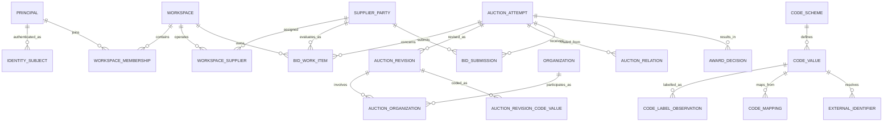

# 도메인·데이터·코드 체계

## 1. 데이터 권위와 스키마 소유권

| 계층 | 저장소 | 권위가 있는 질문 | 변경 방식 |
|---|---|---|---|
| source evidence | R2 `raw/` | 소스가 언제 어떤 바이트를 보냈는가? | append-only, content-addressed |
| ingestion control | PostgreSQL `ingest` | 어떤 실행·관측·격리가 있었는가? | dataplane 기록 |
| canonical facts | PostgreSQL `core` | 원본을 현재 규칙으로 해석한 업무 사실은 무엇인가? | 검증된 projector만 발행 |
| user state | PostgreSQL `app` | 사용자가 무엇을 선택·기록·확인했는가? | API만 쓰기 |
| analytics | PostgreSQL `mart` | 특정 기준시점/버전의 파생 분석은 무엇인가? | projector가 교체 가능하게 생성 |

각 사실의 권위 저장소는 하나다. R2 raw는 canonical 검색 모델이 아니고, `core`는 사용자 메모를
소유하지 않으며, `mart`는 원본 사실을 대신하지 않는다.

권장 DB 역할은 `migrator`, `ingestor`, `projector`, `api`다. API는 `core`/`mart`를 읽고
`app`만 쓴다. ingestor는 `ingest`만, projector는 검증된 `ingest`를 읽어 `core`/`mart`를 쓴다.

## 2. 식별자 원칙

문자열을 모두 제거하는 것이 목표가 아니다. **문자열이 정체성과 관계를 암묵적으로 결정하는
상태를 제거하는 것**이 목표다.

문자열이 남는 곳:

- 정부/외부 코드의 원문 값: 선행 0을 보존하는 `text`
- 이름, 주소, 원본 라벨, 설명, 사용자 메모
- content hash, object key처럼 계약으로 정의된 기술 식별자

문자열을 쓰지 않는 곳:

- 내부 PK/FK와 엔터티 간 조인
- 이름·주소를 합친 복합 키
- URL의 기관/지역/공고 식별자
- 지역·기관·사업자 동등성 비교

외부 경계의 식별자는 다음 3항으로 유일하다.

```text
(source_system, code_scheme, code)
```

예: `('eat', 'eat:organization', '00001234')`. 수신 후 `code_value_id bigint` 또는 해당
도메인 엔터티의 내부 bigint ID로 해소한다. 화면 URL은 `/organizations/4821`,
`/auction-attempts/918244`처럼 내부 ID를 쓴다.

## 3. 핵심 도메인 모델



### 3.1 AuctionAttempt

입찰 업무 사실의 중심이다.

- 내부 PK: `auction_attempt_id bigint`
- 외부 유일성: `(source_system, ELCTRN_BID_ID)`
- 화면용 공고번호 `ELCTRN_BID_NO`는 별도 속성이고 PK가 아니다.
- 화면용 공고번호는 nullable revision 속성이고 attempt identity 행에는 저장하지 않는다.
- `AuctionRevision`은 `normalized_record_id`를 직접 참조하고 그 interpretation으로 유일하다.
- 같은 normalized record replay는 revision을 재사용하고 새 parser interpretation은 별도 revision이다.
- 공고 상태, 공고 변경, 취소, 마감, 금액, 방식의 시간 변화를 보존한다.
- 재입찰/상위 공고 관계는 `AuctionRelation`과 원본 `UP_ELCTRN_BID_ID`로 연결한다.
- 공고번호 접미사나 제목을 파싱해 차수를 만들지 않는다.

### 3.2 Organization

`School`이 아니라 보편 `Organization`을 기준정보로 둔다.

- 기관 유형: 학교, 유치원, 어린이집, 교육청, 공공기관 등
- `OrganizationIdentifier`: eaT `PURR_CD`, 필요한 경우 `PURR_ID`, 향후 NEIS 코드 등
- `AuctionOrganization`: revision별 구매기관, 대표기관, 수요기관, 배송지 등 role을 가진 관계
- 공동구매는 공고 하나에 N개 대상 기관을 연결한다.

기관명·주소는 속성/관측값이다. 이름이 같거나 바뀌어도 기관 정체성이 바뀌지 않는다. eaT projector는
`PURR_CD`만 기관 식별자로 사용하고 새 기관을 `type='unknown'`, `canonical_name=NULL`로 만든다.
`PURR_NM`은 `language='und'`인 observation-scoped code label 증거이며 별도 reconciliation 정책 없이
canonical 이름이나 학교 유형으로 승격하지 않는다.

### 3.3 SupplierParty

법적 사업자와 소스 계정을 분리한다.

- `SupplierParty`: 사업자등록번호 등 법적 정체성
- `SourceSupplierAccount`: eaT `SHIPPER_CD` 같은 소스별 참여 계정
- 한 법적 사업자에 여러 소스 계정이 있을 수 있고 그 반대 관계는 명시적으로 검증한다.
- 워크스페이스는 `WorkspaceSupplier`로 자신이 운영하는 법적 사업자를 연결한다.

### 3.4 BidSubmission과 AwardDecision

`won boolean`으로 개찰 사실을 축약하지 않는다.

- `BidSubmission`: 업체, 제출/취소/무효 상태, 제출 시각, 금액, 투찰률, 순위, source status
- `AwardDecision`: 낙찰/유찰/재공고 등 결정, 결정 시각, 선택된 submission/업체, 원본 근거
- withdrawal과 무효는 낙찰 실패와 다른 상태다.
- 동일 공고의 source revision에 따라 결과가 정정될 수 있으므로 관측 이력을 보존한다.

### 3.5 BidWorkItem

사용자 운영 모델의 grain은 다음 unique constraint로 보호한다.

```text
unique(workspace_id, supplier_party_id, auction_attempt_id)
```

`recorded_value`는 사용자가 eatbid에 적어둔 판단이고, 실제 제출은 `BidSubmission`에서만
관측한다. “NeaT 입력 확인” 역시 사용자 확인 이벤트이지 source-observed submission이 아니다.

### 3.6 Principal과 Workspace identity

인증 제공자의 계정 식별자와 eatbid application identity를 분리한다.

- `Principal`: eatbid 내부 행위 주체. 내부 PK는 `principal_id bigint`다.
- `IdentitySubject`: `(provider, issuer, subject)` 인증 식별자를 `principal_id`에 연결한다.
- `Workspace`: 내부 PK `workspace_id bigint`를 사용한다.
- `WorkspaceMembership`: `(workspace_id, principal_id)`와 role/permission 상태를 가진다.

Better Auth 같은 provider가 문자열 user ID를 요구해도 그 값은 provider-owned auth table과
`IdentitySubject.subject`에만 남는다. workspace, supplier, work item 등 application 관계가 그 문자열을
FK로 사용하지 않는다. `packages/shared`의 기존 문자열 user/workspace schema는 목표 DDL이 아니다.

첫 application DDL은 `app.principal`, `app.identity_subject`, `app.workspace`,
`app.workspace_membership`만 만든다. 네 테이블의 PK/FK는 모두 PostgreSQL bigint이고,
`identity_subject`만 `(provider, issuer, subject)`를 보존해 bigint `principal_id`에 연결한다.
API role은 이 application-owned 테이블만 읽고 쓸 수 있으며 schema 생성 권한은 갖지 않는다.

JSON은 bigint를 직접 표현하지 못하므로 HTTP path/response에서는 내부 ID를 선행 0 없는 양의 10진 문자열로
인코딩한다. presentation boundary가 이를 bigint로 변환하며 application/domain과 DB 관계는 계속 bigint다.
`Number`로 변환하지 않고 `MAX_SAFE_INTEGER`를 넘는 ID를 계약 테스트로 검증한다. 상세 결정은
[ADR 0018](../adr/0018-application-identity-and-id-wire-format.md)을 따른다.

첫 canonical read인 `GET /api/v1/auctions/{auctionId}`는 `AuctionAttempt` bigint ID로 최신 revision을
찾는다. 응답은 source payload나 DB row를 노출하지 않고 revision ID, nullable 시각/금액,
`source_system`, external source ID, observation/normalized-record bigint ID, content hash를 bounded provenance로
제공한다. external source ID는 근거 필드이지 URL/관계 키가 아니다.

## 4. 코드 체계

### 4.1 범용 구조

- `CodeScheme`: 소유기관, namespace, 설명, 버전 정책, 유효기간 정책
- `CodeValue`: scheme 내 원본 code, 활성 기간, 내부 ID
- `CodeLabelObservation`: 시점·출처별 라벨. 라벨 변경을 정체성 변경으로 보지 않는다.
- `CodeMapping`: 서로 다른 scheme 값 간의 명시적 관계와 근거·유효기간·확신 상태
- `ExternalIdentifier`: 도메인 엔터티와 source-scoped code를 연결

`CodeMapping`은 동등성뿐 아니라 `broader`, `narrower`, `overlaps`, `successor` 같은 관계를
표현할 수 있어야 한다. 행정구역 개편을 문자열 치환으로 처리하지 않는다.

### 4.2 반드시 분리할 scheme

| scheme | 의미 | 직접 비교 가능한 범위 |
|---|---|---|
| `eat:auction-location-sido` | eaT 공고 소재 시도 | 같은 scheme/버전 |
| `eat:auction-location-sigungu` | eaT 공고 소재 시군구 | 같은 scheme/버전 |
| `eat:eligibility-area` | eaT 참가제한 `PDLC_CD` | 같은 scheme/버전 |
| `mois:administrative-region` | 행정안전부 법정/행정구역 | 동일 하위 scheme/버전 |
| `neis:school` | NEIS 학교 식별자 | 같은 scheme/버전 |

`SIDO_CD`/`SIGUNGU_CD`와 `PDLC_CD`가 같은 지역처럼 보여도 직접 조인하지 않는다. 소유기관과
의미가 다른 코드 체계이므로 근거가 있는 `CodeMapping`을 통해서만 eligibility에 사용한다.

### 4.3 정부 코드가 없는 분류

품목처럼 공식 코드가 없는 개념에는 가짜 정부 코드를 만들지 않는다.

- `Taxonomy`: eatbid가 소유하는 분류 체계와 버전
- `TaxonomyTerm`: 내부 분류 항목
- `ClassificationRule`: 규칙/모델 버전과 유효기간
- `AuctionClassification`: 대상, term, 출처 필드, rule version, confidence/검토 상태

공고명에서 추정했다면 그 사실을 숨기지 않고 `source = inferred_from_title`로 남긴다.

## 5. 원본 관측과 revision

R2 객체 키:

```text
raw/{source}/{endpoint}/{sha256}.xml.gz
```

동일 바이트는 같은 객체를 공유할 수 있지만 HTTP 요청 관측은 매번 별도 행이다.
`ingest.raw_observation`은 최소한 다음을 가진다.

- `observation_id`, `run_id`, source, endpoint
- 정규화한 request parameters, 요청/응답 시각, HTTP status
- content hash, object key, byte length, compression

처리 순서는 `HTTP response → hash → R2 write 확인 → observation commit → parse`다.
`raw_observation`은 불변 HTTP 증거이며 source entity ID, parser 상태, schema fingerprint,
quarantine reason을 소유하지 않는다. parser 해석은 processing run별
`normalization_attempt(run_id, observation_id, parser_version)`에 append한다. 성공 attempt의
exact output은 `normalization_attempt_record`로 연결하고, 격리는 bounded reason을 남긴다.
파싱 실패도 raw를 잃거나 과거 attempt를 덮어쓰지 않는다.

정규화 성공만으로 schema shape를 승인하지 않는다. `(source, endpoint, parser_version)`별 reviewed
dataset/column contract가 parser와 같은 canonical fingerprint algorithm을 사용하며, attempt의
fingerprint가 다르거나 contract가 없으면 `SOURCE_CONTRACT`로 publication을 막는다. 새 column은
raw/attempt에 그대로 관측한 뒤 별도 human review로 contract를 갱신한다.

capture/backfill은 자기 run의 observation만 처리한다. replay는 새 HTTP observation을 만들거나
원래 `run_id`를 바꾸지 않고 `replay_input` manifest로 기존 evidence를 참조한다. 같은 parser의
deterministic normalized record는 여러 attempt가 재사용할 수 있고, 새 parser는 독립 key와
attempt를 만든다.

Replay identity는 호출자가 제공한 run/publication UUID, build/parser version, start time과 exact raw
observation ID set이다. `ReplayRunRepository`가 runtime shape와 unknown observation을 먼저 검증하고,
run + pending publication + 정렬한 manifest 전체를 repository-owned transaction 하나로 동결한다.
capture용 repository는 replay run을 만들 수 없고 publication repository도 manifest member를 추가하지
않는다. 같은 run ID 재호출은 이 metadata와 member set이 모두 같아야 하며 일부 input을 나중에
붙이거나 다른 publication ID로 바꾸지 못한다.
capture repository의 request 계획, raw/blob 기록, 실패 전이는 run을 잠그고 capture/backfill mode만
허용하므로 replay run의 evidence ledger나 pending publication을 우회 변경할 수 없다.

새 normalized interpretation이 생길 때만 새 `AuctionRevision`을 만든다. revision은
`normalized_record_id`를 통해 observation과 parser version을 직접 추적한다. 같은 raw라도 새 parser가
새 normalized record를 만들면 별도 revision이고, replay가 같은 normalized record를 재사용하면 기존
revision을 재사용한다. 현행 뷰가 검증된 최신 revision을 선택해도 과거 이력은 삭제하지 않는다.

## 6. 발행과 멱등성

- 수집 실행은 요청 단위 계획과 기대 `TOT_CNT`를 먼저 기록한다.
- 관측 중복 방지 키와 source entity/revision content hash unique constraint를 DB로 강제한다.
- 모든 요청 단위와 current run/parser의 final normalization attempt를 검증한 뒤에만
  publication을 `validated`로 만든다.
- 검증된 exact normalized record ID는 `publication_record`에 동결하며 projector는 이
  manifest만 소비한다.
- projector fingerprint는 member별 `(source_system, external_bid_id, raw_content_sha256,
  parser_version, normalized_payload_sha256)` tuple만 정렬해 계산하며 bigint ID/행 순서는 포함하지 않는다.
- replay resume, validation, projector는 `run → raw/topology → publication → publication_record` 순서로
  잠근다. projector는 canonical row와 revision-scoped bigint 관계를 insert-or-verify한 뒤 exact member
  count가 성공한 경우에만 한 transaction으로 `published`를 전환한다.
- projector는 capture의 `raw_observation.run_id` 또는 replay의 exact `replay_input` candidate set과
  candidate별 current-parser attempt/member bijection을 다시 잠가 검증한다. factory output은 잠근
  lineage/source/hash와 재비교하고 relation은 purchaser 및 `(code_value_id, role)` 전체 set이 정확해야 한다.
- candidate→attempt→record 잠금/검증은 source-agnostic PostgreSQL topology verifier가 단독 소유하며,
  Task 8 validation과 Task 9 projection은 같은 결과를 소비한다.
- 같은 verifier의 partial invariant는 incomplete running/source/data-failed replay에서 missing candidate를
  허용하되, 존재하는 current-parser final attempt와 normalized/quarantined별 정확한 1/0 member lineage만
  허용한다. strict coherent는 모든 candidate가 normalized인 이 invariant의 refinement다.
- terminal 재검증은 current attempt-record member를 다시 잠그고 계산하여 frozen sorted member
  set과 status/metadata/count를 정확히 비교한다. validated 상태는 failed request, request/candidate
  count drift, missing/mismatched/non-normalized attempt, output parser/type/observation drift, 미검토
  schema contract가 하나라도 있으면 거부한다. Task 8 auction은 candidate별 정확히 한 output을
  요구하므로 swapped edge나 2-output/0-output 재분배도 거부한다. join table의 미래 N:M 표현력은
  유지하지만 이 publication 계약에서는 cardinality나 global member set만 같아서는 통과하지 않는다.
  failed 상태는 외부 수정으로 승격하지 않는다. source/data failure는 빈 manifest를,
  projection failure는 coherent topology의 exact frozen manifest를 typed failure 반환보다 먼저 검증한다.
  source/data completeness failure는 incomplete일 수 있지만 partial structural coherence는 필수다.
- 실패/불완전 실행은 원인과 raw를 보존하지만 현재 canonical snapshot을 바꾸지 않는다.
- deterministic projection 충돌은 core write를 rollback하고 `PROJECTION_CONTRACT`로 실패시키되 이전
  `validated_at`과 frozen member를 보존한다. 실패 표시는 fresh connection transaction으로 내구화하고,
  projector는 ambient transaction이 아닌 idle connection의 repository-owned transaction만 허용한다.
  transient DB/provider 오류는 validated 상태로 남겨 retry한다.
- mart는 영향받은 partition/cohort를 새 build ID로 만든 뒤 원자적으로 활성화한다.
- 재처리는 `replay_input`의 raw observation 집합과 processing parser/projector version을
  명시한다. orchestration은 manifest-only/일부 normalized/running/validated/published checkpoint에서
  단조롭게 재개한다. failed state는 저장된 typed category를 R2 접근보다 먼저 반환하고,
  published state도 저장 count만 신뢰하지 않고 exact topology/relation/fingerprint를 재검증한다.

## 7. 분석 모델

분석은 `core`의 사실을 소비하되 별도 `mart` 테이블에 저장한다.

권장 mart:

- institution/category/floor outcome cohort
- supplier participation and award history
- market thickness by time/region/category
- workspace-owned supplier history
- auction replay snapshot
- procurement cadence/calendar

모든 mart 행/빌드는 `mart_build_id`, `computation_version`, `source_release/run set`, `as_of`,
`built_at`, `sample_n`을 가진다. 대규모 JSON 결과를 Organization/Auction master 행에 넣지 않는다.

## 8. DDL과 계약

`packages/db`의 Drizzle schema가 DDL 작성의 유일한 원천이다. 생성된 SQL migration을 검토·
커밋하고 같은 Git SHA의 migration image가 배포 전에 적용한다. `schema.sql`과 `db:push`는
목표 구조에서 제거한다.

HTTP/API 계약은 `packages/contracts`에서 별도로 정의한다. DB 테이블을 그대로 외부 응답으로
노출하지 않으며, Python Pydantic 모델과 TypeScript 계약은 source payload 및 공개 API라는
서로 다른 경계를 담당한다.
