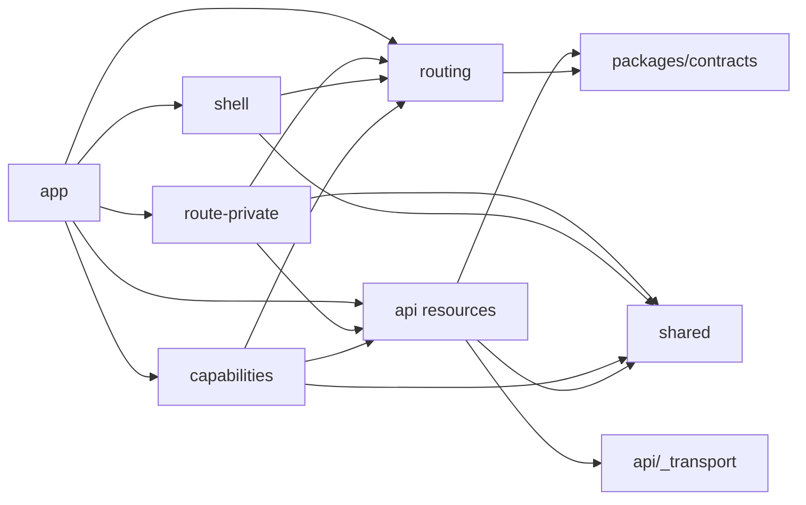

# 프론트엔드 애플리케이션 기반

이 문서는 [ADR 0023](../adr/0023-nextjs-web-modular-boundaries.md)을 `apps/web`에서 적용하는 장기
구현 규칙이다. 제품 화면의 질문과 우선순위는 product 문서가, HTTP wire는 `packages/contracts`가,
업무 불변식은 `packages/domain`과 Server가 소유한다.

## 1. 모듈과 의존 방향

```text
app             Next route lifecycle과 composition
route-private   한 segment의 presentation model, UI와 interactive leaf
shell           providers, navigation, application chrome
capabilities    재사용 사용자 intent와 orchestration
api             contract-backed resource request와 Query Options
routing         반복되는 동적 Next 화면 URL builder
shared          generic config/lib/UI
```

브라우저 generic hook은 `shared/lib/hooks/`에, generic helper는 `shared/lib/`에, 그 외 hook은 소비하는
route-private 또는 capability 내부에 둔다. 스타터 잔재 `hooks/`와 `lib/`는 삭제 전용 ledger로만 남고 새 파일을
받지 않는다. legacy route-private module(`app/dashboard`, `app/welcome`, `app/s`)도 canonical 층에서 import하지
않는다.



다이어그램은 내부 project edge다. shell provider와 API Query Options처럼 해당 책임에 필요한 승인된 외부
toolkit은 layer가 직접 import할 수 있다.

shell은 capability를 import하지 않는다. capability는 서로의 내부를 import하지 않고 API resource public
entry를 통해 공유 server state를 사용한다. API resource끼리도 직접 결합하지 않으며 여러 resource가
필요한 업무 흐름은 capability 또는 명시적 Nest aggregate endpoint가 조합한다.

`index.ts`는 client-safe cross-slice API만 내보내고 RSC internal-origin 접근은 별도 `server.ts`에서
내보낸다. 같은 slice 내부 구현은 실제 파일을 직접 import한다. 큰 barrel에서 UI, server-only code와
client code를 한꺼번에 재수출하지 않는다.

route는 metadata, RSC read/prefetch와 shell model 주입에 한해 resource `server.ts`를 직접 사용한다.
shell은 endpoint를 읽지 않고 상위 layout에서 받은 serializable session/workspace view만 렌더링한다. header
control과 sidebar 계정 허브는 상위 layout이 slot으로 주입하며, session 계약이 없는 지금은 legacy `dashboard`
layout만 legacy control을 주입하고 canonical `(workspace)` route에는 계정 허브·로그인·전역 설정이 없다.
한 route에서만 필요한 presentation과 interactive leaf는 segment private `_model`/`_ui`/`_lib`에 둔다.
독립된 사용자 intent, command/permission/feedback lifecycle 또는 여러 resource orchestration이 생길 때만
capability로 승격한다.

## 2. route와 rendering

- `page.tsx`, `layout.tsx`는 async params/searchParams를 await하고 route identity를 계약 schema로
  검증한 뒤 route-local UI 또는 capability public entry를 조합한다.
- Server Component가 기본이다. `'use client'`는 상호작용 leaf에 둔다.
- Server→Client에는 plain serializable wire/presentation data만 전달한다.
- route별 loading/error/not-found를 명시한다. error UI는 retry와 correlation 가능한 오류 표면을 둔다.
- `loading.tsx`는 같은 segment의 화면 전용 `ScreenSkeleton` 하나만 반환한다. 실제 화면과 skeleton은
  동일한 frame과 section 순서를 공유하고, refetch나 mutation 중에는 전체 화면 skeleton으로 되돌리지 않는다.
- Cache Components가 켜져 있으므로 `cookies()`, `headers()`, `params`, `searchParams` 접근은 page 안
  Suspense 경계의 loader component에서만 await한다. root layout과 shell은 static이어야 하며, theme 같은
  첫 paint 속성은 `<head>` inline script가 cookie에서 설정한다. legacy `/dashboard` layout과 공개 `/s/[token]`만
  `export const instant = false`로 검증에서 제외하고 canonical route에는 추가하지 않는다
  ([ADR 0028](../adr/0028-cache-components-and-self-hosted-cache.md)).
- `@slot`은 독립 panel lifecycle이 필요한 경우에만 쓰고 모든 slot에 `default.tsx`를 둔다.
- 무거운 browser-only 지도/chart는 client leaf에서 dynamic import한다. 계산 권위는 chart에 두지 않는다.

## 3. data access

`api/_transport`는 raw `fetch`, response body decode, status와 Problem Details 같은 request/response
transport만 담당한다. 다른 디렉터리는 `fetch`나 `Response.json()`을 직접 호출하지 않는다. resource
module은 승인된 request adapter에 operation descriptor의 path와 schema를 주입한다.

operation descriptor가 method, version, semantic path, request/response/problem schema, implementation owner와
operation ID를 한 번 소유한다. framework-neutral definition에서 Nest adapter/OpenAPI/Web 경로를 파생하고 Web이나 Server source에 canonical `/api/v1/...` literal을
반복하지 않는다. transport는 operation의 validated relative path만 받으며 origin은 browser same-origin 또는
server-only runtime config가 소유한다. repository endpoint lint는 canonical literal, frontend mirror,
operation ID·method/path 중복과 Nest/OpenAPI/Web 파생 경로 drift를 검사하며 Web/Server lint와 CI가 호출한다.

```text
route/capability
  → api/auctions auctionQueries.detail(auctionId)
  → getAuction({ auctionId, signal })
  → api/_transport requestContract(...)
  → unknown JSON
  → auctionV1ResponseSchema.parse(...)
  → cache/presentation
```

- bigint ID는 canonical decimal string 상태로 key, URL과 props를 통과한다.
- `AbortSignal`은 Query function에서 transport의 `fetch`까지 전달한다.
- resource의 raw `fetch`/`Response.json()` 우회는 legacy baseline이 아닌 신규 차단 대상이다.
- malformed 2xx는 contract error, RFC 9457은 typed HTTP error, abort는 사용자 오류 toast 대상이 아니다.
- browser는 same-origin ingress, RSC는 `API_URL` 내부 origin을 쓰되 operation/schema는 같다.
- client-safe `index.ts`와 `server-only`인 `server.ts`를 분리한다.
- Web은 browser-safe contract resource subpath만 import한다. clean checkout dev/typecheck/build와 bundle graph는
  package root, ingestion/generator와 `@eatbid/domain` runtime이 client entry에 들어오지 않음을 증명한다.
- `@eatbid/contracts`의 Node 배포물은 NestJS 소비를 위해 CommonJS로 유지한다. Next가 직접 transpile하는
  `src` export는 중첩 `type=module` 경계로 분리하고 repository gate가 이 조건을 검사한다.
- 같은 endpoint의 query key와 consumer adapter는 API resource가 한 번만 소유한다.
- command adapter/mutation option은 API resource, form·권한·피드백·orchestration은 capability가 소유한다.
- new product Route Handler, unchecked `.json()`, manual public DTO를 금지한다.

## 3.1 Next 화면 route

- `app/` file-system route가 화면 URL 권위다.
- `typedRoutes: true`와 `next typegen && tsc --noEmit`을 clean checkout gate로 실행한다.
- `Link`, router API, `PageProps`, `LayoutProps`, `RouteContext`는 생성 route type을 사용한다.
- one-off 정적 path는 typed literal, 반복되는 동적 path만 `src/routing/<resource>.ts` builder를 사용한다.
- `routing/`은 canonical decimal ID route만 만든다. 복합 문자열 identity를 쓰는 legacy route builder는
  legacy route 옆 `_lib`에 두고 삭제 전용 ledger로 추적한다.
- exhaustive `ROUTES` mirror, route group/parallel slot 이름 노출, placeholder route와 `as Route` cast를 금지한다.
- `/api/**` ingress는 Nest 전용이며 신규 Next Route Handler는 기본 금지한다. Web-owned handler 예외는 별도
  ADR, non-`/api` prefix, ingress rule과 owner contract를 요구한다.
- Server Action은 URL 상수로 모델링하지 않는다. progressive enhancement/RSC invalidation/server-only cookie가
  필요할 때만 같은 resource server entry를 호출하며 Zod I/O, serializable result와 invalidation만 소유한다.

## 4. 상태 선택표

| 상태 | 도구 | 규칙 |
|---|---|---|
| 최초 server read | RSC | 서버에서 병렬로 시작하고 필요한 경계만 stream |
| interactive server state | TanStack Query | API resource Query Options, 명시적 stale/invalidation |
| 공유 가능한 화면 조건 | `nuqs` | URL이 복원·공유 권위 |
| command draft | stable TanStack Form v1 | Zod command contract, 사용자 입력은 기본 empty |
| 짧은 view interaction | React state | hover/open/selection만 |
| app chrome | shell provider | theme/navigation/query client/toaster |
| 깊은 client-owned editor | capability-local Zustand | 실제 반복 update와 수명이 입증될 때만 |

server 사실을 Zustand/localStorage에 복제하지 않는다. 분석 결과를 client에서 새 권위로 계산하지 않고
versioned evidence를 표시용 adapter로 바꾼다.

TanStack Form v2 alpha는 기반 계약이 아니며 stable 전환·persistence·submit intent를 별도 issue에서
검증하기 전 도입하지 않는다. exact version과 React Compiler/Cache Components 정책은
[application-runtime.md](stack/application-runtime.md)가 소유한다.

## 5. UI와 행동 합성

`shared/ui`는 shadcn/Base UI와 Tailwind semantic token을 소유한다. Button은 접근성, 시각 variant와
공통 press motion만 제공한다. 로그인 요구, 권한, command, audit/analytics는 capability component가
Button에 주입한다.

CSS custom property가 runtime design-token 권위다. JSON token source가 필요해질 경우 JSON→CSS 생성과
drift test 없는 이중 관리는 허용하지 않는다. theme selector와 light/dark mode는 shell에서 제공한다.

canonical 업무 route와 기존 dashboard route는 같은 `ApplicationShell`을 사용한다. route별 layout이
사이드바·헤더·테마 제어를 복제하지 않으며, 제품 navigation 항목 추가는 별도 정보 구조 기획으로 남긴다.

QueryClient의 QueryCache/MutationCache는 공통 오류 분류와 telemetry hook을 제공하고, capability는
`meta`로 사용자 toast/무시/inline 처리 정책을 명시한다. 개인정보와 후보값은 telemetry 기본 payload가
아니다.

## 6. migration rule

새 폴더만 만들고 legacy code를 그대로 import하는 것을 완료로 보지 않는다. slice별 완료 조건은 다음과
같다.

1. Server public operation과 Zod request/response 계약이 있다.
2. route identity가 internal decimal string ID를 사용한다.
3. network boundary에서 runtime parse한다.
4. error/empty/stale/unknown과 provenance를 화면에서 구분한다.
5. dependency/size/unchecked-fetch gate와 한국어 테스트를 통과한다.
6. 대체한 retired endpoint, manual DTO, local persistence를 삭제한다.

현재 계약이 없는 market, analysis, work item과 candidate flow는 placeholder endpoint를 만들지 않고
blocked capability로 남긴다. 첫 executable slice인 `/auctions/[auctionId]`는 canonical operation과 Zod
응답 계약, RSC 조회, 화면 전용 loading, 404와 503 경계를 연결했다. 아직 제품 navigation에는 추가하지 않았다.

## 7. quality gate

- import graph: reverse edge, cross-capability/API deep import, API resource 간 import와 source cycle을 거부한다.
- legacy import: 신규 층(`app/(workspace)`, `shell`, `capabilities`, `api`, `shared`, `routing`)은
  `components/hooks/lib/config/types`를 import하지 않는다. 기존 edge는 삭제 전용 fingerprint로만 남는다.
- client 업무 계산: `lib/band.ts`, `deadline.ts`, `mark-rates.ts`, `rate-text.ts`, `school-id.ts`의 export는
  삭제 전용 ledger로 고정하며 Server 계약 응답으로 대체할 때만 지운다.
- transport: network call 위치, client/server entry 분리와 runtime schema parse를 검사한다.
- package graph: browser-safe contract subpath와 clean dev/build를 검사하고 Node/ingestion/domain runtime 유입을 거부한다.
- identity/value: ID `Number` 변환, exact money/rate의 float authority를 거부한다.
- RSC: route-level client component와 non-serializable prop을 검토한다.
- compiler: annotation mode 대상만 opt-in하고 build·행동 회귀 evidence 없이 범위를 넓히지 않는다.
- cache: `next build`가 canonical route의 blocking-prerender 오류를 gate한다. `use cache`는
  `api/<resource>/server.ts` read 함수에만 두고 사용자별·session 데이터에는 쓰지 않는다.
- size: 300줄 초과는 responsibility split 또는 reason/owner/split trigger가 있는 waiver가 필요하다.
- tests: 신규·변경 test name은 한국어다.
- browser: `test:e2e:foundation`은 별도 contract fixture와 Chromium으로 loading stream, exact money,
  404/503, 공통 셸과 reduced motion을 검증한다. fixture 증거를 실제 dev 데이터 증거로 부르지 않는다.
- baseline: 기존 실패 목록은 삭제 방향으로만 변하며 새 위반을 허용하지 않는다.

전체 typecheck/lint/build가 green이 되기 전에는 production-ready라고 표시하지 않는다. 변경 범위의
focused gate와 기존 baseline을 PR evidence에서 분리해 보고한다.
