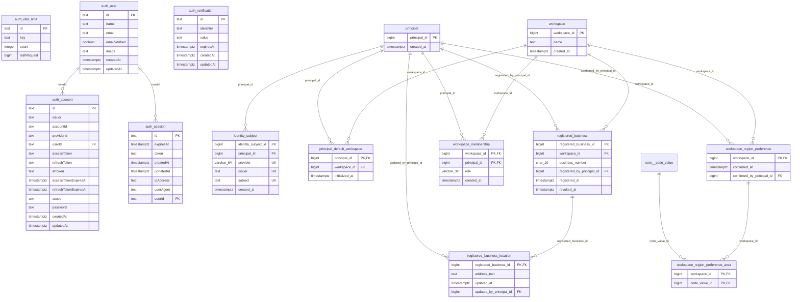

<!-- 생성물이다. 직접 편집하지 않고 `pnpm architecture:erd:write`로 다시 만든다. 원천: packages/db/drizzle/20260915232504_run_workflow_name/snapshot.json -->
# `app` 스키마 ERD

Drizzle 마이그레이션 `20260915232504_run_workflow_name`의 snapshot에서 만든 표·컬럼·외래키 그림이다. 표 14개.
다른 스키마의 표는 관계선에만 `schema__table`로 나타난다. 의미와 불변식은
[domain-and-data.md](../domain-and-data.md)와 [수집 쓰기 지도](../ingestion-write-map.md)가 설명한다.

