<!-- 생성물이다. 직접 편집하지 않고 `pnpm architecture:erd:write`로 다시 만든다. 원천: packages/db/drizzle/20260916012138_backfill_coverage_failed_publications/snapshot.json -->
# `core` 스키마 ERD

Drizzle 마이그레이션 `20260916012138_backfill_coverage_failed_publications`의 snapshot에서 만든 표·컬럼·외래키 그림이다. 표 18개.
다른 스키마의 표는 관계선에만 `schema__table`로 나타난다. 의미와 불변식은
[domain-and-data.md](../domain-and-data.md)와 [수집 쓰기 지도](../ingestion-write-map.md)가 설명한다.

```mermaid
erDiagram
    auction_attempt {
        bigint auction_attempt_id PK
        varchar_64 source_system UK
        text external_bid_id UK
    }
    auction_attempt_link {
        bigint auction_attempt_link_id PK
        bigint auction_revision_id FK, UK
        bigint from_auction_attempt_id FK
        bigint to_auction_attempt_id FK, UK
        varchar_32 relation UK
        text display_bid_no
        bigint source_status_code_value_id FK
        timestamptz bid_opened_from
        timestamptz bid_closed_at
        numeric_18_2 base_amount
        numeric_18_2 planned_amount
        char_3 currency
        bigint observation_id FK
    }
    auction_organization {
        bigint auction_revision_id PK, FK
        bigint organization_id PK, FK
        varchar_32 role PK
    }
    auction_revision {
        bigint auction_revision_id PK, UK
        bigint auction_attempt_id FK, UK
        bigint normalized_record_id FK, UK
        bigint observation_id FK
        char_64 content_sha256
        text display_bid_no
        varchar_64 source_status
        text title
        timestamptz announced_at
        timestamptz deadline_at
        timestamptz opened_at
        numeric_18_2 base_amount
        numeric_18_2 planned_amount
        numeric_6_3 floor_rate
        char_3 currency
        jsonb source_payload
    }
    auction_revision_code_value {
        bigint auction_revision_id PK, FK
        bigint code_value_id PK, FK
        varchar_32 role PK
    }
    award_decision {
        bigint award_decision_id PK
        bigint auction_revision_id FK, UK
        bigint auction_attempt_id FK
        integer awarded_roster_ordinal
        bigint source_supplier_account_id FK
        bigint supplier_party_id FK
        timestamptz awarded_at
        numeric_18_2 awarded_amount
        char_3 currency
        numeric_15_3 awarded_rate
        numeric_15_3 runner_up_rate
        bigint source_status_code_value_id FK
        bigint observation_id FK
    }
    bid_submission {
        bigint bid_submission_id UK
        bigint auction_revision_id FK, UK
        bigint auction_attempt_id FK
        timestamptz opened_at UK
        integer roster_ordinal UK
        bigint source_supplier_account_id FK
        bigint supplier_party_id FK
        timestamptz submitted_at
        numeric_18_2 amount
        numeric_18_2 effective_amount
        char_3 currency
        numeric_15_3 bid_rate
        integer rank
        bigint source_status_code_value_id FK
        bigint withdrawal_code_value_id FK
        text_array draw_numbers
        integer observed_roster_size
        bigint observation_id FK
    }
    code_label_observation {
        bigint code_label_observation_id PK
        bigint code_value_id FK, UK
        text label UK
        varchar_16 language UK
        timestamptz observed_at
        bigint observation_id FK, UK
    }
    code_mapping {
        bigint code_mapping_id PK
        bigint from_code_value_id FK
        bigint to_code_value_id FK
        varchar_32 relation
        timestamptz valid_from
        timestamptz valid_to
        bigint evidence_observation_id FK
        varchar_32 status
    }
    code_release {
        bigint code_release_id PK
        uuid source_release_id FK, UK
        bigint code_scheme_id FK, UK
        varchar_128 source_version
        timestamptz published_at
        text_array promoted_grain
        integer source_row_count
        integer member_count
        integer excluded_row_count
    }
    code_release_member {
        bigint code_release_id PK, FK
        bigint code_value_id PK, FK
        bigint parent_code_value_id FK
        varchar_64 grain
        boolean active
        timestamptz valid_from
        timestamptz valid_to
    }
    code_scheme {
        bigint code_scheme_id PK
        text namespace UK
        varchar_128 owner
        varchar_64 version_policy
        varchar_64 valid_time_policy
    }
    code_value {
        bigint code_value_id PK
        bigint code_scheme_id FK, UK
        text code UK
        timestamptz valid_from
        timestamptz valid_to
        boolean active
    }
    code_value_coordinate {
        bigint code_value_coordinate_id PK
        bigint code_value_id FK, UK
        bigint code_release_id FK, UK
        numeric_9_6 latitude
        numeric_9_6 longitude
        varchar_32 crs
        bigint evidence_observation_id FK
    }
    organization {
        bigint organization_id PK
        varchar_64 type
        text canonical_name
        timestamptz created_at
    }
    organization_identifier {
        bigint organization_identifier_id PK
        bigint organization_id FK
        bigint code_value_id FK, UK
        bigint observation_id FK
    }
    source_supplier_account {
        bigint source_supplier_account_id PK, UK
        bigint supplier_party_id FK, UK
        varchar_64 source_system
        bigint account_code_value_id FK, UK
        bigint observation_id FK
    }
    supplier_party {
        bigint supplier_party_id PK
        varchar_32 type
        text canonical_name
        bigint business_number_code_value_id FK, UK
        timestamptz created_at
    }
    auction_attempt ||--o{ auction_attempt_link : "from_auction_attempt_id"
    auction_attempt ||--o{ auction_attempt_link : "to_auction_attempt_id"
    auction_attempt ||--o{ auction_revision : "auction_attempt_id"
    auction_attempt ||--o{ mart__open_auction_snapshot : "auction_attempt_id"
    auction_attempt ||--o{ mart__org_round_summary : "auction_attempt_id"
    auction_attempt ||--o{ mart__org_round_summary : "supersedes_attempt_id"
    auction_revision ||--o{ auction_attempt_link : "auction_revision_id"
    auction_revision ||--o{ auction_organization : "auction_revision_id"
    auction_revision ||--o{ auction_revision_code_value : "auction_revision_id"
    auction_revision ||--o{ award_decision : "auction_revision_id, auction_attempt_id"
    auction_revision ||--o{ bid_submission : "auction_revision_id, auction_attempt_id"
    auction_revision ||--o{ mart__open_auction_snapshot : "terms_revision_id"
    auction_revision ||--o{ mart__org_round_summary : "auction_revision_id"
    code_release ||--o{ code_release_member : "code_release_id"
    code_release ||--o{ code_value_coordinate : "code_release_id"
    code_release_member ||--o{ code_release_member : "code_release_id, parent_code_value_id"
    code_scheme ||--o{ code_release : "code_scheme_id"
    code_scheme ||--o{ code_value : "code_scheme_id"
    code_value ||--o{ app__workspace_region_preference_area : "code_value_id"
    code_value ||--o{ auction_attempt_link : "source_status_code_value_id"
    code_value ||--o{ auction_revision_code_value : "code_value_id"
    code_value ||--o{ award_decision : "source_status_code_value_id"
    code_value ||--o{ bid_submission : "source_status_code_value_id"
    code_value ||--o{ bid_submission : "withdrawal_code_value_id"
    code_value ||--o{ code_label_observation : "code_value_id"
    code_value ||--o{ code_mapping : "from_code_value_id"
    code_value ||--o{ code_mapping : "to_code_value_id"
    code_value ||--o{ code_release_member : "code_value_id"
    code_value ||--o{ code_value_coordinate : "code_value_id"
    code_value ||--o{ mart__build_coverage : "region_code_value_id"
    code_value ||--o{ mart__open_auction_snapshot : "item_code_value_id"
    code_value ||--o{ mart__open_auction_snapshot : "region_sido_code_value_id"
    code_value ||--o{ mart__open_auction_snapshot : "region_sigungu_code_value_id"
    code_value ||--o{ mart__open_auction_snapshot : "source_status_code_value_id"
    code_value ||--o{ mart__org_round_summary : "award_method_code_value_id"
    code_value ||--o{ mart__org_round_summary : "item_code_value_id"
    code_value ||--o{ mart__win_rate_distribution_monthly : "award_method_code_value_id"
    code_value ||--o{ mart__win_rate_distribution_monthly : "item_code_value_id"
    code_value ||--o{ mart__win_rate_distribution_monthly : "region_code_value_id"
    code_value ||--o{ organization_identifier : "code_value_id"
    code_value ||--o{ source_supplier_account : "account_code_value_id"
    code_value ||--o{ supplier_party : "business_number_code_value_id"
    ingest__normalized_record ||--o{ auction_revision : "normalized_record_id"
    ingest__raw_observation ||--o{ auction_attempt_link : "observation_id"
    ingest__raw_observation ||--o{ auction_revision : "observation_id"
    ingest__raw_observation ||--o{ award_decision : "observation_id"
    ingest__raw_observation ||--o{ bid_submission : "observation_id"
    ingest__raw_observation ||--o{ code_label_observation : "observation_id"
    ingest__raw_observation ||--o{ code_mapping : "evidence_observation_id"
    ingest__raw_observation ||--o{ code_value_coordinate : "evidence_observation_id"
    ingest__raw_observation ||--o{ organization_identifier : "observation_id"
    ingest__raw_observation ||--o{ source_supplier_account : "observation_id"
    ingest__source_release ||--o{ code_release : "source_release_id"
    organization ||--o{ auction_organization : "organization_id"
    organization ||--o{ mart__open_auction_snapshot : "organization_id"
    organization ||--o{ mart__org_round_summary : "organization_id"
    organization ||--o{ mart__win_rate_distribution_monthly : "organization_id"
    organization ||--o{ organization_identifier : "organization_id"
    source_supplier_account ||--o{ award_decision : "source_supplier_account_id, supplier_party_id"
    source_supplier_account ||--o{ bid_submission : "source_supplier_account_id, supplier_party_id"
    supplier_party ||--o{ mart__org_round_summary : "winner_supplier_party_id"
    supplier_party ||--o{ source_supplier_account : "supplier_party_id"
```

