<!-- 생성물이다. 직접 편집하지 않고 `pnpm architecture:erd:write`로 다시 만든다. 원천: packages/db/drizzle/20260916182744_implausible_round_values/snapshot.json -->
# `ingest` 스키마 ERD

Drizzle 마이그레이션 `20260916182744_implausible_round_values`의 snapshot에서 만든 표·컬럼·외래키 그림이다. 표 15개.
다른 스키마의 표는 관계선에만 `schema__table`로 나타난다. 의미와 불변식은
[domain-and-data.md](../domain-and-data.md)와 [수집 쓰기 지도](../ingestion-write-map.md)가 설명한다.

```mermaid
erDiagram
    normalization_attempt {
        bigint normalization_attempt_id PK
        uuid run_id FK, UK
        bigint observation_id FK, UK
        varchar_128 parser_version UK
        varchar_16 status
        timestamptz attempted_at
        char_64 schema_fingerprint
        text quarantine_reason
    }
    normalization_attempt_record {
        bigint normalization_attempt_id PK, FK
        bigint normalized_record_id PK, FK
    }
    normalized_record {
        bigint normalized_record_id PK
        bigint observation_id FK, UK
        varchar_64 record_type UK
        text source_entity_id UK
        jsonb normalized_payload
        varchar_128 parser_version UK
        timestamptz normalized_at
    }
    publication {
        uuid publication_id PK
        uuid run_id FK, UK
        varchar_16 status
        timestamptz validated_at
        timestamptz activated_at
        bigint expected_count
        bigint normalized_count
        bigint published_count
        char_64 canonical_fingerprint
        varchar_128 projector_version
    }
    publication_record {
        uuid publication_id PK, FK
        bigint normalized_record_id PK, FK
    }
    raw_blob {
        char_64 content_sha256 PK
        text object_key UK
        bigint byte_length
        varchar_255 content_type
        varchar_64 content_encoding
        timestamptz stored_at
    }
    raw_observation {
        bigint observation_id PK
        uuid run_id FK
        bigint request_unit_id FK
        varchar_64 source
        text endpoint
        jsonb request_params
        timestamptz fetched_at
        bigint http_status
        char_64 content_sha256 FK
    }
    replay_input {
        uuid run_id PK, FK
        bigint observation_id PK, FK
    }
    request_unit {
        bigint request_unit_id PK, UK
        uuid run_id FK, UK
        varchar_64 source UK
        text endpoint UK
        jsonb request_params
        char_64 request_params_hash UK
        bigint expected_count
        bigint observed_count
        integer attempt_count
        varchar_16 status
    }
    run {
        uuid run_id PK
        varchar_32 mode
        varchar_16 status
        varchar_64 build_sha
        varchar_128 parser_version
        text workflow_name
        timestamptz started_at
        timestamptz ended_at
        varchar_64 failure_category
        bigint expected_count
        bigint captured_count
        bigint published_count
    }
    source_hold {
        bigint hold_id PK
        varchar_32 source
        varchar_32 reason
        text detail
        timestamptz held_at
        uuid held_by_run_id
        timestamptz release_after
        timestamptz released_at
    }
    source_release {
        uuid source_release_id PK
        varchar_64 source UK
        varchar_128 release_name UK
        varchar_16 status
        timestamptz as_of
        char_64 manifest_sha256
        timestamptz sealed_at
        varchar_64 failure_category
    }
    source_release_dataset {
        uuid source_release_id PK, FK
        text endpoint
        varchar_128 dataset PK
        varchar_64 record_type
        varchar_128 parser_version
        char_64 schema_fingerprint
        bigint expected_count
        bigint observed_count
        bigint normalized_count
        bigint quarantined_count
        boolean required
    }
    source_release_observation {
        uuid source_release_id PK, FK
        bigint observation_id PK, FK
    }
    source_release_run {
        uuid source_release_id PK, FK
        uuid run_id PK, FK
    }
    normalization_attempt ||--o{ normalization_attempt_record : "normalization_attempt_id"
    normalized_record ||--o{ core__auction_revision : "normalized_record_id"
    normalized_record ||--o{ normalization_attempt_record : "normalized_record_id"
    normalized_record ||--o{ publication_record : "normalized_record_id"
    publication ||--o{ mart__build : "publication_id"
    publication ||--o{ publication_record : "publication_id"
    raw_blob ||--o{ raw_observation : "content_sha256"
    raw_observation ||--o{ core__auction_attempt_link : "observation_id"
    raw_observation ||--o{ core__auction_revision : "observation_id"
    raw_observation ||--o{ core__award_decision : "observation_id"
    raw_observation ||--o{ core__bid_submission : "observation_id"
    raw_observation ||--o{ core__code_label_observation : "observation_id"
    raw_observation ||--o{ core__code_mapping : "evidence_observation_id"
    raw_observation ||--o{ core__code_value_coordinate : "evidence_observation_id"
    raw_observation ||--o{ core__organization_identifier : "observation_id"
    raw_observation ||--o{ core__source_supplier_account : "observation_id"
    raw_observation ||--o{ mart__open_auction_snapshot : "observation_id"
    raw_observation ||--o{ normalization_attempt : "observation_id"
    raw_observation ||--o{ normalized_record : "observation_id"
    raw_observation ||--o{ replay_input : "observation_id"
    raw_observation ||--o{ source_release_observation : "observation_id"
    request_unit ||--o{ raw_observation : "request_unit_id"
    request_unit ||--o{ raw_observation : "request_unit_id, run_id"
    run ||--o{ normalization_attempt : "run_id"
    run ||--o{ publication : "run_id"
    run ||--o{ raw_observation : "run_id"
    run ||--o{ replay_input : "run_id"
    run ||--o{ request_unit : "run_id"
    run ||--o{ source_release_run : "run_id"
    source_release ||--o{ core__code_release : "source_release_id"
    source_release ||--o{ mart__build : "source_release_id"
    source_release ||--o{ source_release_dataset : "source_release_id"
    source_release ||--o{ source_release_observation : "source_release_id"
    source_release ||--o{ source_release_run : "source_release_id"
```

