<!-- 생성물이다. 직접 편집하지 않고 `pnpm architecture:erd:write`로 다시 만든다. 원천: packages/db/drizzle/20260917092744_announcement_change_kind/snapshot.json -->
# `mart` 스키마 ERD

Drizzle 마이그레이션 `20260917092744_announcement_change_kind`의 snapshot에서 만든 표·컬럼·외래키 그림이다. 표 8개.
다른 스키마의 표는 관계선에만 `schema__table`로 나타난다. 의미와 불변식은
[domain-and-data.md](../domain-and-data.md)와 [수집 쓰기 지도](../ingestion-write-map.md)가 설명한다.

```mermaid
erDiagram
    build {
        bigint build_id PK
        varchar_64 mart_name UK
        uuid source_release_id FK, UK
        uuid publication_id FK, UK
        varchar_32 calc_version UK
        varchar_64 builder_version
        varchar_64 region_scheme
        varchar_16 status
        timestamptz as_of
        timestamptz started_at
        timestamptz computed_at
        timestamptz activated_at
        timestamptz superseded_at
        bigint row_count
        timestamptz retain_until
        varchar_64 failure_category
    }
    build_coverage {
        bigint build_id FK, UK
        bigint region_code_value_id FK, UK
        date month_kst UK
        bigint expected_count
        bigint observed_count
        bigint normalized_count
        bigint quarantined_count
        varchar_16 coverage
    }
    build_vocabulary_gap {
        bigint build_id PK, FK
        varchar_128 scheme_namespace PK
        text fragment PK
        bigint row_count
    }
    open_auction_snapshot {
        bigint build_id FK, UK
        bigint open_auction_snapshot_id PK
        bigint auction_attempt_id FK, UK
        timestamptz observed_at UK
        bigint observation_id FK
        bigint organization_id FK
        integer bid_count
        timestamptz source_last_changed_at
        timestamptz closes_at
        timestamptz opens_at
        timestamptz announced_at
        numeric_18_2 base_amount
        char_3 currency
        bigint item_code_value_id FK
        text item_label
        bigint source_status_code_value_id FK
        text source_status_label
        numeric_6_3 floor_rate
        text title
        text display_bid_no
        bigint solo_bid_method_code_value_id FK
        bigint region_sido_code_value_id FK
        bigint region_sigungu_code_value_id FK
        text organization_label
        bigint terms_revision_id FK
    }
    open_auction_snapshot_item {
        bigint open_auction_snapshot_id PK, FK
        bigint item_code_value_id PK, FK
    }
    org_round_summary {
        bigint build_id PK, FK
        bigint auction_attempt_id PK, FK
        bigint auction_revision_id FK
        bigint organization_id FK
        text item_label
        timestamptz announced_at
        timestamptz opened_at
        numeric_6_3 floor_rate
        bigint award_method_code_value_id FK
        numeric_18_2 base_amount
        numeric_18_2 planned_amount
        char_3 currency
        numeric_15_3 awarded_assessment_rate
        numeric_15_3 runner_up_assessment_rate
        numeric_18_2 day_floor_amount
        numeric_9_4 day_floor_bid_rate
        numeric_9_4 awarded_bid_rate
        integer list_count
        integer below_day_floor_count
        integer withdrawn_count
        integer withdrawal_cohort_age_days
        bigint winner_supplier_party_id FK
        bigint supersedes_attempt_id FK
        varchar_16 lineage_status
        date opened_month_kst
        varchar_32 quarantine_reason
    }
    org_round_summary_item {
        bigint build_id PK, FK
        bigint auction_attempt_id PK, FK
        bigint item_code_value_id PK, FK
    }
    win_rate_distribution_monthly {
        bigint build_id FK, UK
        bigint win_rate_distribution_id PK
        varchar_16 scope UK
        bigint region_code_value_id FK, UK
        bigint organization_id FK, UK
        numeric_6_3 floor_rate UK
        bigint award_method_code_value_id FK, UK
        date month_kst UK
        numeric_15_3 bin_lower UK
        numeric_15_3 bin_width
        bigint attempt_count
    }
    build ||--o{ build_coverage : "build_id"
    build ||--o{ build_vocabulary_gap : "build_id"
    build ||--o{ open_auction_snapshot : "build_id"
    build ||--o{ org_round_summary : "build_id"
    build ||--o{ win_rate_distribution_monthly : "build_id"
    core__auction_attempt ||--o{ open_auction_snapshot : "auction_attempt_id"
    core__auction_attempt ||--o{ org_round_summary : "auction_attempt_id"
    core__auction_attempt ||--o{ org_round_summary : "supersedes_attempt_id"
    core__auction_revision ||--o{ open_auction_snapshot : "terms_revision_id"
    core__auction_revision ||--o{ org_round_summary : "auction_revision_id"
    core__code_value ||--o{ build_coverage : "region_code_value_id"
    core__code_value ||--o{ open_auction_snapshot : "item_code_value_id"
    core__code_value ||--o{ open_auction_snapshot : "region_sido_code_value_id"
    core__code_value ||--o{ open_auction_snapshot : "region_sigungu_code_value_id"
    core__code_value ||--o{ open_auction_snapshot : "solo_bid_method_code_value_id"
    core__code_value ||--o{ open_auction_snapshot : "source_status_code_value_id"
    core__code_value ||--o{ open_auction_snapshot_item : "item_code_value_id"
    core__code_value ||--o{ org_round_summary : "award_method_code_value_id"
    core__code_value ||--o{ org_round_summary_item : "item_code_value_id"
    core__code_value ||--o{ win_rate_distribution_monthly : "award_method_code_value_id"
    core__code_value ||--o{ win_rate_distribution_monthly : "region_code_value_id"
    core__organization ||--o{ open_auction_snapshot : "organization_id"
    core__organization ||--o{ org_round_summary : "organization_id"
    core__organization ||--o{ win_rate_distribution_monthly : "organization_id"
    core__supplier_party ||--o{ org_round_summary : "winner_supplier_party_id"
    ingest__publication ||--o{ build : "publication_id"
    ingest__raw_observation ||--o{ open_auction_snapshot : "observation_id"
    ingest__source_release ||--o{ build : "source_release_id"
    open_auction_snapshot ||--o{ open_auction_snapshot_item : "open_auction_snapshot_id"
    org_round_summary ||--o{ org_round_summary_item : "build_id, auction_attempt_id"
```

