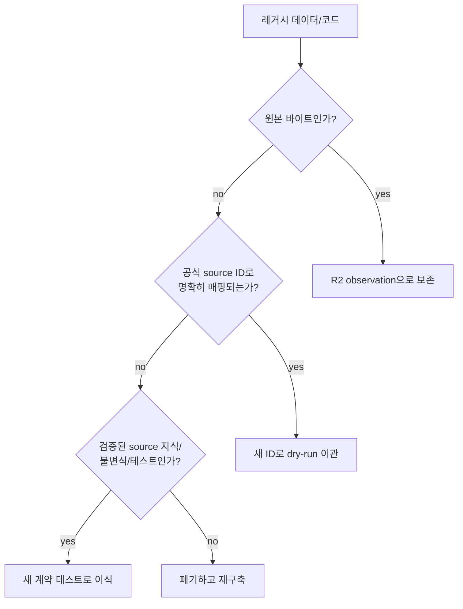

# 레거시 폐기와 전환 경계

## 결정

현재 단계는 완전 초기이므로 목표 모델에 맞지 않는 DB, URL, API, serving table, Parquet lake,
loader, 문자열 ID, Kubernetes CronJob을 호환 계층으로 끌고 가지 않는다. 새 기반을 만든 뒤
검증된 데이터만 명시적으로 다시 적재한다.

이 문서는 당장 파일을 삭제하라는 명령이 아니라, 구현 전환에서 무엇을 자산으로 인정할지 정한다.

## 반드시 보존

| 자산 | 보존 방식 |
|---|---|
| 수집한 원본 XML/응답 | content hash를 계산해 R2 raw observation으로 이관 |
| 검증된 source endpoint/parameter knowledge | dataplane adapter 계약 테스트와 운영 문서로 이관 |
| 원본 필드의 검증된 식별자/불변식 | Pydantic 모델, DB constraint, fixture/golden test로 이관 |
| source fixture와 재현 가능한 실패 사례 | 민감정보 제거 후 test fixture로 보존 |
| 제품 조사·사용자 흐름·분석 요구 | 새 product/quality 및 모듈 문서에 반영 |
| 명확히 source ID에 매핑되는 사용자 소유 상태 | dry-run/report/승인 가능한 migration으로 이관 |

## 기본 폐기

- `"{시군구}|{학교명}"` 등 이름/주소/라벨 복합 키
- 레거시 DB PK를 외부 정체성으로 간주하는 로직
- SIDO/SIGUNGU와 PDLC의 직접 비교
- 주소/기관명/공고번호 문자열 파싱으로 정부 코드를 재생성하는 로직
- 현재 URL 구조를 유지하기 위한 alias/translation layer
- 수기로 관리하는 `infra/k8s/base/schema.sql`과 운영 `db:push`
- Parquet를 canonical truth로 삼는 lake/loader/serving 이중화
- crawler Kubernetes CronJob과 hostPath/SQLite/shared JSON 단계 계약
- master 테이블에 붙인 분석 JSON, `won` boolean 같은 손실 축약
- 재입찰을 공고번호 접미사로 추론하는 코드
- 초대형 root module과 경계를 넘는 직접 DB 수정

## 데이터별 판정

이름이 우연히 같은 것은 “명확히 매핑”이 아니다. source identifier, 충분한 보조 필드,
충돌 0의 검증 보고서가 있어야 한다. 모호한 사용자 상태는 자동 이관하지 않고 사용자에게
확인받거나 보존용 export로 남긴다.

## 전환 게이트

### Gate 1 — 원본과 코드 기반

- raw inventory와 content hash 완료
- source identifiers/code schemes 등록
- archive-before-parse 및 replay 검증
- 문자열 복합키 없는 새 `core` 최소 모델 구축

### Gate 2 — canonical shadow build

- 동일 범위를 새 pipeline으로 backfill
- `TOT_CNT`, 공고/revision/기관/업체/결과 불변식 대조
- quarantine와 미지원 코드가 숫자로 설명됨
- 레거시와 차이가 raw observation까지 추적됨

### Gate 3 — 제품 read cutover

- Server가 새 `core`/`mart`만 읽음
- URL과 API가 내부 ID/새 계약 사용
- 핵심 분석이 sample/as_of/version을 제공
- freshness와 query 성능 목표 검증

### Gate 4 — 사용자 state cutover

- workspace/supplier/auction grain migration dry-run 보고서 승인
- 모호한 레코드 격리/사용자 확인
- backup 및 rollback point 확보
- Server write가 새 `app`만 사용

### Gate 5 — 레거시 제거

- 새 workflow가 두 정기 주기 이상 완전성 검증 통과
- restore/replay drill 통과
- 레거시 reader/writer/scheduler가 0임을 검색과 런타임으로 확인
- 그 뒤 별도 변경에서 old table/file/job을 제거

## 금지하는 전환 방식

- dual-write를 장기간 정상 구조로 유지
- 새 내부 ID 대신 옛 문자열 key를 숨겨서 계속 사용
- backfill과 정기 poll이 다른 parser/정규화 경로를 사용
- 데이터 차이를 이유 없이 “레거시가 맞다” 또는 “신규가 맞다”고 가정
- rollback이라는 이름으로 새 모델에 옛 스키마를 영구 내장

## 저장소 통합

Python `eat-bid` 저장소의 살아 있는 수집 지식과 필요한 이력은 `apps/dataplane`으로 흡수한다.
JavaScript/TypeScript는 pnpm/Turborepo, Python은 `uv`/`pyproject.toml`/`uv.lock`을 사용하되
CI와 image tag는 한 Git SHA에 묶는다. 두 저장소가 같은 업무 사실을 각각 소유하는 상태를 끝낸다.
