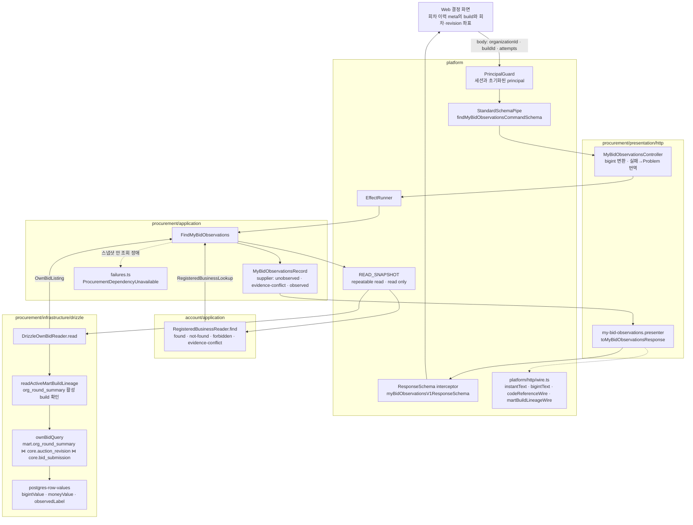

# 내 투찰 관측 조회 흐름

`myBidObservationV1Operations.findMyBidObservations`(`POST`, route `me/businesses/{businessId}/bid-observations`)
한 요청이 어느 모듈의 어느 계층과 port를 지나는지 한 장으로 적는다. ADR 0045가 정한 자리(presenter, infrastructure
장식자, 모듈 공통 실패)를 실제 흐름에서 확인하기 위한 그림이며, 이 흐름의 모듈 경계 재편은 EAT-152의 비목표였다.
권위는 코드와 [ADR 0045](../adr/0045-server-module-presentation-seam.md), 명단 증거 규칙은 ADR 0041, 계정·워크스페이스
규칙은 ADR 0032이고 이 그림은 설명을 보조한다.

## 한 요청의 경로

## 판정과 공개 상태

| use case 판정 | 내부 실패 | HTTP | Problem code |
|---|---|---|---|
| 등록 사업자가 없음 | `RegisteredBusinessNotFound`(account) | 404 | `NOT_FOUND` |
| 다른 워크스페이스의 등록 | `RegisteredBusinessForbidden`(account) | 403 | `FORBIDDEN` |
| 지정한 build가 더 이상 활성이 아님 | `OwnBidBuildChanged` | 409 | `CONFLICT` |
| 회차·revision 조합이 그 build·기관의 요약에 없음 | `OwnBidAttemptsNotInBuild` | 400 | `VALIDATION_ERROR` |
| 스냅샷 안 조회 장애 | `ProcurementDependencyUnavailable` | 503 | `DEPENDENCY_UNAVAILABLE` |

성공 응답의 `supplier`는 `unobserved`·`evidence-conflict`·`observed` 셋이며 `observed`일 때만 회차별 결과
(`submitted`·`absent-from-roster`·`roster-not-observed`·`evidence-conflict`)가 실린다. 대조가 안 된 사업자에게도
build와 회차 조합은 확인하므로 응답 status가 대조 상태를 알려 주는 통로가 되지 않는다. 명단 상한
(`procurement/domain/roster-limits.ts`)을 넘긴 회차는 다른 회차를 막지 않고 그 회차만 `evidence-conflict`로 격리된다.

## 경계 메모

- 한 읽기 스냅샷에서 account port와 procurement port를 함께 부르는 이유는 권한 판정과 사실 조회가 서로 다른
  시점을 보면 방금 회수된 등록의 기록을 돌려주거나 방금 이어진 party를 미연결로 말하게 되기 때문이다.
- procurement가 account의 application port(`RegisteredBusinessReader`)와 실패 클래스를 import하는 것은 모듈
  public application interface 사용이라 허용된다(ADR 0016). account의 presentation·infrastructure는 넘지 않는다.
- use case는 `MyBidObservationsRecord`(bigint·Temporal·도메인 값)만 돌려주고 십진 문자열·wire 봉투는 presenter가
  `platform/http/wire.ts`로 만든다. 응답 키 순서는 interceptor의 Zod parse가 스키마 순서로 정한다.
- 이 흐름의 모듈 경계를 다시 볼 계기는 두 번째 개인 조회가 같은 스냅샷 규칙(권한 판정 + 사실 조회)을 필요로
  할 때다. 그때 스냅샷 안 대조를 공용 application 서비스로 뽑을지 판단한다.
