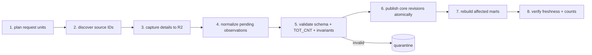

# 런타임·Argo·배포·운영

## 1. 책임 분리

> **Argo CD는 원하는 배포 상태를 맞추고, Argo Workflows는 데이터 작업을 실행한다.**

Argo CD가 crawler를 직접 실행하거나 CronJob을 관리하는 것을 데이터 오케스트레이션으로
간주하지 않는다. 목표 상태에서는 Kubernetes CronJob, 애플리케이션 내부 scheduler,
Argo Workflows가 같은 수집을 중복 예약하지 않는다.

## 2. 수집 workflow



`marts`(7)는 `WorkflowTemplate`의 실제 task이며 `project` 뒤에 붙고 CLI `build-marts`를 부른다.
mutex는 `eatbid-core-publication`이 아니라 **`eatbid-mart-build`**다. 같은 mutex를 쓰면 mart 빌드가
다음 수집의 발행을 막아 소스 관측이 늦어지는데, mart는 파생물이라 stale이 정상 상태다(ADR 0011).
`replay`도 core를 다시 앉히므로 `replay-pipeline` DAG가 같은 task를 뒤에 잇는다.

web 읽기 캐시 무효화는 **새 pod도 새 task도 아니다**. `project`가 발행을 끝낸 뒤, `build-marts`가
활성 포인터를 옮긴 뒤 그 프로세스가 직접 web ClusterIP Service(`EATBID_WEB_INTERNAL_URL`, 기본
`http://web`)의 `POST /internal/cache/revalidate`를 부른다(ADR 0036). 무효화 시점을 아는 것은 새 사실을
방금 공개한 그 프로세스이고, 그 판단을 workflow YAML로 옮기면 같은 판단이 두 곳에 산다.
실패는 발행·빌드를 실패시키지 않고 JSON 한 줄(`event: "cache-revalidate-failed"`)로만 남으며, 화면은
`cacheLife` 상한(최대 1시간) 안에서 스스로 회복한다. 요청은 터널·Ingress를 지나지 않고, 밖에서 온
`/internal` 요청은 Traefik `ipAllowList` middleware가 403으로 닫는다.

정부 코드 reference 적재는 같은 `WorkflowTemplate`의 별도 entrypoint `reference-pipeline`이다
(ADR 0035). DAG는 `capture-reference`(공식 파일 GET → sha256 → R2 → `ingest.raw_observation` →
`source_release` 봉인) → `project-reference`(`core.code_release`·`code_release_member`·`code_value`·
`code_label_observation`·`code_mapping` 투영) 둘이며, source semaphore와 core 발행 mutex를 eaT 수집과
공유한다. 별도 스케줄러·CronJob은 만들지 않는다(AGENTS 9). 같은 파일 sha256이면 release manifest
unique가 두 번째 봉인을 막으므로 재실행이 안전하다.

`verify`(8)는 아직 별도 pod로 만들지 않는다. build의 `verified` 전이가 이미 저장된 행을 다시 세어
`row_count`를 고정하므로 pod 하나를 더 띄우는 값이 증명되지 않았다(AGENTS 11).

하나의 `WorkflowTemplate`과 dataplane 이미지로 다음 모드를 실행한다.

| mode | 목적 | 초기 예약 |
|---|---|---|
| `poll-open` | 열린 공고·변경을 업무시간에 짧은 지연으로 반영 | 약 30분, source 정책에 맞춰 조정 |
| `daily-reconcile` | 전체 상태·변경·개찰·낙찰을 재대조 | 일 1회 |
| `backfill` | 날짜×지역×상태 범위를 수동/운영 승인으로 채움 | ad hoc |
| `replay` | 기존 raw를 새 parser/projector version으로 재해석 | ad hoc |
| `reference` | 정부 공개 코드 파일을 새 code release로 적재 | 월 1회 (`reference-pipeline` entrypoint) |

스케줄은 `CronWorkflow`로 선언하고 실제 네트워크 제한에 맞춰 조정한다. `parser-version` 기본값은
`eat-v2`다(2026-09-06, EAT-69). 상세 응답의 명단·낙찰·재공고 블록을 읽는 version이 그것뿐이라 기본값이
`eat-v1`이면 하한율·투찰·낙찰 core 테이블이 비어 있는 채로 발행된다.

### 2.1 모드가 날짜 창이 되는 곳 (2026-09-04, EAT-34)

`mode`는 WorkflowTemplate parameter에서 `discover` 단계의 `EATBID_WORKFLOW_MODE`를 거쳐 CLI
`eatbid discover --mode`로 그대로 전달된다. 창 번역은 manifest가 아니라
`apps/dataplane/src/eatbid/pipeline/collection_window.py`가 `--as-of`의 서울 날짜로 수행한다.
근거는 [수집 모드별 날짜 창 실측](../evidence/source-boundary/2026-09-03-collection-mode-windows.md)이다.

| mode | `--start-date`/`--end-date` | 출처 |
|---|---|---|
| `poll-open` | 오늘 하루 | CLI가 `--as-of`에서 번역, 인자로 주면 거부 |
| `daily-reconcile` | 오늘-6일 ~ 오늘 | CLI가 `--as-of`에서 번역, 인자로 주면 거부 |
| `backfill` | 사람이 지정 | `argo submit --from workflowtemplate/eatbid-dataplane -p mode=backfill -p start-date=YYYYMMDD -p end-date=YYYYMMDD` |

단계 사이의 정체성은 `discover`가 workflow uid에서 결정적으로 파생해 output parameter로 넘긴다.
`capture`는 `discover`의 `external-bid-id-chunks`로, `normalize`는 확장된 `capture`의
`observation-ids`로 fan-out하고 `validate`·`project`는 detail run 정체성으로 발행한다. CLI
`--result-dir`가 machine result를 파일로 남기므로 workflow는 stdout을 파싱하지 않는다.

### 2.2 backfill 구간 분할 단위와 중복 제거 (2026-09-06, EAT-46)

**과거 구간을 여러 실행으로 나눌 때 한 실행의 창은 달력 월 하나다.** 근거는
[목록이 남긴 네 질문의 실측](../evidence/source-boundary/2026-09-06-list-open-questions.md) §6이다.

창이 입찰기간 겹침 필터라 인접 창은 같은 공고를 다시 돌려주고, `discover`는 창 사이 중복을
제거하지 않으므로 그 겹침이 상세 재호출로 그대로 번진다. 한 공고가 걸리는 창 수의 기댓값은
`1 + 입찰기간 / 분할`이고 실측 입찰기간은 중앙 6일이다.

| 분할 | 공고당 창 수 | 2026-08을 그 분할로 돌 때의 상세 호출 |
|---|---|---|
| 1일 | 7.02 | 약 99,000 |
| 7일 | 1.86 | 약 26,000 |
| 30일 | 1.20 | 16,973 (실측 `TOT_CNT`) |
| 90일 | 1.07 | — |

피크 월의 고유 공고는 약 14,100건이고 30일 창의 `TOT_CNT` 16,973이 이미 그 1.20배다. 같은 달을
주 단위로 쪼개면 26,000건, 하루씩 쪼개면 99,000건의 상세를 부른다.

무릎이 7일과 30일 사이이고 90일로 넓혀 얻는 것은 0.13창뿐인데 실패한 실행이 다시 도는 범위가
3배가 된다. 달력 월은 사람이 재현·추적하기 쉽고 급식 공고가 몰리는 납품 월 경계와 맞으며, 피크
월도 `PAGE_SIZE=1000` 기준 17페이지로 `SOURCE_PAGE_BUDGET`(기본 100) 안이다. 그 page size는 CLI
기본값이 아니라 WorkflowTemplate discover 단계의 `EATBID_DISCOVER_PAGE_SIZE` env가 정하며, 예산과의
곱이 월 창 상한을 덮는지는 `infra/tests/test_workflow_contract.py`가 검사한다.

중복 제거 규칙:

- 중복 제거 키는 숫자 `ETN_BID_ID`다. 표시용 `ETN_BID_NO`의 사슬 기준선으로 합치지 않는다 —
  재공고 차수는 서로 다른 `AuctionAttempt`다(AGENTS 2·4, [ADR 0006](../adr/0006-identifiers-and-code-schemes.md)).
- 한 창 안의 중복은 계약이 막는다. `parse_bid_list_page`가 페이지 안 유일성을, `discover_release`가
  페이지 사이 유일성을 검사하고 위반을 `SOURCE_CONTRACT`로 닫는다.
- 창 사이 중복은 제거하지 않는다. 같은 공고를 새 관측으로 다시 캡처하되 R2가 content hash로 앉히고
  정규화 fingerprint가 같으면 기존 canonical revision을 재사용한다.
- `TOT_CNT` 대조는 창 단위 사실이다. 여러 창을 합친 고유 건수를 `TOT_CNT` 합계와 비교하면 겹침만큼
  항상 어긋나므로 그렇게 검증하지 않는다.

### 2.3 fan-out 단위는 발견 건이 아니라 chunk다 (2026-09-06, EAT-79)

**`capture`와 `normalize`의 pod 하나는 공고 여러 건을 순차로 처리한다.** 근거는
[수집 cutover와 첫 backfill](../evidence/collection/2026-09-06-collection-cutover-first-backfill.md) §6이다.
건당 pod 하나일 때 상세 한 건은 약 17초였고 그중 소스 응답은 약 7초뿐이라 나머지는 pod 생성·wait
컨테이너·종료 비용이었다. 2026-08 한 달 목록이 16,973건이므로 그 구조로는 한 달 백필이 약 80시간,
12개월이 40일이다.

| 값 | 소유자 | 내용 |
|---|---|---|
| chunk 크기 50 | `apps/dataplane/src/eatbid/pipeline/chunk.py` | manifest가 아니라 코드가 갖는다. workflow 인자에 숫자를 두면 매니페스트가 CLI와 별개의 두 번째 설정 원천이 된다 |
| `external-bid-id-chunks` | `discover` output parameter | 봉인된 manifest 순서 그대로 나눈 JSON 배열의 배열. capture가 이것으로 fan-out한다 |
| `observation-ids` | `capture` output parameter | chunk 하나가 실제로 관측한 ID 목록. normalize가 같은 단위를 이어받는다 |
| `--external-bid-ids-json` / `--observation-ids-json` | CLI | chunk는 argv 한 칸의 JSON 배열이다. 모양 검사(비어 있지 않음·고유·양의 숫자)는 인자 단계가 fail-closed로 한다 |

바뀌지 않는 것: 건별 `request_unit`·raw 객체·관측 grain, source semaphore(chunk pod 단위로 잡히므로
소스 동시 호출은 그대로), `parallelism: 4`, `retryStrategy` 부재. 평평한 `external-bid-ids`는 pod 안에
파일로 남지만 output parameter가 아니다. 피크 월이면 아무 단계도 읽지 않는 그 목록만으로 workflow
status가 수백 KB 늘어난다.

## 3. 실행 안전장치

- source 전역 semaphore를 둔다. 초기 capacity는 1이며 관측 후 늘린다.
- canonical publication/projector에는 mutex를 둬 서로 다른 실행의 활성화가 엇갈리지 않게 한다.
- pod는 stateless다. hostPath, 로컬 SQLite, 공유 JSON 파일을 단계 계약으로 쓰지 않는다.
- 각 실행/관측/로그에 `run_id`, correlation ID, Git SHA, image digest, parser/projector version을 남긴다.
- 목록 응답의 `TOT_CNT`와 실제 발견/캡처 건수를 request unit 단위로 정확히 대조한다.
- `PAGE_SIZE` 상한 1000은 소스 정책이 아니라 우리 정책이다. 소스는 5000까지 절단 없이 돌려주며 묶는
  것은 `BID_LIST_MAX_RESPONSE_BYTES`(16 MiB)와 행당 약 1.8 KB, 즉 약 9,300행이다(2026-09-06 실측,
  EAT-46). 1000은 그 한계의 9분의 1이라 여유가 있으므로 유지하되 "소스가 거부한다"로 설명하지 않는다.
- 한 건이라도 조용히 누락되면 성공 처리하지 않는다. failure count가 있으면 비영(0이 아닌) exit다.
- chunk 안의 한 건이 실패해도 그 chunk 전체를 실패로 접지 않는다. 실패한 건만 실패로 기록하고
  나머지는 계속 관측하되, chunk는 반드시 비영 exit로 끝나 DAG가 뒤 단계를 잇지 못한다. 계속
  진행할지는 취향이 아니라 run ledger의 상태가 정한다. `SOURCE_THROTTLED`와 `SOURCE_CONTRACT`는
  그 자리에서 run을 실패로 닫아 뒤의 건이 terminal state로 거부되므로 남은 건을 시도하지 않고,
  `CONFIGURATION`은 애초에 그 건의 문제가 아니다. 계속 도는 것은 응답 자체가 오지 않은
  `TRANSIENT_NETWORK`와 그 관측 하나에 갇힌 `DATA_QUARANTINED`뿐이다. 실패가 범주별로 섞이면
  종료 코드는 먼저 멈춰야 할 범주를 따른다(`SOURCE_THROTTLED` → `CONFIGURATION` →
  `SOURCE_CONTRACT` → `DATA_QUARANTINED` → `TRANSIENT_NETWORK`). 삼킨 실패는 건마다 한 줄 JSON으로
  stderr에 남으며 최종 실패와 같은 비밀값 제거 규칙을 쓴다(2026-09-06, EAT-79).
- retry는 timeout/일시적 네트워크/일시적 5xx만 대상으로 한다. 403, 429, 차단 신호, 계약 위반,
  인증/설정 오류는 무한 재시도하지 않고 명시적으로 중단한다.
- 그 retry는 WorkflowTemplate이 아니라 CLI 프로세스 안에서 한다. `retryStrategy`를 두면 source
  semaphore 밖에서 pod가 늘어나므로, semaphore 안에서 도는 dataplane이 횟수와 총 대기 시간 상한을
  가진 지수 backoff로 직접 다시 보낸다. 응답이 오지 않은 실패만 다시 보내며, 응답이 도착한 뒤의
  전송 중단·decoding 실패·크기 초과는 다시 보내도 같은 결론이라 즉시 중단한다. 상한은 manifest가
  아니라 `SOURCE_RETRY_*` 설정이 소유한다(2026-09-06 backfill 실측, EAT-72).
- backfill은 같은 source semaphore를 공유해 정기 poll을 압도하지 않게 우선순위/동시성을 제한한다.
- `withParam` fan-out 폭은 workflow 전체 `parallelism`으로 클러스터 용량 아래에 묶는다. 발견 건수만큼
  pod를 한꺼번에 띄우면 단일 노드의 pod 상한과 DB 연결을 소진한다(2026-09-05 첫 backfill에서 실측,
  [수집 cutover와 첫 backfill](../evidence/collection/2026-09-06-collection-cutover-first-backfill.md)).
  source semaphore는 소스 보호, `parallelism`은 클러스터 보호이며 서로 대체하지 않는다. fan-out
  단위가 chunk가 된 뒤에도 이 둘은 그대로다(§2.3).
- workflow timeout/retry/schedule 값은 단위가 붙은 config와 명명한 duration factory에서만 만들며,
  calendar 기간과 elapsed timeout을 같은 숫자로 취급하지 않는다.
- run/observation/publication timestamp는 UTC absolute instant로 기록하고 source 지역 시각은 IANA zone을
  명시해 해석한다. container의 local timezone이나 수동 offset에 의미를 맡기지 않는다.

exit category와 exit code:

| category | exit code | 재시도 | replay 적격 | 의미 |
|---|---|---|---|---|
| `TRANSIENT_NETWORK` | 69 | CLI 안에서 이미 소진 | 예 | 응답이 오지 않은 연결/timeout, warmup 5xx |
| `SOURCE_THROTTLED` | 75 | workflow 중단, 운영 확인 | 예 | 429/차단 징후 |
| `SOURCE_CONTRACT` | 76 | 재시도 금지 | 예 | schema/TOT_CNT/불변식 위반, 소진 후에도 남은 endpoint 5xx |
| `DATA_QUARANTINED` | 65 | raw 보존 후 실행 실패 | 예 | 파싱 불가/미지원 코드 |
| `CONFIGURATION` | 64 | 재시도 금지 | 아니오 | secret/endpoint/argument 오류 |

이 표의 category 이름은 프로세스 exit code와 `ingest.run.failure_category`·
`ingest.source_release.failure_category`에 같은 문자열로 남으며, 권위는
`apps/dataplane/src/eatbid/failure_categories.py` 하나다. 실패한 실행을 pod 종료 코드로 보든 run
표로 보든 같은 원인을 읽어야 하므로 예외→category 분류도 그 모듈이 소유한다. 검증 시각 없이 닫힌
실패(`TRANSIENT_NETWORK`·`SOURCE_THROTTLED`·`SOURCE_CONTRACT`·`DATA_QUARANTINED`)는 보존된 raw만
남기므로 `replay`로 복구하며, 이미 검증을 통과한 뒤의 `PROJECTION_CONTRACT`는 얼린 publication을
유지해야 해서 부분 topology를 허용하지 않는다.

`TRANSIENT_NETWORK`가 나왔다는 것은 상한까지 다시 보내고도 응답이 없었다는 뜻이므로 같은 실행을
자동으로 또 돌리지 않는다. endpoint 응답은 status와 무관하게 raw로 보존하므로 재시도 후에도 5xx가
남으면 그 관측을 남기고 `SOURCE_CONTRACT`로 닫는다. 몇 번째 시도에서 응답을 받았는지는 해석이
아니라 관측이라 `ingest.request_unit.attempt_count`(기본값 1)에 남겨 성공한 실행에서도 소스
불안정을 사후에 셀 수 있게 한다.

## 4. 발행 트랜잭션

1. workflow 시작 시 `ingest.run`과 request unit 계획을 만든다.
2. 응답을 R2에 성공적으로 기록한 뒤 observation을 완료한다.
3. normalize 결과는 아직 공개되지 않은 staging 상태로 둔다.
4. completeness와 도메인 불변식을 전부 통과하면 publication ID를 만든다.
5. 짧은 DB transaction에서 core revision과 active publication 포인터를 전환한다.
6. 영향 범위 mart를 새 build ID로 생성·검증한 뒤 active build를 전환한다.
7. 끝에서 source-to-core 지연, 건수, quarantine, mart freshness를 검증한다.

**"영향 범위"는 어느 행을 고칠지가 아니라 어느 mart를 통째로 다시 만들지의 문제다.** 발행이 실은
record type이 그 범위를 정하고(`auction.v1`은 회차 요약만, `auction.v2`는 분포까지, 목록 관측은 오늘
화면만), mart 안에서는 전량을 새 build로 다시 만든다. 행 단위 증분은 "이전 build에서 무엇을
물려받았는가"라는 상태를 하나 더 만들고, 실측이 전량 재빌드를 감당한다
([규모 실측](../evidence/mart/2026-09-06-mart-build-sizing.md), [ADR 0034](../adr/0034-mart-build-identity-and-atomic-activation.md)).

전환은 이전 active를 `superseded`로, 새 `verified`를 `active`로 바꾸는 한 트랜잭션이며 런타임 DDL이
없다. 동시 전환은 두 번째가 partial unique index 위반으로 끊긴다. 활성 build가 아직 없는 상태는
오류가 아니라 빈 목록이다.

실패 실행은 진단을 위해 남지만 현재 공개 상태를 부분적으로 덮어쓰지 않는다. mart 표에 대한 쓰기는
`building` 상태의 build에만 허용되므로 활성 build의 행을 고치는 것이 물리적으로 불가능하다.

## 5. GitOps와 이미지 공급망

```text
GitHub monorepo
  ├─ CI: lint/test/build/migration validation
  ├─ GHCR: web, server, dataplane immutable images
  └─ GitOps manifests: exact image digest + Git SHA
         │
         ▼
      Argo CD
  ├─ platform application: CRDs/controllers/storage primitives
  └─ product application: web/server/migration/workflow templates/schedules
```

- web/server/dataplane은 한 커밋의 Git SHA를 공유한다.
- `BUILD_SHA`는 그 release commit(소문자 hex 40자)이며 64자 hex도 받는다. 세 이미지와 dataplane
  CLI·run ledger가 같은 계약을 쓴다([`ARCH-DELIVERY.md`](../ARCH-DELIVERY.md) §3). 원본 객체
  해시(content sha256)는 의미가 다른 값이므로 64자 계약을 따로 유지한다.
- 환경에서 mutable `latest`를 쓰지 않고 digest로 고정한다.
- migration은 동일 커밋에서 만든 image를 Argo CD Sync hook 또는 동등한 단일 실행 Job으로
  적용하며 timeout과 실패 상태를 가진다.
- 런타임 역할의 권한도 저장소가 소유한다. `infra/product/db-provisioning.sql` 하나가 권위이고
  hook Job이 migration 뒤·앱 앞 sync-wave에서 멱등하게 적용한다. 역할 생성과 비밀번호만 사람 단계로
  남으며, 사람이 psql로 넣은 GRANT는 다음 sync에 이 파일의 상태로 되돌아간다.
- 애플리케이션은 기대 schema migration/version을 시작 시 확인한다.
- **`core.bid_submission`의 연도 파티션을 더하는 것도 migration lane이다.** 개찰 연도 range 파티션은
  운영 작업이 아니라 DDL이므로 `packages/db`의 새 마이그레이션 하나가 `DETACH DEFAULT` → 연도 파티션
  생성 → 행 이동 → `ATTACH DEFAULT`를 한 트랜잭션에서 수행한다. `DEFAULT` 파티션에 해당 연도 행이
  하나라도 있으면 PostgreSQL이 단순 `CREATE TABLE ... PARTITION OF`를 거부하므로 그 순서를 문서가
  아니라 마이그레이션 파일이 소유한다
  ([ADR 0033](../adr/0033-bid-submission-partitioning-and-supplier-core.md) §3). 파티션 자식도 `core`
  스키마의 관계이므로 `infra/product/db-provisioning.sql`의 default privileges가 함께 따라오는지
  같은 변경에서 확인한다.
- Workflow CRD/controller 같은 플랫폼 수명주기와 제품 배포를 별도 Argo CD application으로 둔다.
- 초기에는 Argo Events, 내장 MinIO, 별도 workflow archive DB를 추가하지 않는다.

### 5.1 push에서 배포까지의 연결 (2026-09-02 확정)

```text
main push
  → validate.yml   architecture check · test · build · Playwright (읽기 전용, 발행 권한 없음)

release/v<semver> annotated tag push
  → build.yml preflight   tag가 annotated이고 peel한 commit이 현재 origin/main HEAD인지 확인
  → build.yml test/build  image 4종 build · scan · GHCR push · cosign sign/attest/verify
  → build.yml promote     main을 checkout해 release commit인지 확인한 뒤
                          digest를 infra/product/kustomization.yaml에 커밋하고 main에 push
  → Argo CD               main의 infra/product를 동기화
```

- **코드 권위는 `main`, 발행 권위는 tag다.** ADR 0024대로 GitHub Free에서는 branch를 서버가 보호할 수
  없으므로 `main` push와 수동 실행에는 publication 권한을 주지 않는다. 불변 annotated tag
  `release/v<MAJOR>.<MINOR>.<PATCH>`만 build workflow를 시작한다.
- **배포 대상은 `main`의 `infra/product` 하나다.** `infra/k8s/base`는 product overlay가 참조하는 기반일
  뿐 직접 동기화 대상이 아니다. base만 보면 WorkflowTemplate·CronWorkflow·migration Job·Secret 참조가
  클러스터에 존재하지 않는다.
- annotated tag를 push하면 `github.sha`가 commit이 아니라 tag object일 수 있다. image tag, `GIT_SHA`,
  revision label, SLSA `gitCommit`, promotion guard는 모두 preflight가 peel해 낸 commit 하나를 쓴다.
- promote는 `git push origin HEAD:main` normal push다. tag 발행 뒤 `main`이 움직였다면 preflight 비교나
  non-fast-forward에서 멈추고, promote commit 자체는 tag가 아니므로 다시 빌드를 시작하지 않는다.
- 비밀값은 Infisical이 소유하고 클러스터는 사본을 받는다. `infra/product/secrets.yaml`의 InfisicalSecret이
  경로와 Secret 이름만 선언하며 값은 저장소에 들어가지 않는다. operator 자신의 universal auth 자격증명만
  클러스터에 수동으로 두고 같은 값을 `prod:/platform/kubernetes`에 복구용으로 보관한다.
- repository manifest 변경과 live cluster apply는 서로 다른 단계다. `infra/argocd/application.yaml`을
  커밋해도 클러스터의 Application은 그대로이며, 실제 전환은 별도 승인 뒤 `kubectl apply`로 이뤄진다.
  절차는 [main-authority-cutover.md](../operations/main-authority-cutover.md)를 따른다.

## 6. 배포 토폴로지

초기 운영 환경은 이 PC의 Hyper-V VM `eatbid-k3s`에서 도는 단일 노드 k3s다(EAT-50). Docker Desktop의
k3d는 로그인 세션에 묶여 재부팅마다 클러스터가 죽고 그 동안 Argo CD 배포·Argo Workflows 수집·cloudflared
터널이 전부 멈추므로 운영 클러스터로 쓰지 않는다. VM은 호스트 부팅 시 자동 시작되고 k3s는 systemd
서비스다. 생성·부트스트랩·데이터 이전·cutover 절차는 [k3s-hyperv-vm.md](../operations/k3s-hyperv-vm.md)를
따른다. 이 구성은 노드 장애를 견디는 HA가 아니며, 별도 머신으로 갈 때는 VM 이미지를 그대로 옮긴다.

초기 배포 구성:

- `web` Deployment/Service
- `server` Deployment/Service
- `dataplane`은 Argo Workflow pod로만 실행
- PostgreSQL StatefulSet + 명시적 PVC 용량/retention
- R2 외부 bucket
- Argo Workflows controller; UI/server는 기본 비공개 또는 운영자만 접근
- Cloudflare tunnel/ingress는 web/server의 필요한 경로만 공개

Argo Workflows UI, PostgreSQL, metrics endpoint는 공용 인터넷에 직접 노출하지 않는다.

## 7. 보안

- 현재 비밀값·버전·접근권한·회전 상태는 Infisical만 권위가 된다. Git에는 값이 아닌 key 계약과
  `SecretStore`/`ExternalSecret` 참조만 둔다. Kubernetes 전달은 ADR 0022의 Kubernetes Auth와
  External Secrets Operator 경계를 따른다.
- source credential, R2 credential, DB role별 credential을 분리하고 최소 권한을 적용한다.
- workflow service account는 필요한 Workflow/Secret/DB/R2 권한만 가진다.
- API는 workspace와 supplier 소유권을 모든 command/query에서 검증한다.
- 로그에 사업자등록번호, credential, 전체 source payload를 기록하지 않는다.
- raw bucket은 lifecycle/retention 변경을 운영 승인 대상으로 하고 삭제 권한을 일반 ingestor에서 뺀다.

## 8. 관측성과 운영

처음부터 구조화 JSON 로그와 run/correlation ID를 사용한다. 최소 지표:

- source request/response count, latency, status
- expected `TOT_CNT` 대비 discovered/captured/published count
- raw write failure, parser failure, quarantine by reason/schema fingerprint
- source-to-raw, raw-to-core, core-to-mart 지연
- workflow duration/retry/failure category
- active publication/build age
- DB storage, connection, slow query, R2 write/read error

초기에는 로그와 PostgreSQL run ledger로 시작할 수 있다. 운영 규모가 생기면 OpenTelemetry
Collector, Prometheus/Grafana/Loki를 추가한다. 제품 경로에 특정 관측 벤더 SDK를 직접 결합하지 않는다.

## 9. 백업과 복구

- R2 raw: versioning/retention을 사용하고 content hash로 무결성을 검사한다.
- PostgreSQL: 정기 full backup과 WAL/증분 전략을 R2 또는 독립 backup 위치에 둔다.
- `app` 사용자 상태는 raw로 재생성할 수 없으므로 최우선 복구 대상이다.
- `core`는 raw+version으로 재구성 가능하지만 복구시간 단축을 위해 DB backup에도 포함한다.
- `mart`는 DB 복구 후 재생성 가능하다.
- restore drill은 새 namespace/임시 DB에서 수행하고 실제 query/count/freshness 검증까지 완료한다.

초기 복구 목표는 **사용자 상태 RPO 1시간 이내, 핵심 서비스 RTO 4시간 이내**로 두되,
현재 단일 노드 환경에서 WAL 보관이 준비되기 전에는 달성 보장이 아닌 목표로 표시한다.

## 10. 도입 순서와 보류 스택

지금 도입:

- Argo Workflows, R2 raw, PostgreSQL, Drizzle migrations
- Python `uv`, Pydantic, Ruff, Pyright, pytest
- 구조화 로그, `pg_trgm`, Infisical 로컬 주입 계약, run/correlation ID
- Kubernetes Auth + External Secrets Operator는 실제 workload 전환 issue에서 도입

측정 후 도입:

- CloudNativePG 또는 managed PostgreSQL
- OpenTelemetry Collector + Prometheus/Grafana/Loki
- 복잡한 mart가 충분히 늘어난 뒤 dbt
- 읽기 병목 뒤 read replica
- PostgreSQL로 감당하기 어려운 반복 scan/외부 소비자가 증명된 뒤 Parquet export

현재 도입하지 않음:

- Kafka, Redis/Celery, Airflow/Dagster
- Elasticsearch/OpenSearch, ClickHouse
- Spark, Iceberg/Delta, canonical Parquet lake
- 마이크로서비스, service mesh, Argo Events

## 11. 현재 실행 가능 경계

Task 13에서 production `run_foundation_slice` composition과 실제 psycopg repository를 통해 한
`bid-detail-one.xml`의 `start/plan → capture/archive → observation → normalize → validate/freeze →
project → replay`가 자동 검증된다. transport 대역은 `MemoryRawObjectStore`와 fake `SourceClient`지만
parser, schema contract, publication, projector, replay는 production 구현을 그대로 호출한다. 같은 raw와
`eat-v1` replay는 새 run/publication에서 원 observation을 참조하고 같은 canonical fingerprint와 기존
canonical revision을 재사용한다.

이 capability는 아직 외부 실행기가 아니다. eaT list/detail HTTP transport, live R2 adapter wiring,
stage별 PostgreSQL ledger를 여는 CLI composition은 Task 14 범위다. 현재 여섯 CLI command는 placeholder
exit 64이며 WorkflowTemplate을 실행 성공 상태로 만들 수 없다. 따라서 product WorkflowTemplate과 두
CronWorkflow는 **dormant**이고 두 schedule은 계속 `spec.suspend: true`다. live source/R2 호출, image
publish, Workflow submit, Argo CD sync, schedule resume는 Task 14 구현·오프라인 gate와 별도 사용자 승인
전에는 실행하지 않는다. 오프라인 fixture capability와 외부 execution evidence의 판정은
[data-foundation-gate.md](../operations/data-foundation-gate.md)를 따른다.
