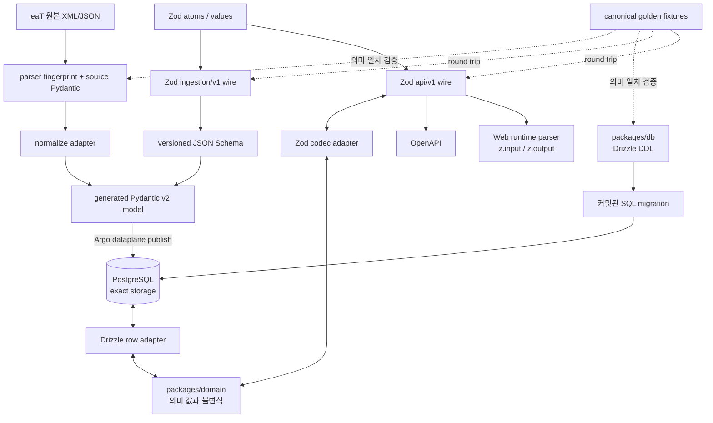

# 시간·정량 값·Zod 계약

이 문서는 [ADR 0021](../adr/0021-zod-portable-contract-hub.md)을 구현 가능한 경계로
풀어쓴다. 목표는 `string`과 `number`를 없애는 것이 아니라, **업무 의미와 단위가 지워진 원시값이
계층을 통과하지 못하게 하는 것**이다.

## 1. 하나의 진실 원천이 뜻하는 것

여기서 SSOT는 모든 계층을 한 schema 파일로 생성한다는 뜻이 아니다. **같은 질문에 답하는
권위가 둘이면 안 된다는 뜻**이다. canonical interchange와 공개 API JSON은 Zod, 업무 값의 의미와
불변식은 domain, 물리 DB 형식은 Drizzle, eaT 원본 응답 형식은 reviewed parser contract와 known-column
source Pydantic이 각각 하나의 권위를
가진다. 한 계층의 모델을 다른 계층에 그대로 노출하지 않고 명명한 adapter에서 변환한다.



| 질문 | 유일한 권위 | 여기서 파생되는 것 | 여기서 파생하지 않는 것 |
|---|---|---|---|
| eaT가 실제로 보낸 모양은 무엇인가? | raw evidence + reviewed parser/fingerprint + known-column Pydantic | normalized input | interchange/API DTO, DDL |
| Python과 TypeScript가 교환하는 canonical JSON은 무엇인가? | Zod `ingestion/v1`·`ingestion/v2` wire schema | JSON Schema, generated Pydantic model | source parsing, DDL |
| 금액·비율·시간의 업무 의미는 무엇인가? | `packages/domain` | 불변식과 명명된 변환 | JSON field 이름, DB column |
| 어떤 API JSON을 공개하고 받는가? | Zod `api/v1` wire schema | `z.input`/`z.output`, OpenAPI, web parser | DDL |
| 어떻게 정확히 저장하는가? | `packages/db` Drizzle schema | SQL migration, row type | HTTP response |

쌍방향 화살표는 생성 관계가 아니라 명시적 encode/decode 경계다. OpenAPI나 Zod에서 DDL을 만들지
않고 Drizzle row를 HTTP DTO로 사용하지 않는다. source parser/Pydantic은 독립 권위지만 normalized Pydantic은
Zod JSON Schema에서 생성한다. 각 권위 사이의 의미 보존은 canonical fixture와 integration test로
증명한다.

### 계약을 바꿀 때 시작할 곳

- normalized interchange field·null 의미·범위를 바꾸면 Zod `ingestion/v1`부터 바꾸고 JSON Schema와
  generated Pydantic model을 재생성한다.
- 공개 API JSON을 바꾸면 Zod `api/v1`부터 바꾸고 OpenAPI와 web 소비자 계약을 갱신한다.
- `BidRate`와 `FloorRate`를 섞을 수 없는 것처럼 업무 의미를 바꾸면 domain부터 바꾸고 codec과
  integration test로 전파한다.
- `numeric` precision, index, foreign key처럼 저장 제약을 바꾸면 Drizzle과 migration부터 바꾼다.
- eaT XML field나 원본 해석 규칙을 바꾸면 parser fingerprint, source Pydantic과 normalize adapter부터 바꾼다.

이 규칙 덕분에 한 변경이 어디서 시작되어야 하는지 결정할 수 있고, AI 세션이 편의상 controller,
DB row, crawler model에 같은 interface를 복사하는 것을 막는다.

## 2. 최종 파일 구조

```text
packages/domain/src/
├─ time/
│  ├─ temporal.ts
│  ├─ clock.ts
│  ├─ elapsed-duration.ts
│  └─ instant-text.ts
├─ numeric/
│  ├─ canonical-decimal.ts
│  ├─ money.ts
│  ├─ quantities.ts
│  └─ rates.ts
└─ geo/
   └─ coordinate.ts

packages/contracts/src/
├─ atoms/
│  ├─ decimal.ts
│  ├─ geo.ts
│  ├─ identifier.ts
│  ├─ instant.ts
│  └─ source-code.ts
├─ values/
│  ├─ money.ts
│  ├─ rate.ts
│  ├─ coordinate.ts
│  └─ provenance.ts
├─ resources/procurement/
│  ├─ identity.ts
│  ├─ schedule.ts
│  └─ pricing.ts
├─ ingestion/v1/
├─ ingestion/v2/
│  └─ resources/            # bid-roster · bid-submission · award-decision
│                           # · auction-terms · reserve-price-draw · attempt-link
├─ api/v1/
├─ codecs/
└─ portable-registry.ts

packages/contracts/generated/
├─ ingestion-v1.schema.json
└─ ingestion-v2.schema.json

apps/dataplane/src/eatbid/generated/
├─ ingestion_v1.py
└─ ingestion_v2.py
```

`ingestion/v2`는 v1을 고친 것이 아니라 별도 root다. v1 root에 필드를 더하면 optional이어도 재직렬화가
새 키를 내보내 봉인된 canonical payload가 전부 불일치가 되기 때문이다(ADR 0025). 두 계약을 가르는 것은
`parser_version`이고 reviewed source schema fingerprint는 `required` 부분집합으로 계산해 v1·v2가 같다
([ADR 0029](../adr/0029-eat-v2-bid-list-contract.md)).

승인된 공개 응답에 restriction 필드가 아직 없으므로 public `resources/procurement/restrictions.ts`는
의도적으로 만들지 않는다. source ingestion의 별도 제한 정보가 곧바로 공개 lifecycle 계약이 되지는 않는다.

`index.ts`는 export만 한다. 포맷, 계산, validation, DB mapping을 한 파일에 모으지 않는다.

## 3. 시간 모델

| 의미 | 내부 타입 | wire | DB | 금지되는 대체 |
|---|---|---|---|---|
| 관측/공고/제출의 절대 시점 | `Temporal.Instant` | UTC ISO 8601 `...Z` | `timestamptz` | timezone 없는 문자열, `Date` |
| 영업일·개찰일·납품일 | `Temporal.PlainDate` | `YYYY-MM-DD` | `date` | UTC 자정 `Date` |
| 서울 기준 일정 표현 | `Temporal.ZonedDateTime` | instant + 명시된 zone | `timestamptz` + 정책상 zone | 수동 `+9h` |
| 달력 기간 | `Temporal.Duration` | ISO duration 또는 bounded fields | 목적별 | 고정 30일을 한 달로 취급 |
| timeout/retry/drain | `ElapsedMilliseconds` | 단위가 붙은 config field | 목적별 | 일반 `number` |

`Clock`은 `now(): Temporal.Instant`만 제공한다. 시스템 구현 한 곳만 `Temporal.Now.instant()`를
호출하고 test clock은 고정 Instant를 반환한다. source adapter는 `Asia/Seoul` IANA zone으로 입력을
해석한다. absolute timestamp를 표시할 때만 사용자의 zone으로 바꾸며 저장 의미를 바꾸지 않는다.

## 4. 금액·비율·출처 코드

### 금액

```json
{ "amount": "123456789.00", "currency": "KRW" }
```

- `amount`는 부호·지수 표기·천 단위 구분자가 없는 canonical nonnegative decimal string이다.
- 1차 source 계약은 `KRW`만 허용한다. 다른 currency는 source와 scale 정책을 추가한 뒤 연다.
- PostgreSQL `numeric`과 Python `Decimal`이 계산한다. TypeScript는 exact string을 비교·전달하고,
  실제 업무 산술이 필요해질 때 별도 ADR로 decimal engine을 선택한다.
- 원본 `BID_CALC_AMT` 같은 관측 금액을 다른 금액×비율로 복원하지 않는다.

### 비율

| 타입 | 예 | 범위/의미 |
|---|---:|---|
| `PercentagePoints` | `90.125000` | 100을 기준으로 한 표시 단위 |
| `Ratio` | `0.901250` | 1을 기준으로 한 계산 단위 |
| `FloorRate` | `88.745000` | source가 제공한 낙찰하한 퍼센트포인트 |
| `BidRate` | `90.123000` | source가 관측한 투찰 퍼센트포인트 |
| `SharePercent` | `42.500000` | 0..100 점유율 |

`BidRate`와 `FloorRate`는 같은 표현이라도 서로 다른 업무 사실이다. `PercentagePoints ↔ Ratio`
변환은 명명한 함수만 허용한다. source 범위 밖 값은 raw에서 삭제하지 않고 validation/quarantine 상태로
남긴다. `double precision`은 canonical rate DDL에 사용하지 않는다.

#### wire 비율 계약 다섯이 나뉘어 있는 이유

`packages/contracts/src/values/rate.ts`의 다섯은 표현이 겹쳐도 범위와 소비자가 다르다. 하나로
합치면 좁은 계약이 넓은 관측을 격리하거나, 넓은 계약이 공개 응답의 범위 보장을 잃는다.

| wire 계약 | 정밀도·범위 | 지금 쓰는 곳 | 왜 따로 두나 |
|---|---|---|---|
| `PercentagePoints` | 소수 6자리, 0~100 | 공개 API 응답의 일반 비율 | 표시 단위의 기본형 |
| `Ratio` | 소수 6자리, 0~1 | 아직 자원 필드 소비자가 없다. 경계 테스트만 고정한다 | `PercentagePoints`의 계산 단위 짝. 0~1로 닫힌 계약이 필요할 때 새로 만들지 않게 자리를 지킨다 |
| `BidRate` | 소수 3자리, 0~100 | ingestion v2 `terms.floorRate`, api/v1 회차 응답의 낙찰률·2등·그날 하한 | mart `numeric(6,3)`과 같은 정밀도. 하한율과 공개 낙찰률은 정의상 100을 넘지 않는다 |
| `ObservedBidRate` | 소수 3자리, 정수부 최대 12자리, **상한 없음** | ingestion v2 `submission.bidRate`, `award.awardedRate`, `award.runnerUpRate` | `SAJEONG_PCT`는 예정가격 대비 소스 계산값이라 100을 넘고 단가 입찰에서는 훨씬 크게 튄다. 상한을 두면 관측을 격리하게 된다(규칙 3) |
| `ReservePriceRatio` | 소수 6자리, 0~9.999999 | ingestion v2 `reservePriceDraw` 후보의 `ratio` | `CMNM_PLNPRC_RT`는 0~1 비율이 아니라 기초금액 대비 배율이라 1을 넘는 관측이 있다 |

`ObservedBidRate`의 **DB 표현은 `numeric(15,3)`이다**(`core`와 `mart` 모두). `numeric(6,3)`에 들어가지
않으므로 [ADR 0033](../adr/0033-bid-submission-partitioning-and-supplier-core.md) §2가 정했고
`core.bid_submission.bid_rate`·`core.award_decision.awarded_rate`·`runner_up_rate`가 그 열이다.
공개 API가 계속 `BidRate`인 이유는 낙찰 행의 사정률이 100을 넘는 공고가
전수에서 0건이기 때문이며, 그 관측 근거는
[2026-09-04 전수 재정규화 리포트](../evidence/normalization/2026-09-04-eat-v2-renormalization.md)
(계산 버전 `eat-v2-r3`)다.

### 출처 코드 값

외부 코드는 `SourceCodedValue`로 수신한다. 권위는 `(source_system, code_scheme, code)` 세 값이고
`label`은 사람이 코드의 의미를 확인할 **증거**다. 라벨로 조인하거나 라벨을 상태로 승격하지 않으며,
라벨이 비어 오는 코드가 있으므로 nullable이다(규칙 2·3).

`normalizedSupplierAccount.sourceSystem`도 같은 규칙을 따른다. 계정 코드와 사업자번호는 각각
`SourceCodedValue`로 관측 그대로 보존되고, 어느 쪽도 내부 정체성이 아니다. `SupplierParty`로의 승격은
projector가 별도 정책으로 한다(`domain-and-data.md` §3.3).

ingestion v2가 지금 싣는 code scheme은 여덟이다. namespace는 `<source>:<kebab-case 의미>`이며 소스
column명은 정체성이 아니라 "지금 어디서 관측하는가"를 적은 메타데이터다. 문자열과 column 짝의 단일
권위는 `apps/dataplane/src/eatbid/source/eat/code_schemes.py`이고 아래가 그 표 전부다.

| code scheme | 원본 column | 파서 |
|---|---|---|
| `eat:bid-status` | `ds_bidList.BID_STT` (라벨 `BID_STT_NM`) | `source/eat/roster.py` |
| `eat:withdrawal-flag` | `ds_bidList.WITHDRAWAL_YN` | `source/eat/roster.py` |
| `eat:supplier-account` | `ds_bidList.SHIPPER_CD` (라벨 `SHIPPER_NM`) | `source/eat/roster.py` |
| `eat:business-number` | `ds_bidList.BIZ_NO` | `source/eat/roster.py` |
| `eat:planned-price-type` | `ds_info.PLNPRC_TYPE_CD` (라벨 `PLNPRCE_TYPE_NM`) | `source/eat/auction_terms.py` |
| `eat:award-method` | `ds_info.SUCBID_DCSN_MTH_CD` (라벨 `SUCBD_DECISION_MTHD_NM`) | `source/eat/auction_terms.py` |
| `eat:reserve-price-selection-flag` | `ds_pList.CHC_YN` | `source/eat/reserve_price.py` |
| `eat:attempt-status` | `ds_bidHistory.ETN_BID_STT` (라벨 `ETN_BID_STT_NM`) | `source/eat/lineage.py` |

낙찰 방식은 `SUCBD_DECISION_MTHD`가 아니라 `SUCBID_DCSN_MTH_CD`다. 앞 이름은 `ds_bidList`·
`ds_bidHistory`에만 있고 `ds_info`에는 없으며, `SUCBD_DECISION_MTHD_NM`은 라벨이지 코드가 아니다.
`eat:reserve-price-selection-flag`는 그 회차 추첨에 뽑힌 복수예정가격 후보를 표시하며, 회차마다 정확히
4행이 `Y`이고 그 넷의 평균이 예정가격이라는 전수 관측이 근거다
([2026-09-02 기전 판정](../experiments/2026-09-02-mechanism-verdict.md)).
`eat:attempt-status`는 투찰이 아니라 공고 시도 하나의 상태다. 실측 값이 007 낙찰·009 유찰·003
입찰공고라 grain이 `AuctionAttempt`이며(규칙 4), 지금은 재입찰 사슬 블록에서만 관측되지만 그 블록은
관측 위치이지 정체성이 아니다. 투찰 한 건의 판정인 `eat:bid-status`와 묶지 않는다.

이 여덟의 `CodeScheme` 등록(소유기관·버전·유효기간)은 `packages/db/src/seeds/code-schemes.ts`가 갖고,
두 목록이 같은지는 `apps/dataplane/tests/unit/test_code_schemes.py`와 같은 이름의 시드 테스트가
양방향으로 고정한다. 서로 다른 scheme을 매핑 없이 같다고 보지 않는다(규칙 6).

## 5. 수량·용량·합성 단위

- ID와 DB count/byte length는 `bigint`로 읽는다. Drizzle `mode: "number"`를 사용하지 않는다.
- safe integer가 계약으로 증명되는 page size, HTTP status, UI 표본 수만 bounded number를 허용한다.
- `ExpectedRecordCount`, `CapturedRecordCount`, `PublishedRecordCount`는 completeness 정책에서 이름과
  grain을 유지한다. 일반 `Count` 하나로 모든 값을 교환하지 않는다.
- `ByteLength`와 `PayloadByteLimit`은 별도 타입이다.
- `AwardsPerSupplierYear`, `AuctionsPerYear`, `WonAmountPerPeriod`처럼 분자/분모/기간이 있는 값은 그
  전체 의미를 타입·필드명·Zod metadata에 기록한다.

## 6. 좌표

```json
{
  "latitude": 37.566500,
  "longitude": 126.978000,
  "crs": "EPSG:4326"
}
```

latitude/longitude는 finite number와 법정 범위를 검증한다. 좌표만으로 기관 정체성을 만들지 않고,
기관 또는 지역 코드에 대한 `GeoPointObservation`이 source, method, observedAt, accuracy/resolution
상태를 가진다. 66개 좌표 누락은 이 계약과 provenance를 만든 뒤 별도 enrichment/backfill workflow로
해결한다. 임시 이름 lookup 결과를 `core`에 직접 채우지 않는다.

## 7. Zod 계약 규율

- `packages/contracts`의 interchange/public schema는 `z.strictObject`와 explicit bound를 사용한다.
- `z.infer`/`z.input`/`z.output`만 TypeScript wire type을 만든다.
- JSON은 identity/schedule/pricing/restrictions/provenance의 중첩 resource로 구성한다. 최종 DTO마다
  `.shape` spread를 반복하지 않는다.
- 같은 contract family는 `.pick()`/`.omit()`/`.safeExtend()`로 조립한다. ingestion/request/response/
  DB row 사이에는 `.pick()`을 사용하지 않는다. `z.intersection()`은 object DTO 조립에 사용하지 않는다.
- pagination/version처럼 반복되는 envelope만 작은 local generic factory로 만든다. 별도 contract
  framework와 Immer를 schema composition에 사용하지 않는다.
- domain conversion이 필요한 값은 `wireSchema` 옆에 `z.codec(wireSchema, domainSchema, ... )`를
  두되 OpenAPI에는 wire schema를 전달한다.
- response도 parse/encode 검증을 통과해야 하며 controller가 수동 object spread로 internal field를
  누락시키는 방식에 의존하지 않는다.
- Zod metadata의 description은 단위, scale, timezone/CRS, null 의미를 설명한다.
- nullable은 unknown, not-applicable, not-yet-observed를 한 값으로 숨기지 않는다. 업무상 구분이
  필요하면 discriminated union을 사용한다.
- portable registry는 JSON Schema로 표현 가능한 기능만 허용한다. versioned JSON Schema와 generated
  Pydantic model은 커밋하고 CI 재생성 diff로 drift를 차단한다.
- 각 entry는 `definePortableContract({ id, recordType, contractVersion, payloadSchema })`가 최종
  `contractVersion` literal wire schema와 언어 중립 manifest를 만든다. Python normalizer/projector는 생성
  상수/dispatch를 사용하며 같은 version/record-type literal을 다시 작성하지 않는다.

### 한 값이 API를 통과하는 실제 흐름

공고 기초금액을 조회하는 경우를 예로 들면 다음 순서를 지킨다.

1. Drizzle adapter가 PostgreSQL `numeric`을 부동소수점으로 바꾸지 않고 canonical decimal
   string으로 읽는다.
2. adapter가 `Money` factory에 amount와 `KRW`를 전달한다. 여기서 domain 불변식을 통과하지
   못하면 use case로 값이 들어가지 않는다.
3. use case는 `Money`를 다루며 DB row나 HTTP object의 shape를 알지 못한다.
4. response codec이 `Money`를 `{ "amount": "123456789.00", "currency": "KRW" }`로 encode한다.
5. controller는 Zod response schema로 최종 출력을 검증한다. OpenAPI와 web parser도 바로 이 wire
   schema를 사용한다.

입력은 이 순서의 역방향이다. `schema.parse`만 통과한 원시 object를 application에 넘기지 않고,
codec의 decode가 domain factory까지 통과해야 유효한 입력이다. 반대로 DB row를 controller가 직접
반환하거나 type assertion으로 검증을 생략하는 것도 금지한다. `AuctionRecord`는 application 내부 port,
공개 wire는 Zod에서 추론한 `AuctionV1Response`다. 제거한 TypeScript-only `AuctionResponse`는 import할 수
없어야 하며 compile-time consumer fixture가 그 API surface를 고정한다.

### 이름 붙은 시간·DB adapter

- `packages/domain/src/time/clock.ts`의 exported top-level `systemClock`만 `Temporal.Now.instant()`를 호출한다.
- `apps/server/src/modules/procurement/infrastructure/drizzle/drizzle-auction-reader.ts`의 `AuctionRow`만
  PostgreSQL driver `Date | string`을 받고, top-level `postgresInstant`가 즉시 Temporal로 닫으며
  `mapAuctionRow`가 semantic `AuctionRecord`를 만든다.
- 위 경로와 symbol 이름은 exact exception이다. 디렉터리·substring·새 adapter 일반 예외가 아니다.

## 8. 정적 품질 gate와 예외

`tools/architecture/check-semantic-values.mjs`와 Python 동등 gate는 다음을 검사한다.

- 허용된 adapter 밖의 `Date`, ambient clock, Day.js/date-fns/Moment/Luxon import
- raw numeric timer argument와 단위 없는 timeout/interval/TTL constant
- canonical money/rate column의 floating-point DDL
- DB bigint의 JavaScript number mapping
- Zod 외부에 중복 작성한 public wire interface
- 사람이 중복 작성한 normalized Pydantic model과 generated contract drift
- portable registry의 codec/transform/overwrite/runtime custom predicate
- registry 밖에 반복한 ingestion `recordType`/`contractVersion` dispatch literal
- naive Python datetime과 float money/rate normalization

portable registry file과 exported const top-level `portableContracts` root는 필수다. registry entry에서
도달 가능한 schema graph는 호출한 schema factory body/return까지 검사한다. 따라서 alias나 조건부
branch/factory에 숨긴 codec·transform/overwrite·runtime custom predicate도 실패한다. Zod/schema origin을 증명해
동명이인 일반 `transform` helper를 오탐하지 않으며, registry 밖 adjacent codec이 guarded output을 위해
쓰는 `z.custom`까지 전역 금지하지는 않는다.

TypeScript gate는 `globalThis.Date`, namespace Temporal, `window` timer와 use-site 이전 assignment alias까지
compiler symbol로 추적한다. Python gate는 lexical scope와 사용 순서를 보존하고 local re-export를 따라가며
`builtins.float`, nested money/rate conversion, naive `utcfromtimestamp`, 실제 `timedelta.total_seconds()`를
구분한다. HTTP public boundary의 exported manual type/interface는 이름 suffix와 무관하게 금지하고 Zod
inferred type만 허용한다.

레거시 예외 ledger는 exact repository path, AST node kind, normalized node text SHA-256, 이유, 제거 gate와
동일 fingerprint의 multiplicity를 고정한다. line number만 기록해 이동으로 우회하지 않고 감소/삭제만
허용하며 추가·text drift·동일 node 복제를 거부한다. 신규 server/domain/contracts/db/dataplane에는 일반
예외를 허용하지 않는다.

CI와 로컬의 권위 명령은 다음과 같다.

```text
pnpm architecture:check
pnpm test:quality
pnpm contracts:check
pnpm contracts:python:check
```

두 contract check는 임시 생성물과 커밋 artifact를 비교할 뿐 추적 파일을 쓰지 않는다. CRLF/LF는
logical comparison에서 정규화한다. CI의 hosted Ubuntu publication lane과 hosted `windows-latest`
portability lane은 모두 pnpm/uv frozen install을 먼저 마친 뒤 drift gate를 실행하며 image build는 두
lane에 의존한다.

## 9. 단계적 전환

1. `packages/domain`과 Zod atom/value/resource, ingestion/API wire 계약을 만든다.
2. ingestion JSON Schema와 deterministic generated Pydantic lane, golden round trip을 만든다.
3. 신규 server의 config/shutdown/logging/auction read를 Clock·Temporal·semantic value로 전환한다.
4. `packages/db` bigint mapping과 canonical numeric 정책을 고친다.
5. dataplane의 source time/Decimal/count 변환을 generated model과 동일 fixture로 검증한다.
6. 정적 gate로 현재 상태를 동결하고 CI에 연결한다.
7. frontend는 ADR 0023의 domain gateway에서 public wire를 runtime parse하고 canonical vertical slice별로
   legacy 화면을 교체한다.

Web의 `present-*` chart/map adapter가 일시적으로 number를 필요로 하면 근사 presentation value임을
명시하고 canonical 판단, query key 또는 command payload에는 재사용하지 않는다.
누락 좌표를 이름 lookup으로 canonical 위치에 채우는 것도 이 단계의 범위가 아니며, CRS/provenance
계약을 소비하는 별도 Argo enrichment/backfill이 필요하다.
