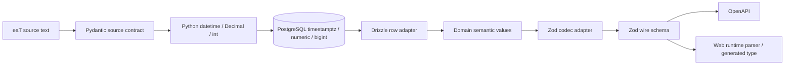

# 시간·정량 값·Zod 계약

이 문서는 [ADR 0020](../adr/0020-semantic-values-temporal-zod-contracts.md)을 구현 가능한 경계로
풀어쓴다. 목표는 `string`과 `number`를 없애는 것이 아니라, **업무 의미와 단위가 지워진 원시값이
계층을 통과하지 못하게 하는 것**이다.

## 1. 권위와 derivation 방향



화살표는 파생·변환 방향이다. OpenAPI나 Zod에서 DDL을 만들지 않고, Drizzle row를 HTTP DTO로
사용하지 않으며, Pydantic을 TypeScript에서 생성하지 않는다. 동일성을 주장하는 대신 canonical
fixture와 integration test로 각 변환이 같은 의미를 유지하는지 증명한다.

## 2. 목표 파일 구조

```text
packages/domain/src/
├─ time/
│  ├─ temporal.ts
│  ├─ clock.ts
│  ├─ elapsed-duration.ts
│  └─ instant-text.ts
├─ decimal/
│  └─ canonical-decimal.ts
├─ money/
│  ├─ currency.ts
│  └─ money.ts
├─ rate/
│  ├─ percentage-points.ts
│  └─ ratio.ts
├─ quantity/
│  ├─ count.ts
│  └─ byte-length.ts
└─ geo/
   ├─ coordinate.ts
   └─ distance.ts

packages/contracts/src/primitives/
├─ time.ts
├─ money.ts
├─ rate.ts
├─ quantity.ts
└─ geo.ts
```

`index.ts`는 export만 한다. 포맷, 계산, validation, DB mapping을 한 파일에 모으지 않는다.

## 3. 시간 모델

| 의미 | 내부 타입 | wire | DB | 금지되는 대체 |
|---|---|---|---|---|
| 관측/공고/제출의 절대 시점 | `Temporal.Instant` | UTC ISO 8601 `...Z` | `timestamptz` | timezone 없는 문자열, `Date` |
| 영업일·개찰일·납품일 | `Temporal.PlainDate` | `YYYY-MM-DD` | `date` | UTC 자정 `Date` |
| 서울 기준 일정 표현 | `Temporal.ZonedDateTime` | instant + 명시된 zone | `timestamptz` + 정책상 zone | 수동 `+9h` |
| 달력 기간 | `Temporal.Duration` | ISO duration 또는 bounded fields | 목적별 | 고정 30일을 한 달로 취급 |
| timeout/retry/drain | `ElapsedMilliseconds` | 단위가 붙은 config field | 목적별 | 일반 `number` |

`Clock`은 `now(): Temporal.Instant`만 제공한다. 시스템 구현 한 곳만 `Temporal.Now.instant()`를
호출하고 test clock은 고정 Instant를 반환한다. source adapter는 `Asia/Seoul` IANA zone으로 입력을
해석한다. absolute timestamp를 표시할 때만 사용자의 zone으로 바꾸며 저장 의미를 바꾸지 않는다.

## 4. 금액과 비율

### 금액

```json
{ "amount": "123456789.00", "currency": "KRW" }
```

- `amount`는 부호·지수 표기·천 단위 구분자가 없는 canonical nonnegative decimal string이다.
- 1차 source 계약은 `KRW`만 허용한다. 다른 currency는 source와 scale 정책을 추가한 뒤 연다.
- PostgreSQL `numeric`과 Python `Decimal`이 계산한다. TypeScript는 exact string을 비교·전달하고,
  실제 업무 산술이 필요해질 때 별도 ADR로 decimal engine을 선택한다.
- 원본 `BID_CALC_AMT` 같은 관측 금액을 다른 금액×비율로 복원하지 않는다.

### 비율

| 타입 | 예 | 범위/의미 |
|---|---:|---|
| `PercentagePoints` | `90.125000` | 100을 기준으로 한 표시 단위 |
| `Ratio` | `0.901250` | 1을 기준으로 한 계산 단위 |
| `FloorRate` | `88.745000` | source가 제공한 낙찰하한 퍼센트포인트 |
| `BidRate` | `90.123000` | source가 관측한 투찰 퍼센트포인트 |
| `SharePercent` | `42.500000` | 0..100 점유율 |

`BidRate`와 `FloorRate`는 같은 표현이라도 서로 다른 업무 사실이다. `PercentagePoints ↔ Ratio`
변환은 명명한 함수만 허용한다. source 범위 밖 값은 raw에서 삭제하지 않고 validation/quarantine 상태로
남긴다. `double precision`은 canonical rate DDL에 사용하지 않는다.

## 5. 수량·용량·합성 단위

- ID와 DB count/byte length는 `bigint`로 읽는다. Drizzle `mode: "number"`를 사용하지 않는다.
- safe integer가 계약으로 증명되는 page size, HTTP status, UI 표본 수만 bounded number를 허용한다.
- `ExpectedRecordCount`, `CapturedRecordCount`, `PublishedRecordCount`는 completeness 정책에서 이름과
  grain을 유지한다. 일반 `Count` 하나로 모든 값을 교환하지 않는다.
- `ByteLength`와 `PayloadByteLimit`은 별도 타입이다.
- `AwardsPerSupplierYear`, `AuctionsPerYear`, `WonAmountPerPeriod`처럼 분자/분모/기간이 있는 값은 그
  전체 의미를 타입·필드명·Zod metadata에 기록한다.

## 6. 좌표

```json
{
  "latitude": 37.566500,
  "longitude": 126.978000,
  "crs": "EPSG:4326"
}
```

latitude/longitude는 finite number와 법정 범위를 검증한다. 좌표만으로 기관 정체성을 만들지 않고,
기관 또는 지역 코드에 대한 `GeoPointObservation`이 source, method, observedAt, accuracy/resolution
상태를 가진다. 66개 좌표 누락은 이 계약과 provenance를 만든 뒤 별도 enrichment/backfill workflow로
해결한다. 임시 이름 lookup 결과를 `core`에 직접 채우지 않는다.

## 7. Zod 계약 규율

- `packages/contracts`의 public schema는 `z.strictObject`와 explicit bound를 사용한다.
- `z.infer`/`z.input`/`z.output`만 public TypeScript wire type을 만든다.
- domain conversion이 필요한 값은 `wireSchema` 옆에 `z.codec(wireSchema, domainSchema, ... )`를
  두되 OpenAPI에는 wire schema를 전달한다.
- response도 parse/encode 검증을 통과해야 하며 controller가 수동 object spread로 internal field를
  누락시키는 방식에 의존하지 않는다.
- Zod metadata의 description은 단위, scale, timezone/CRS, null 의미를 설명한다.
- nullable은 unknown, not-applicable, not-yet-observed를 한 값으로 숨기지 않는다. 업무상 구분이
  필요하면 discriminated union을 사용한다.

## 8. 정적 품질 gate와 예외

`tools/architecture/check-semantic-values.mjs`와 Python 동등 gate는 다음을 검사한다.

- 허용된 adapter 밖의 `Date`, ambient clock, Day.js/date-fns/Moment/Luxon import
- raw numeric timer argument와 단위 없는 timeout/interval/TTL constant
- canonical money/rate column의 floating-point DDL
- DB bigint의 JavaScript number mapping
- Zod 외부에 중복 작성한 public wire interface
- naive Python datetime과 float money/rate normalization

레거시 예외 ledger는 파일·구문·이유·제거 gate를 고정한다. line number만 기록해 이동으로 우회하지
않고 AST fingerprint로 재생성/감소를 검증한다. 신규 server/domain/contracts/db/dataplane에는 일반
예외를 허용하지 않는다.

## 9. 단계적 전환

1. `packages/domain`과 primitive Zod wire 계약, golden fixture를 만든다.
2. 신규 server의 config/shutdown/logging/auction read를 Clock·Temporal·semantic value로 전환한다.
3. `packages/db` bigint mapping과 canonical numeric 정책을 고친다.
4. dataplane의 source time/Decimal/count 변환을 동일 fixture로 검증한다.
5. 정적 gate로 현재 상태를 동결하고 CI에 연결한다.
6. frontend는 사용자와 기능/정보 구조를 합의한 뒤 wire 계약 소비자로 전환한다.

frontend cutover 전에도 새 backend 계약은 단위를 잃지 않는다. web chart/map adapter가 일시적으로
number를 필요로 하면 근사 presentation value임을 명시하고 canonical 판단에는 재사용하지 않는다.
