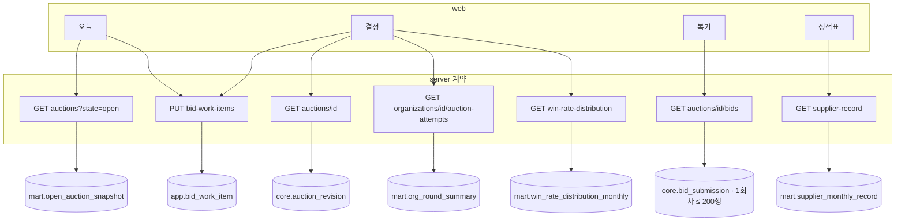

# 투찰 결정 화면 v2 — 재료·적재·아키텍처

작성 2026-09-04. 근거: `docs/architecture/domain-and-data.md`, `c4.md`, `runtime-and-deployment.md`, `packages/db/src/schema`, `docs/experiments/2026-09-01-data-inventory.md`, `docs/ARCH-DATA.md` 1-6·§9, 2026-09-04 03:15 KST 클러스터 실측.

## 0. 한 문장

화면 넷(오늘·결정·복기·성적표)이 필요로 하는 재료의 대부분은 **원본에 있지만 아직 적재되지 않는다.** 상세 응답 309개 필드 중 14개만 정규화되고, 명단 블록 `ds_bidList`·예비가격 `ds_pList`는 읽지 않으며, `core`에 투찰 행 테이블이 없고 `mart` 테이블은 하나도 없다. 화면 계약(EAT-37~40)보다 **적재 경로 세 단계**가 먼저다.

## 1. 화면별 재료

원본 블록 이름은 eaT 상세 응답의 Nexacro dataset id다. `채움률`은 2026-09-02 전수 재고조사(233,382건) 기준.

| 화면 요소 | 재료 | 원본 (블록.컬럼) | 입도 | 채움률 | 적재 목적지 | 계산 위치 |
| -- | -- | -- | -- | -- | -- | -- |
| 헤더·배너 | 기관명·소재지·품목·하한율·기초금액·공고/마감/개찰 시각·정정 차수 | `ds_info.PURR_NM SIDO_CD SIGUNGU_CD MAIN_ITEMS BGNG_PRC PBANC_YMD BID_END_DT OPNG_DT`, 하한율·차수는 미독 컬럼 | 공고 revision | 13개는 100%, 하한율·차수 미확인 | `core.auction_revision` (+코드값) | 없음 |
| 배너 참여 수 | 마감 전 참여 수 추이 | 목록 `ds_list.BID_CNT LAST_CHG_DT` (EAT-34) | 공고 × 관측 시각 | 목록 38컬럼 중 2개만 파싱 중 | `ingest.raw_observation` → `mart.open_auction_snapshot` | poll-open 실행마다 |
| 흐름·과거 회차 | 회차별 낙찰률·2등가·그날 하한·명단 수·무효 수·낙찰 업체·재공고 관계 | `ds_bidList.*`(투찰률·상태·사업자), `ds_pList`(추첨 예비가격), `ds_bidHistory`(3.28%) | 회차(AuctionAttempt) | **미독** | `core.bid_submission`, `core.award_decision`, `core.supplier_party` → `mart.org_round_summary` | publish 뒤 mart 빌드 |
| 호가창(비교집단) | 모집단 × 품목 × 하한율 × 월 × 0.01칸 낙찰 횟수, 표본, 최빈 구간 | `core.award_decision` 집계 | 월 × 칸 | — | `mart.win_rate_distribution_monthly` | publish 뒤 mart 빌드 |
| 그날 하한 | 회차별 무효 상단(원본 판정 `status`), 명단 내 자리 | `ds_bidList` 판정 컬럼 | 회차 | 미독 | `core.bid_submission` | 없음(관측값) |
| rail 이 값이면 | 지난 N회 낙찰됐을 회차, 무효였을 회차, 보통 참여, 낙찰값 위 0.1 안 곳수 | `mart.org_round_summary` + `core.bid_submission` | 회차 | — | 위와 같음 | 요청 시 N ≤ 200행 계산 |
| 업체 탭 | 기관별 반복 참여 업체, 회차별 자리 | `ds_bidList.SHIPPER_CD` ↔ `SupplierParty` | 업체 × 회차 | 미독 | `core.supplier_party`, `core.source_supplier_account` | 요청 시 |
| 오늘 | 열린 공고 목록 + 지금 값이면 무효였을 회차 + 내 기록 | `ds_list` + `mart.org_round_summary` + `app.bid_work_item` | 공고 | 목록 파싱 확장 필요 | `mart.open_auction_snapshot`, `app` | poll-open |
| 성적표·복기 | 사업자번호로 대조한 내 투찰·낙찰·무효·2등 차이, 회차별 결과 | `ds_bidList`(사업자·투찰률·상태) ↔ 워크스페이스 사업자 | 사업자 × 회차, 월 | 미독 | `mart.supplier_monthly_record` | publish 뒤 mart 빌드 |
| 내 값 기록 | 사용자가 적어둔 투찰률·금액·시각 | 사용자 입력 | 워크스페이스 × 회차 | — | `app.bid_work_item` | API 쓰기 |

## 2. 규모 (실측)

| 항목 | 값 | 출처 |
| -- | -- | -- |
| 개찰 완료 공고, 16 시도, 33개월 | 404,396건 · 월 12,254건 | ARCH-DATA 1-6 |
| 5년 공고 | 약 74만 건 | 위에서 환산 |
| 명단 | 공고당 평균 55곳, 중앙 30, p95 197 | 26,000 조사 |
| 투찰 행 5년 | 약 6,700만 행(parquet 실측 공고당 90행 기준) · 492 B/행 · 약 33 GB | ARCH-DATA §9 |
| 현재 서빙 DB(레거시) | 915만 행 · 5.5 GB, 적재 724만→915만 행에 9분→27분(비선형) | ARCH-DATA 1-5 |
| 레이크 raw | 233,382 파일, 마지막 쓰기 2026-08-30 20:21, 백필 잔량 약 17만 | 2026-09-04 실측 |
| mart 예상 | 분포 (모집단 4 × 지역 ~250 × 품목 8 × 하한율 3 × 월 60 × 칸 80) 상한 수백만, 실제 희소 → 수십만 행 | 설계 |

결론: 원본 행 수천만은 PostgreSQL 한 대로 충분하지만 **요청마다 훑으면 안 된다.** 화면이 읽는 집계는 전부 mart다. 원본을 직접 읽는 건 점 조회(공고 1, 기관 1의 회차 ≤ 200, 명단 1의 ≤ 200행)뿐이다. 투찰 행의 연도 파티션은 **속도 근거가 아니라 격리 목적**이다. 연도별 적재·재구축이 서로를 막지 않게 하는 것이며, 레거시 로더의 9분→27분 비선형은 publish 뒤 mart 빌드가 흡수한다.

## 3. 적재 흐름

```mermaid
flowchart LR
  EAT[(eaT ns.eat.co.kr)]
  subgraph DP[dataplane · Argo Workflows]
    CAP[capture<br/>poll-open · daily-reconcile · backfill]
    NORM[normalize<br/>ds_info · ds_list 38열 · ds_bidList · ds_pList]
    VAL[validate<br/>TOT_CNT · fingerprint · 불변식]
    PUB[publish<br/>release manifest 봉인]
    PROJ[project → core]
    MART[mart build<br/>새 build id → 검증 → active 전환]
  end
  R2[(R2 raw<br/>content-addressed xml.gz)]
  subgraph PG[(PostgreSQL)]
    ING[ingest]
    CORE[core<br/>auction_attempt · auction_revision<br/>bid_submission(연도 파티션) · award_decision<br/>supplier_party · organization]
    MARTS[mart<br/>org_round_summary<br/>win_rate_distribution_monthly<br/>supplier_monthly_record<br/>open_auction_snapshot]
    APP[app<br/>bid_work_item]
  end
  API[server · NestJS<br/>packages/contracts operation]
  WEB[web · Next.js]
  EAT -->|목록·상세 HTTP| CAP --> R2
  CAP --> ING
  R2 --> NORM --> VAL --> PUB --> PROJ --> CORE
  PROJ --> MART --> MARTS
  CORE -->|점 조회| API
  MARTS -->|집계 읽기| API
  APP <-->|기록 쓰기·읽기| API
  API -->|Zod 검증 JSON| WEB
```

### 3.1 수집 모드 (EAT-34)

| 모드 | 주기 | 창 | 읽는 것 | 남기는 것 |
| -- | -- | -- | -- | -- |
| poll-open | 평일 30분, 야간·주말 성김 | 오늘 열린 공고 | 목록 `ds_list` 38열 (`BID_CNT`, `LAST_CHG_DT`) | 참여 수 관측, 신규 공고 상세 1회 |
| daily-reconcile | 매일 22:00 | 최근 N일(`LAST_CHG_DT` 분포로 정함) | 변경된 공고 상세, 개찰 결과 | revision, 명단, 예비가격 |
| backfill | 수동 submit | 구간 분할(시도 × 월) | 과거 상세 전량 | 잔량 약 17만 → 전국 100% |

세 모드는 같은 WorkflowTemplate에서 날짜 창만 다르게 돈다(규칙 9). 지금은 `daily-refresh` CronJob이 suspend 상태이고 Argo Workflows CRD가 클러스터에 없어 **어느 모드도 돌지 않는다.**

### 3.2 core에 새로 필요한 테이블

| 테이블 | 키 | 비고 |
| -- | -- | -- |
| `core.bid_submission` | (auction_attempt_id, supplier_party_id) | 투찰률·금액·원본 판정(`낙찰/낙찰실패/하한미달/철회`)·명단 내 순위. **개찰 연도 파티션.** 원본 판정이 권위, 우리 계산으로 덮지 않음 |
| `core.award_decision` | auction_attempt_id | 낙찰 사업자·낙찰률·추첨 예정가격(`ds_pList` 결과 그대로). **그날 하한은 계산하지 않는다.** 화면의 "그날 하한"은 원본이 무효로 판정한 투찰 중 최고값이라는 관측값이다 |
| `core.supplier_party` / `core.source_supplier_account` | 숫자 id / `SHIPPER_CD` | 사업자번호는 대조 키, 식별자 아님 |
| `core.auction_attempt` 관계 | 재공고 차수 | 목록 `ds_list`의 상태·재입찰 표기(EAT-34 다섯 질문)로 잇고 `ds_bidHistory`(채움률 3.28%)는 보조. 확인 전엔 `unknown` |

### 3.3 mart 빌드 규칙

- 빌드는 publish 트랜잭션 뒤 영향 범위만 새 build id로 만들고 검증한 뒤 active를 바꾼다(runtime §4). 화면 응답은 `sourceRelease`·`buildId`·`computedAt`을 싣는다.
- `win_rate_distribution_monthly`: (scope, region_code, item_code, floor_rate, month, bin) → count. 기간 조회는 월 행 합산. 지역 코드는 행안부 체계(규칙 6).
- `org_round_summary`: 회차 1행 요약(낙찰률·2등·그날 하한·명단 수·무효 수·낙찰 업체 id). 흐름·과거 회차·rail이 이것만 읽는다.
- `supplier_monthly_record`: (supplier_party_id, month) → 투찰·낙찰·무효·2등 차이. 성적표. **워크스페이스가 등록한 사업자만 빌드한다.** 명단은 공개 자료지만 집계는 우리가 만든 프로파일이라 타인 것은 mart에도 두지 않는다.
- `open_auction_snapshot`: poll-open마다 교체. 오늘 화면. 목록 계약은 행마다 기관 요약을 **포함**해 한 쿼리로 내고(N+1 금지), 응답에 release·ETag를 붙여 같은 release면 캐시한다. 1,000명 동시 새로고침 부하 실측은 EAT-44 acceptance.
- 진행 중인 달은 build 전환 전까지 `부분`으로 표시하고 `computedAt`을 병기한다. mart는 파생물이라 stale이 정상 상태다(ADR 0011). 겹쳐 보기의 지난 달은 닫힌 달이라 stale이 없다.
- `coverage`: 시도별 보유율을 release manifest에서 계산해 응답에 싣는다. 분모(`TOT_CNT`)는 EAT-34가 끝나야 생기므로 **그 전엔 `unknown`**이다. 백필 완료 전 미완결 지역은 회색.

## 4. 화면별 요청 경로



A2만 구현돼 있다. A1·A3·A4·A5·A6·A7은 EAT-37~40에서 계약부터 만든다.

## 5. 현재와 목표의 격차

| # | 격차 | 있는 것 | 필요한 것 | 담는 이슈 |
| -- | -- | -- | -- | -- |
| 1 | 목록 파싱 | 38열 중 2열 | `BID_CNT`·`LAST_CHG_DT`·`STRPRCE`·상태·마감 | EAT-34 |
| 2 | 수집 실행 | CronJob suspend, Argo Workflows 미설치 | WorkflowTemplate 인자·모드 번역, 백필 재개 | EAT-34, 클러스터 승인은 EAT-16 뒤 |
| 3 | 명단·예비가격 정규화 | `ds_bidList`·`ds_pList` 미독 | reviewed parser + fingerprint + normalized model | EAT-42 |
| 4 | core 투찰 테이블 | 없음 | 3.2의 네 테이블, 연도 파티션 ADR | EAT-43 (ADR 필요) |
| 5 | mart | 스키마만 | 3.3의 네 mart + 빌드/전환 | EAT-44 (ADR 0011 아래) |
| 6 | 계약·화면 | auction find 하나 | A1·A3~A7 | EAT-37~40 |
| 7 | 서버 배포 | 새 ReplicaSet readiness 404, 4.5일째 절반 | health 경로 정합 | EAT-33 |

## 6. 순서

1. EAT-34: 목록 38열 + 모드→날짜 창 + Argo 실행 경로. 백필 재개는 사용자 승인.
2. 명단 정규화(격차 3) + core 테이블·파티션 ADR(4). 실측 26,000 조사와 남산초 92회로 검증.
3. mart 넷(5)과 빌드·전환. 전국 완결 게이트는 여기서 `coverage`로 측정.
4. EAT-36 셸(진행 중) → EAT-37(이력) → EAT-38(분포) → EAT-39(오늘) → EAT-40(성적표).

화면은 2·3과 병행해 fixture로 만들 수 있고, 2·3은 남산초 92회차 같은 **작은 release로 먼저 수직 관통**시킨다. 전국 백필은 출시 게이트이지 개발 게이트가 아니다.

## 7. 미결 (사용자 결정)

- mart 빌드 트리거는 Argo Workflows `marts` 단계인데 CRD가 클러스터에 없다. Argo Workflows 설치 승인(EAT-16 뒤)을 앞당길지, 그 전까지 mart 빌드를 돌리지 않을지. 규칙 9상 CronJob 병존은 안 된다.

## 8. 공방 기록 (2026-09-04)

공격자·수비자 3라운드. 인정·변경 6(파티션 목적과 행 수, coverage 분모, 그날 하한 관측값, 사업자 mart 범위, 재공고 링크 근거, 동시 사용 N+1·캐시), 수비 성공 2(mart stale, 일정), 미결 1(§7). 수집 재개: 2026-09-04 03:58 KST 백필 컨테이너 둘 기동, daily-refresh suspend 해제.
