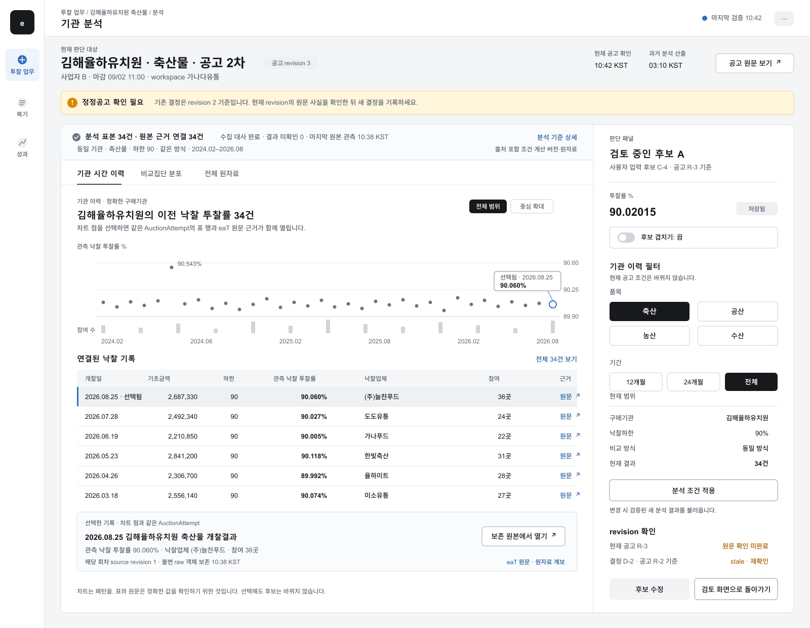

# eatbid 화면 체계

이 문서는 eatbid가 어떤 화면에서 어떤 질문에 답하고, 어떤 사실과 상태를 어떤 밀도로 보여 주는지
정의한다. 픽셀 단위 구현 명세나 디자인 시스템 코드의 대체물이 아니다. 분석 수치와 cohort 계약은
[`decision-support.md`](decision-support.md), 제품 capability 순서는 [`roadmap.md`](roadmap.md)가
권위다.

시안과 구현의 대조 결과는 [`notice-design-fidelity.md`](notice-design-fidelity.md)에 기록한다.

## 1. 화면이 만들 경험

eatbid의 화면은 사용자가 값을 대신 받아 가는 곳이 아니라 **확인할 공고를 놓치지 않고, 근거를
검토하고, 자신이 만든 후보와 결정을 당시 상태 그대로 보존하는 업무 공간**이다.

```text
대상 발견
  → 정확한 공고 회차 × 사업자 선택
  → 현재 공고 사실과 분석 근거 확인
  → 사용자 후보 저장
  → 결정 기록
  → NeaT 사용자 확인
  → source 제출·결과 대조
  → 다음 판단에서 복기
```

화면은 이 흐름을 순서처럼 안내할 수 있지만, 내부 상태를 하나의 단계 문자열로 축약하지 않는다.
정정공고, 취소, source 지연, NeaT 확인 취소, 제출값 불일치는 동시에 존재할 수 있기 때문이다.

## 2. 설계 원칙

### 2.1 Calm density

토스식 명료성은 카드 수를 줄이는 장식법이 아니라 **지금 판단할 대상과 다음 행동을 한눈에
구분하는 계층**으로 사용한다. 비드큐에서 채택할 것은 전문 도구의 정보 밀도와 근거 표이고,
추천 구간·자동 산출·차트 클릭으로 값 주입하는 문법은 채택하지 않는다.

1. 한 화면은 한 가지 사용자 질문과 한 가지 주 행동을 가진다.
2. 요약에서 상세로 이동해도 공고 회차·revision·사업자·분석 snapshot을 잃지 않는다.
3. 1층은 현재 사실과 다음 행동, 2층은 비교 근거, 3층은 산식·개별 행·원자료다.
4. 관측 사실, 파생 분석, 사용자 기록을 위치·라벨·색으로 구분한다.
5. 표본 부족, stale, unknown, 정정, 불일치를 상품 결함처럼 숨기지 않는다.
6. 색은 의미를 보조한다. 상태명과 원인을 텍스트로 함께 쓴다.
7. 표와 차트는 같은 근거를 다른 방식으로 보여 주며 서로 다른 계산을 하지 않는다.

### 2.2 맥락 보존

- 전역 shell은 워크스페이스와 사업자 filter를 유지한다.
- 업무 목록에서 사업자 셀을 선택하면 오른쪽 판단 도크가 갱신된다.
- `자세히 분석`은 `workspace_id`, `supplier_party_id`, `auction_attempt_id`, 선택된
  `auction_revision_id`, `analysis_result_id`와 그 결과가 참조한 `mart_build_id`를 유지해 독립 분석
  화면을 연다.
- 뒤로 돌아오면 목록 위치, filter, 선택한 셀, 도크 초안을 복원한다.
- 정정 revision 또는 재입찰 attempt로 넘어갈 때는 같은 대상처럼 조용히 치환하지 않는다.

## 3. 전역 정보구조

| 전역 영역 | 사용자가 묻는 질문 | 기본 화면 | 주 행동 |
|---|---|---|---|
| 투찰 업무 | 지금 어떤 공고·사업자 조합을 처리해야 하는가? | 업무 목록 + 판단 도크 | 검토 시작/계속 |
| 분석 상세 | 이 공고와 비교 가능한 과거 관측은 무엇인가? | 업무 셀에서 여는 분석 surface | 후보 저장 |
| 복기 | 당시 결정과 실제 제출·결과는 어떻게 달랐는가? | 결과 대조 | 복기 완료 |
| 성과 | 업무와 판단 자료가 얼마나 완결됐는가? | 운영 성과 | 누락 보완 |
| 자동화 | 반복 탐색·문서 업무에서 무엇을 줄일 수 있는가? | 후속 capability | 검토/문서 생성 |
| 관리 | 사업자·사용자·정책·연동을 어떻게 관리하는가? | 설정 | 변경 저장 |

초기 전역 navigation은 `투찰 업무 | 복기 | 성과`만 노출한다. 첫 분석 상세는 독립 route를 가지되
정확한 `BidWorkItem`에서만 연다. 최근 분석 대상·saved analysis library의 반복 필요가 확인되기
전에는 맥락 없는 전역 `분석` 메뉴를 만들지 않는다. 구현되지 않은 Enterprise 메뉴도 빈 화면으로
먼저 만들지 않으며 `자동화`와 조직 관리 항목은 해당 roadmap gate가 통과할 때 추가한다.

URL: 오늘 `/today`(열린 공고 목록, §10.4), 투찰 업무 `/work`, 복기 `/review`, 성과 `/performance`, 분석 상세
`/work-items/[workItemId]/analysis`. 2026-09 현재 실제로 있는 route는 `/today`와 결정 화면 `/auctions/[auctionId]`이며
`/work`·`/review`·`/performance`는 아직 계획이다.
sidebar를 이 세 항목으로 바꾸는 시점은 `/work` route가 생기는 slice와 같은 변경이며 그 전까지 legacy
`/dashboard/*` 항목과 root redirect를 유지한다.

## 4. 전역 shell

데스크톱 기준 shell은 다음 네 영역으로 구성한다.

```text
┌──────────────────────────────────────────────────────────────────────────────┐
│ eatbid  [워크스페이스 ▾] [사업자: 전체 ▾]          검색     수집상태  계정 │
├──────────────┬───────────────────────────────────────────────────────────────┤
│ 투찰 업무    │ page title · 기준시각 · page action                         │
│ 복기         ├───────────────────────────────────────────────────────────────┤
│ 성과         │                                                               │
│              │                         page body                             │
│              │                                                               │
│ 관리         │                                                               │
└──────────────┴───────────────────────────────────────────────────────────────┘
```

- 전역 사업자 filter는 보기를 좁힐 뿐 사용자 상태의 identity를 바꾸지 않는다.
- `수집상태`는 초록 점 하나가 아니라 `현재 공고 12분 전 · 과거 분석 03:10 기준`처럼 두 freshness를
  분리해 보여 준다.
- 숫자·공고명·기관명 전역 검색은 source label을 찾아 내부 ID로 이동하며 문자열을 identity로 쓰지 않는다.
- page title 오른쪽에 해당 화면의 `as_of` 또는 마지막 동기화 시각을 둔다.

### 공통 셸의 2026-09-08 합의

기존 왼쪽 업무 메뉴를 유지하고 분석할 때 접어 폭을 확보한다. 설정의 세부 메뉴는 설정 화면 내부가
소유하며 오른쪽에 전역 메뉴 계층을 복제하지 않는다. 오른쪽 관심·최근 본·내 공고는 보조 목록이며
현재 공고 정보·선택 회차 기록과 한 번에 하나의 보조 공간을 사용한다.

브라우저 viewport가 `xl`(1280px) 미만이면 오른쪽 도구 줄 자체를 숨겨 본문에 폭을 돌려준다(2026-09-10 EAT-154, §11).
본문 폭의 경계값은 이 하나뿐이다 — 1200과 1280을 함께 적어 두었던 동안 구현이 둘로 갈렸다(2026-09-16 회전, EAT-229).
상단 진입으로 목록을 열고, 차트 점이나 표의 기록 선택은 해당 회차 상세를 Sheet로 연다.
닫아도 선택 회차·차트 확대·표 스크롤은 보존한다. 조회 범위에서 제외된 회차 선택은 해제한다.
넓은 화면에서는 공통 레이아웃의 오른쪽 끝에 보조 패널을 사용하며 차트 확대 자체는 모달로 만들지 않는다.

#### 전체 폭과 전역 배치 — 같은 날 사용자 재확인

오른쪽 메뉴의 전역성은 앱 공통 탐색 정책이고, 분석 화면의 좌우 여백 제거는 해당 화면의 지면 정책이다.
두 정책을 결합해 공고 내부의 오른쪽 메뉴나 별도 중앙 여백을 만들지 않는다. 전역 메뉴는 페이지가
바뀌어도 유지하며, 현재 공고·선택 회차의 맥락 도구와 상세 내용만 해당 화면 수명주기를 따른다.

공고 분석은 기본 보기부터 좌우 바깥 여백과 최대 폭 제한 없이 가용 폭을 모두 사용한다.
글자·차트 축·조작 영역의 내부 여백은 유지한다. 홈·설정은 화면 목적에 맞는 읽기 폭을 유지한다.
차트 `크게 보기`는 브라우저 콘텐츠 뷰포트 전체를 사용한다(EAT-214, 2026-09-14 사용자 재확정).
공통 헤더·사이드바·도구 줄과 바깥 여백·최대 폭을 없애고, 작은 제목·조건·범례·닫기 영역을 제외한
가로·세로 공간을 차트에 준다. 흐름은 같은 캔버스와 필터·축·선택 상태를 유지하고, 분포 Popup도
같은 전체보기 프레임으로 네 변을 채운다. 휴대폰과 낮은 창에서도 진입과 크기 재측정을 제공한다.
전체보기의 현재 공고·선택 회차 진입은 차트 상단의 `상세 보기`에 두며, 열린 상세는 뷰포트 안의
같은 보조 영역을 쓴다. Escape·닫기·뒤로 가기는 보던 조건과 초점을 복원한다.

공고·기록 도구와 펼친 상세는 `ApplicationShell`의 공통 오른쪽 영역에 둔다. 중앙 공고 제목·필터보다
아래에서 시작하는 route 내부 aside는 이 배치의 구현으로 보지 않는다. 도구 줄 64px, 상세 320px를
기준으로 공통 헤더 아래부터 viewport 하단까지 배치하고 닫힌 상세는 너비를 차지하지 않는다.
일반 보기의 작은 화면 진입도 공통 헤더에 둔다. 차트 전체보기에서는 위의 상단 진입을 사용한다.

공통 레이아웃은 표시 위치와 크기만 소유한다. 선택한 회차·조회·명단은 공고 route가 소유하고,
과거 회차 선택은 중앙의 분석 대상 공고를 바꾸지 않는다. 다른 route로 떠나면 해당 공고의 도구와
상세는 해제한다. 전역 바로가기의 실제 데이터 기능은 별도 연결 단위다.

이 배치는 코드 구조 계획 검토 후 사용자의 실행 승인으로 dev에 연결했다. 구현 상태와 검증 순서는
[`workspace-dock-implementation.md`](workspace-dock-implementation.md)가 기록한다.

이번 실제 구현은 확인된 현재 공고와 회차 명단부터 연결한다. 관심·최근 본·내 공고는 각각의
canonical 사용자 상태/업무 조회 계약이 준비된 뒤 제공한다. 미구현 목록을 실제 데이터처럼
채우거나 레거시 local mark를 새 사용자 상태 SSOT로 가져오지 않는다.

## 5. 핵심 업무 표면: 목록 + 판단 도크

### 5.1 목록의 grain

한 행은 `AuctionAttempt`이며, 현재 `Workspace`에서 사업자 열의 한 셀은 하나의
`BidWorkItem(Workspace × SupplierParty × AuctionAttempt)`이다. 초기 고객의 1~3개 사업자는 열로
비교할 수 있고, 사업자가 많아지면 열을 무한히 늘리지 않고 선택한 사업자 집합 또는 row expansion을
사용한다.

| 열 | 항상 보이는 내용 | 정렬/필터 |
|---|---|---|
| 공고 | 기관, 공고명, 차수, revision/정정 표시 | 기관·품목·신규/정정/재입찰 |
| 마감 | 남은 시간과 절대 시각 | 마감 임박순 |
| 확정 사실 | 품목군, 기초금액, 명시 하한, source 참가제한지역 요약 | 금액대·품목·공고 제한지역 |
| 자료 상태 | 최신 검증본/갱신 지연/새 자료 검증 중/자료 격리와 이유 | 검증 자료만/갱신 필요 |
| 사업자 A..C | 파생한 다음 행동과 값 기록 존재 여부 | 미검토·재확인·NeaT 확인·대조 |

사업자 셀은 `값 입력란`이 아니다. 셀 선택은 현재
`Workspace × SupplierParty × AuctionAttempt`의 `BidWorkItem`과 선택된 `AuctionRevision`을 잠그고
판단 도크를 연다. 목록에서 값을 바로 수정하면 잘못된 사업자·revision에 기록할 위험과 분석 근거를
건너뛰는 위험이 크므로 inline price edit을 허용하지 않는다.

사업자 상태 filter는 quantifier를 반드시 표시한다.

| filter scope | 의미 |
|---|---|
| 선택 사업자 | 현재 선택한 사업자 셀만 판정한다. |
| 하나라도 | 보이는 사업자 중 하나 이상의 셀이 조건에 맞으면 행을 반환하고 매칭 셀을 강조한다. |
| 모두 | 보이는 모든 사업자 셀이 조건에 맞을 때만 행을 반환한다. |

행은 매칭 셀 중 가장 긴급한 다음 행동, 그다음 최단 마감으로 정렬한다. 결과 수는
`27개 공고 · 54개 사업자 판단`처럼 행과 셀을 함께 표시한다. 공고 제한지역은 source 사실일 뿐
특정 사업자의 전체 자격 판정이 아니며, 사업자별 확인 결과는 각 셀과 도크에서만 보여 준다.

### 5.2 판단 도크

판단 도크는 넓은 데스크톱에서 오른쪽 420~480px의 독립 sticky surface다. 목록 scroll과 무관하게
선택한 target과 현재 주 행동을 유지하며, 다른 셀을 누르면 저장하지 않은 변경을 명확히 처리한 뒤
target을 바꾼다.

```text
┌ 판단 도크 ─────────────────────────────┐
│ 기관 · 공고/차수              [원문]   │
│ 사업자 B · revision 3 · 마감 2시간 14분│
│ [정정: 재확인 필요]                    │
├ 현재 사실 ─────────────────────────────┤
│ 기초금액     명시 하한     지역 확인    │
├ 현재 규칙 사실 ────────────────────────┤
│ 원문 하한 · selected revision · 산식    │
├ 과거 관측 분포 ────────────────────────┤
│ cohort 요약 · n · 기간 · as_of         │
│ 압축 분포 · 자료 품질     [자세히 분석] │
├ 내 후보 ───────────────────────────────┤
│ blue marker A/B/C · 저장 결과 상태     │
│ A [             ]  B [             ]   │
│ [후보 저장 · 현재 primary]             │
├ 결정 ──────────────────────────────────┤
│ ( ) 투찰  ( ) 참여하지 않음            │
│ 선택 후보/값 · 근거 메모               │
│                  [결정 기록 · 비활성]   │
└─────────────────────────────────────────┘
```

- 분석은 접힌 보조 링크가 아니다. cohort, `n`, `as_of`, freshness, 작은 분포, 품질 경고를 기본 노출한다.
- 후보 저장과 결정 기록은 분리한다.
- 한 시점의 primary action은 하나다. 미저장 후보가 있으면 `후보 저장`, 저장 후보가 있고 결정이
  없으면 `결정 기록`, 정정 후에는 `변경 확인`, 결정 후에는 `NeaT 입력 확인`만 primary가 된다.
- `참여하지 않음`도 이유를 가진 유효한 decision content다.
- `NeaT 입력 확인`은 결정 기록 이후 별도 사용자 행동이며 `제출 완료`라고 부르지 않는다.
- source-observed 제출과 결과는 사용자가 수정할 수 없는 대조 영역에서만 표시한다.

## 6. 첫 구현 화면: 분석 상세

### 6.1 한 판단 질문, 두 근거 렌즈

> 이 기관 자체의 이전 회차는 시간순으로 어떻게 움직였고, 이번 공고와 비교 가능한 집단에서는 값이
> 어떻게 분포했으며, 같은 measure로 사용자가 직접 적은 후보는 각각 어디에 놓이는가?

첫 렌즈는 exact `Organization`의 이전 `AuctionAttempt`를 산점도와 표로 보여 준다. 두 번째 렌즈는
사전 등록 cohort policy의 selected member set을 값의 분포로 보여 준다. exact 기관 이력과 fallback으로
넓어진 비교집단을 같은 표본처럼 합치지 않는다.

이 화면의 주 행동은 `후보 저장`이다. `결정 기록`은 판단 도크로 돌아간 뒤 수행한다. 분석 화면에
`이 값으로 투찰` 또는 NeaT 이동과 결합된 CTA를 두지 않는다.

### 6.2 데스크톱 wireframe

리뷰 가능한 시각 자산은 아래 PNG와 [편집 가능한 SVG](mockups/analysis-detail-v1.svg)에 둔다. 화면 안의
기관명, 수치와 시각은 interaction과 정보 위계를 검토하기 위한 예시이며 실제 분석 결과가 아니다.

V1은 둥근 카드를 세로로 쌓는 dashboard가 아니라 **연속형 research workbench**를 사용한다. target과
revision은 compact context header에 고정하고, exact 기관 이력·연결 표·비교집단 분포는 하나의 evidence
surface에서 divider로만 구분한다. 후보는 340–400px sticky 판단 rail이 소유한다. source 관측은
neutral/slate, 저장 후보와 사용자 행동만 blue를 사용한다.

#### 신뢰 UI 계약

신뢰의 목표는 확신을 연출하는 것이 아니라 사용자가 결과의 적합성과 한계를 스스로 판단하는
`calibrated reliance`다. 분석 상세는 다음 조건을 동시에 만족해야 출시 가능한 화면으로 본다.

1. 모든 요약 수치와 chart mark는 같은 `AnalysisEvidenceContract`의 구성 행으로 내려간다.
2. chart point와 표 행은 같은 `auction_attempt_id`와 selected revision을 공유하며 양방향으로 강조한다.
3. 첫 화면에는 기술 ID 대신 `원본 확인 건수 / 결과 미확인 / 누락 / 마지막 검증 시각`을 평문으로
   표시한다. source release, mart build, computation version과 raw lineage는 `분석 기준 상세`에서 연다.
4. `현재 공고 사실`, `과거 관측`, `사용자 후보`, `기존 결정`을 같은 값이나 revision namespace로
   합치지 않는다.
5. 시간 이력, 비교분포, 원자료는 한 evidence surface의 명시적 관점 전환으로 제공한다. V1 기본 관점은
   exact 기관 시간 이력과 연결 표이며 한 화면에 핵심 chart를 둘 이상 경쟁시키지 않는다.
6. 후보 overlay는 기본값이 꺼짐이다. 사용자가 `후보 겹쳐 보기`를 켜고 저장된 candidate revision이
   현재 공고 revision과 비교 가능할 때만 blue marker를 표시한다.
7. 과거 관측을 미래 예정가, 낙찰확률, 추천값 또는 안전구간으로 해석하지 않는다. 이 한계는 판단 rail을
   설명판으로 만들지 않고 `분석 기준 상세`, 표본 gate와 후보 비교 결과가 필요한 순간에 표시한다.
8. 분석 화면의 주요 행동은 근거 확인과 후보 저장이다. 다음 단계 CTA는 근거보다 강한 색·크기·위계를
   갖지 않으며 `결정 기록`과 `NeaT 사용자 확인`을 합치지 않는다.
9. 기본 표는 최근 6~8건을 보여 주고 전체 member·제외 member·machine-readable data로 이동할 수 있다.
10. stale, partial, quarantine, mapping unknown, 표본 gate 실패는 badge 장식이 아니라 범위·영향·다음
    행동을 포함한 문장으로 설명한다.



```text
┌ compact target header ────────────────────────────────────────────────────┐
│ OO학교 · 축산물 · 공고 2차 · 사업자 B · 공고 revision 3 · 마감 · 원문   │
├ 정정/자료 상태 ───────────────────────────────────────────────────────────┤
│ 기존 결정은 revision 2 기준 · 현재 revision의 원문 사실 재확인 필요      │
├─────────────────────────────────────────────────┬─────────────────────────┤
│ evidence surface                                │ 판단 rail · sticky       │
│ 분석표본 34 · raw 연결 34 · 수집대사 · 검증시각│ 저장 후보 A · 후보 C-4  │
│ [기관 시간 이력] [비교집단 분포] [전체 원자료] │ [후보 겹쳐 보기: 꺼짐] │
│ [정확한 기관][김해시 맥락] [축산][하한90]      │ target과 후보 계약 상태 │
│ [12개월][24개월][전체] · 고정: 방식/금액대     │ 저장 ≠ 결정 ≠ NeaT      │
│                                                 │                         │
│ 기관 시간 이력 · 전체 범위 chart                │ 후보 A · 사용자 직접 입력│
│ 참여 수 band                                     │ 저장된 후보 근거 위치    │
│ ↕ 같은 AuctionAttempt                           │ [후보 저장]              │
│ 최근 근거 6–8행                                  │ [12개월][24개월][전체]  │
│ ↕ 선택 관측 inspector                           │ 기관·하한·방식·결과 건수│
│ 보존 원본 · source revision · raw lineage       │                         │
│                                                 │ current/candidate/       │
│ chart는 패턴, 표와 원문은 정확값을 확인          │ decision revision 분리   │
│                                                 │                         │
└─────────────────────────────────────────────────┴─────────────────────────┘
```

### 6.3 정보 3층

| 층 | 기본 노출 | 목적 |
|---|---|---|
| 항상 보임 | workspace/target attempt/revision/supplier, 현재 규칙 사실, exact 기관 이력의 scope·`n`·기간·freshness, 시간 산점도와 연결 표, requested/selected cohort와 완화 차원, 포함·제외 수, `as_of`, 분포, 후보, 주요 경고 | 결정을 위한 최소 근거 |
| 펼침 | 전체 cohort predicate, 거절한 fallback, 제외 사유, 기술통계, 공식/산식, 버전 이력, 개별 근거 표 | 해석과 검증 |
| 원자료 | source 문서, raw hash, run/publication, selected revision, code/formula version | 재현과 감사 |

요약을 펼쳐도 다른 snapshot을 조회하거나 UI에서 재계산하지 않는다. 각 층은 하나의
`AnalysisEvidenceContract`를 다른 밀도로 렌더링한다.

### 6.4 기관 이전 기록: 시간 산점도와 연결 표

기관 이력은 옛 web 분석판의 좋은 자산을 계승하되 의미와 행동을 고친다. 옛 `dashboard/analysis` 분석판과
`time-dot-chart`는 2026-09-10 main에서 legacy 화면 잔재로 제거됐고(commit `17672c64`), 시간 흐름과 기록 표는
결정 화면의 [`flow-chart.tsx`](../../apps/web/src/app/(workspace)/auctions/[auctionId]/_features/flow/ui/flow-chart.tsx)와
`_ui/expand/` 이력 표가 잇는다.
2026-08-31 옛 로컬 화면에서 김해율하유치원은 전체 88회, 축산물 34회의 source-observed 기록을 제공했다.
이 수치는 현재 구현 확인 예시이며 target architecture의 고정 fixture가 아니다.

- X축은 개찰일, Y축은 source-observed `award_bid_rate`이며 점 하나가 하나의 `AuctionAttempt`다.
- 기본 scope는 target과 같은 exact `Organization`, 검증된 품목 코드, 하한 measure와 사전 등록 기간이다.
- evidence surface 상단의 filter strip은 target 공고나 candidate를 바꾸지 않는다. 검증된 근거 렌즈,
  품목 코드, exact 하한과 사전 등록 기간을 선택하며, 적용하면 기존 mart build를 참조하는 새
  `analysis_result_id`를 조회한다. client-side로 현재 chart의 member·`n`·통계를 다시 계산하지 않는다.
- `전체 품목 보기`는 기관의 발주·결과를 탐색하는 보기에만 허용한다. 품목별 점과 count를 분리하고
  통합 평균·대표구간·연결선·후보 위치를 제공하지 않는다.
- 선택한 품목이 target 공고 품목과 다르면 candidate overlay를 사용할 수 없으며, target context는 상단에
  계속 고정한다.
- 단일 품목·동일 하한으로 고정된 경우에만 시간 순서를 돕는 얇은 선을 잇는다. 회귀선·예측선·추세
  판정으로 부르지 않는다. 여러 품목 또는 하한이 섞이면 선을 제거하거나 하한별 panel로 분리한다.
- 참여 수는 공통 시간축의 별도 보조 band에 두고 낙찰 투찰률 Y축과 합치지 않는다.
- 극단값은 삭제하지 않는다. 중심 범위를 확대할 때는 `범위 밖 N건`과 `전체 범위 보기`를 함께 제공한다.
- 저장 후보는 명시적 blue line/marker로만 겹친다. 미저장 후보는 표시하지 않는다.
- chart point와 표 행은 같은 `auction_attempt_id`·selected revision을 공유한다. hover/focus/선택은 서로
  강조하고 회차 상세·원문을 열 수 있지만 후보 입력값을 바꾸지 않는다.

기관 이력 표의 기본 열은 다음과 같다.

| 열 | 내용 |
|---|---|
| 개찰일 | source 결과가 관측된 날짜 |
| 품목 | 검증된 품목 코드의 표시명 |
| 기초금액 | source-observed 금액과 단위 |
| 하한 | target과 비교 가능한 source measure |
| 관측 낙찰 투찰률 | source-observed `award_bid_rate` |
| 낙찰업체 | source-observed `SupplierParty` 표시명 |
| 참여 | source에서 관측 가능한 참가 수와 관측 상태 |
| 선택 사업자 투찰 | 정확한 supplier·submission 연결이 있을 때만 표시 |
| 근거 | 원문, selected revision, publication/raw lineage |

현행 화면의 `점/낙찰률 클릭 = 산출기 적용`은 계승하지 않는다. 차트와 표는 evidence selection이고 후보
작성은 별도 사용자 행동이다.

#### 6.4.1 필터 interaction 계약

필터는 부가 설정이 아니라 현재 화면의 모든 숫자가 어떤 member set을 사용하는지 선언하는 첫 번째
reading group이다. 후보 rail 안에 숨기지 않고 탭 바로 아래, chart와 trust strip보다 위에 둔다.

```text
[정확한 기관 이력] [김해시 소재 기관 맥락]
품목 [축산물 ▾]  하한 [90 ▾]  기간 [24개월 ▾]
고정 비교조건  학교·축산물·동일 방식·금액대 5천만~1억원      [비교 기준]

원천 후보 77 → 계산 가능 53 → 포함 49 → 제외 28
2026-08-31 03:18 분석 기준 · 마지막 검증 원천 03:10
```

| control | 기본값 | 화면 효과 |
|---|---|---|
| 근거 렌즈 | 정확한 target 기관 | exact 기관과 지역 context를 별도 result/tab으로 유지한다. `김해시`는 기관 소재 행정코드 mapping이 검증됐을 때만 노출한다. |
| 품목 | target의 검증 품목 | chart·표·trust funnel·선택 회차를 함께 갱신한다. 전체 품목에서는 품목별 facet만 제공하고 후보 overlay를 끈다. |
| 하한 | target의 exact 하한 | 다른 하한은 별도 panel/result다. 서로 다른 하한을 선으로 연결하거나 하나의 대표범위로 요약하지 않는다. |
| 기간 | policy 기본 preset | `12개월/24개월/전체`처럼 등록된 기간만 사용하고 응답의 실제 시작·종료일을 함께 표시한다. |
| 고정 비교조건 | target/policy | 조달 방식·가격 방식·금액대·기관유형을 필터 뒤에 숨기지 않는다. V1은 자유 조합 UI가 아니라 적용값과 완화 여부를 읽게 한다. |
| 내 실제 투찰 표시 | 꺼짐 | target supplier와 연결된 source-observed submission만 sparse marker로 겹친다. cohort와 `n`은 바뀌지 않는다. |
| 재구성 2등 표시 | 꺼짐 | 검증된 complete bid-list 회차에만 marker를 추가한다. 차트 기본 measure나 비교집단 summary를 바꾸지 않는다. |

필터 적용은 원자적이다. 새 결과가 준비되는 동안 filter label만 먼저 바꾸거나 이전 chart와 새 표를
섞지 않는다. 새 결과가 0건이면 자동으로 기간·품목·지역을 넓히지 않고 `적용 조건에서 비교 가능한
기록이 없음`과 reason별 제외 건수를 표시한다. 뒤로가기는 이전 `analysis_result_id`와 선택 관측을
복원하되 candidate revision을 되돌리거나 새로 만들지 않는다.

현재 filter result의 member set은 다음 모든 위치에서 같아야 한다.

- trust funnel의 candidate/eligible/included/excluded count
- 시간 chart와 참여 수 band
- 값 분포와 summary gate
- 최근 근거 표와 전체 포함/제외 표
- 선택 회차 inspector
- 선택 사업자 source submission overlay
- 검증된 경우의 `재구성 2등 투찰률` 표시

업체 roster와 넓은 시장 탐색은 이 result를 몰래 재사용하지 않는다. 별도 질문과 별도 member set을 가진
독립 surface로 이동하며, 같은 페이지에 둘 경우에도 별도의 scope·기간·`n`을 상단에 반복 표시한다.

#### 6.4.2 선택 회차와 2등·내 투찰

기본 chart는 `관측 낙찰 투찰률` 하나만 주 measure로 사용한다. 참여 수는 별도 band이고, 내 실제
투찰과 재구성 2등은 사용자가 켠 경우의 sparse marker다. 점을 선택하면 같은 표 행을 강조하고 다음
inspector를 연다.

```text
2026-05-21 · 축산물 · 하한 90 · 참여 68
관측 낙찰 투찰률       90.023       source-observed
재구성 2등 투찰률      90.031       complete bid-list · formula v1
선택 사업자 실제 투찰  90.084       source-observed submission
사용자 저장 후보       90.050       app candidate revision C-4
[eaT 원문] [참가 목록과 계산 근거] [raw lineage]
```

`재구성 2등 투찰률`은 직접 관측 낙찰값과 같은 색·라벨로 표시하지 않는다. 참가 목록 completeness,
동가·무효 처리와 계산 버전을 확인할 수 없으면 숨기지 말고 `계산 불가`와 이유를 표시한다. 선택 사업자
submission이 source 범위에서 관측되지 않았으면 `미제출`로 단정하지 않고 `관측 불가`를 사용한다.

### 6.5 분포·후보 chart와 규칙 사실

V1 chart의 공통 X축에는 같은 measure contract의 과거 관측과 사용자 후보만 놓는다.

```text
과거 관측     · · · ·  [과거 관측의 중간 50%]  · ·
사용자 후보                 A        B
```

- chart 결과는 `measure_id`, 단위, scale, denominator 의미와 source precision을 표시한다.
- 후보의 measure contract가 다르면 chart에 놓지 않고 비교 불가 이유를 표시한다.
- 공식 규칙은 별도 fact panel에 둔다. source operand와 `rule_evaluator_version`을 포함해 규칙 좌표가
  distribution과 완전히 같은 measure임이 검증된 뒤에만 overlay할 수 있다.
- V1은 복수예가 조합 열거, 난수 시뮬레이션, 미관측 예정가격 산출과 값↔금액 변환을 하지 않는다.
- 규칙 판정에는 target `auction_revision_id`와 `rule_evaluator_version`을 함께 표시한다.
- 과거 관측은 slate 계열 점·rug·histogram이며 성공/실패 색을 쓰지 않는다.
- 저장된 후보는 blue marker와 A/B/C 문자로 구분한다.
- 규칙상 명백한 위반만 red warning을 사용한다.
- 다봉 판정이면 단일 중앙 band를 숨기고 histogram/rug와 설명을 유지한다.
- sample gate가 막으면 quantile과 대표 구간을 그리지 않는다.
- chart hover와 표 행 선택은 서로 highlight하지만 후보값을 바꾸지 않는다.
- V1은 과거 관측값을 후보로 복사하거나 후보를 분포에 snap하는 행동을 제공하지 않는다.
- 후보 위치는 `낮은 관측 17 · 같은 관측 1 · 높은 관측 10`처럼 방향성 없는 기술 문장으로 표시한다.
- 미저장 입력은 marker와 위치 개수를 표시하지 않는다. `후보 저장`이 새 `CandidateRevision`을 만든 뒤
  server `ReplayEvaluator`가 반환한 결과만 표시한다. 입력을 다시 편집하면 이전 결과를 숨기고
  `이전 저장 후보 기준 결과` history에서만 볼 수 있게 한다. UI가 key 입력마다 위치를 계산하거나
  candidate revision을 자동 생성하지 않는다.

### 6.6 비교집단 근거 표

차트 아래 표는 장식용 appendix가 아니라 분포의 구성원을 확인하는 기본 근거다.

| 열 | 내용 |
|---|---|
| 관측일 | 해당 source 결과가 관측된 시각 |
| 기관 | `Organization` 표시명과 유형 |
| 공고·차수 | 과거 `AuctionAttempt`와 revision |
| 비교 차원 | 품목군·금액대·방식 등 실제 적용값 |
| 관측 낙찰 투찰률 | source-observed `award_bid_rate` |
| 판정 | 포함 또는 제외 |
| 제외 사유 | versioned reason code의 사용자 문구 |
| 근거 | 원문, publication, raw lineage 진입 |

기본 화면에는 포함 행을 보여 주되 제외 수와 이유를 바로 볼 수 있어야 한다. `n`을 늘리려고 unknown을
추정하거나 exact와 expanded cohort를 같은 표본처럼 섞지 않는다.

표의 `표 안에서 찾기`는 현재 member를 검색·정렬할 뿐 chart·`n`·cohort를 바꾸지 않는다. V1에는
기간·기관·비교 조건을 바꾸는 UI가 없다. 후속에 추가하더라도 사전 등록 policy만 선택하며, 요청 결과는
기존 검증 `mart_build_id`를 참조하는 새 `analysis_result_id`다. 새 mart build는 dataplane이 완성·검증·
원자 발행할 때만 생성하고 사용자 UI 요청이 만들지 않는다.

## 7. 상태 계약과 화면 투영

사용자에게는 `다음 행동`을 간결하게 보여 주지만 다음 축을 별도 보존한다.

| 상태 축 | 예시 | 화면 표현 |
|---|---|---|
| attempt lifecycle | active/closed/canceled | 공고 header |
| revision relation | selected-is-current/new-revision-exists/decision-bound-to-old-revision | 정정 banner와 선택 revision |
| verified publication | available/unavailable/quarantined | 자료 품질 |
| current-fact freshness / historical-analysis freshness | 각 current/stale | 서로 다른 기준시각과 지연 원인 |
| incoming collection | idle/running/partial/failed | `새 자료 검증 중` 상태 |
| candidate revisions | 별도 append-only `app` 객체 | 후보 history |
| user decision | none/recorded/superseded/voided | 사업자 셀과 결정 영역 |
| decision content | bid(value)/no-bid(reason) | 최종 결정 내용 |
| NeaT confirmation projection | not-applicable/pending/confirmed/revoked | 사용자 증언과 actor/time |
| source submission observation | unobserved/unavailable/observed-submitted/observed-not-submitted | 읽기 전용 source 대조 |
| result | `AwardDecision`의 source-observed disposition과 관측 가능성 | 복기 화면 결과 |
| reconciliation | not-ready/matched/mismatch-open/mismatch-acknowledged/unverifiable | 불일치 queue |
| team assignment | unassigned/assigned | Team gate 이후 담당자 축 |
| team review | not-requested/in-review/approved/rejected | Team gate 이후 검토 축 |

목록의 `다음 행동`은 이 축에서 파생한 presentation 값이다. 예를 들어 `NeaT 확인 필요`가 보인다고
attempt lifecycle이나 publication/freshness 상태를 덮어쓰지 않는다. API와 DB의 canonical state로
역사용하지 않는다.

정정은 lifecycle 상태가 아니라 revision 사건이고, 마지막 verified publication은 stale이면서 새 수집
run은 partial일 수 있다. candidate draft도 recorded decision과 동시에 존재할 수 있다. 위 표의 정확한
enum과 event schema는 구현 계약에서 확정하며 서로 다른 축을 하나의 `status` column으로 합치지 않는다.

NeaT 확인은 boolean checkbox가 아니라 사용자가 확인한 정확한 값, 연결된 decision revision,
actor·occurred_at을 가진 append-only `app` event다. revoke도 이유와 시각을 가진 새 event이며 기존
확인을 덮어쓰지 않는다. 표의 confirmation state는 이 event의 read projection이다.

`observed-not-submitted`는 complete source scope에서 명시적으로 관측된 경우만 사용할 수 있다.
withdrawal·invalid는 낙찰 실패와 합치지 않고 해당 `BidSubmission.source_status`로 표시한다. 결과는
`pending/award_observed/no_award_observed/canceled/outcome_unknown` 같은 관측 disposition으로 모델링하며
정확한 source mapping은 domain 계약이 소유한다.

표시명은 탐색용이며 도크·분석·결정의 route/payload는 `workspace_id`, `supplier_party_id`,
`auction_attempt_id`, `auction_revision_id`의 decimal-string wire ID를 사용한다.

### 7.1 정정과 재입찰

- 정정은 같은 attempt의 새 revision이며 기존 decision snapshot을 보존하고 `재확인 필요`를 만든다.
- V1은 새 revision 존재와 다시 분석해야 하는 이유를 먼저 보여 주고 이전 decision을 수정하지 못하게
  한다. 필드 단위 영향 diff는 source contract가 검증된 후 후속 화면으로 추가한다.
- 재입찰은 관계가 연결된 새 `AuctionAttempt`와 새 사업자 셀이다.
- 과거 후보를 새 attempt로 복사하려면 사용자가 명시적으로 선택하고 새 evidence snapshot을 확인한다.

### 7.2 제출 불일치

`사용자 결정값`, `NeaT 입력 확인값`, `source-observed 제출값`을 세 행으로 나란히 보여 준다.
일치할 때도 합쳐 한 값으로 만들지 않는다. source가 값을 제공하지 않으면 `미제출`로 추정하지 않고
`관측 불가`를 사용한다.

NeaT 확인, 확인 취소, 열린 불일치 사유 기록, acknowledged/unverifiable 종료의 actor·reason 계약은
복기 capability를 구현하기 전에 별도 interaction spec으로 확정한다. 상태 이름만으로 임의 버튼을
만들지 않는다.

## 8. 특수 상태

| 상태 | 기본 화면 | 허용 행동 |
|---|---|---|
| 표본 0 | 비교 가능한 기록 없음, 규칙과 원자료만 표시 | 후보 저장 가능, 과거 위치 없음 |
| 표본 부족 | 개별 점과 사유, 정책이 허용한 통계만 표시 | 후보 저장 가능, 대표 구간 없음 |
| 여러 군집 | histogram/rug와 여러 군집 경고 | 단일 대표범위·평균 CTA 금지 |
| 현재 사실 stale | 판단 header에 blocking warning | 원문 확인, 갱신 요청; 빠른 결정 제한 |
| 과거 분석 stale | 마지막 검증 snapshot 유지 | 비교 가능하나 지연 상시 표시 |
| 부분수집 | 이전 verified snapshot 유지 | 부분 결과를 current로 선택 불가 |
| 후보 저장 후 replay 지연·실패 | 후보 revision은 저장됨, 위치 결과는 없음 | `다시 시도`; 이전 결과 자동 대체·후보 롤백 금지 |
| mapping unknown | cohort 확정 불가와 누락 차원 표시 | 넓은 시장 관측은 별도 탐색으로만 가능 |
| quarantine | 분석 발행 안 함 | 원본/격리 사유 확인 |
| new revision | 변경 알림과 선택 revision | 새 분석 확인 전 기존 decision 수정 금지 |
| canceled | 취소 원본과 시각 | 새 결정 금지, 기존 기록 열람 |

loading skeleton은 표·chart의 구조를 보존한다. `0`, `없음`, `unknown`, `아직 수집 중`을 같은 empty
state로 표현하지 않는다.

## 9. 시각 문법

### 9.1 계층과 밀도

- 배경은 차분한 cool gray, 주요 작업 surface는 white를 사용한다.
- 카드 테두리를 반복하지 않고 section divider와 여백으로 그룹을 만든다.
- page-level 숫자 hero는 최대 1개이며 첫 분석 화면에는 두지 않는다.
- pill badge는 긴급 상태와 filter에만 사용하고 모든 셀을 badge로 채우지 않는다.
- 표 행 높이는 업무용 기본 44px, compact 36px를 제공한다.
- 표가 아닌 목록·격자도 같은 눈금을 쓴다. 한 줄짜리 행은 44px, 묶음 머리와 보조 줄은 36px, 두 줄을 담는 칸(달력)은
  48px이며 화면 계약(§10)이 그 화면의 값을 확정한다. 눈금 밖의 높이를 새로 만들지 않는다.
- 긴 공고명은 두 줄까지 보이고 hover/title만으로 핵심 정보를 숨기지 않는다.

### 9.2 semantic color

| 의미 | 색 역할 |
|---|---|
| source 관측 사실 | neutral/slate |
| 사용자 후보·직접 행동 | blue |
| 파생 분석·cohort | muted indigo/blue-gray |
| 주의·stale·부분 수집 | amber |
| 관측 결손(미상·미관측) | neutral — 색이 아니라 문구(`미상`·`?`)와 굵기 |
| 확정 규칙 위반·열린 불일치 | red |
| source 대조 일치·완결 | green |

낙찰과 패찰을 전체 chart의 green/red로 칠하지 않는다. 과거 분포 안쪽을 green, 바깥을 red로 표시하면
추천 구간처럼 읽히므로 금지한다.

`unknown`은 두 종류다. 품목 미상·게시일 미관측·참가제한지역 미관측처럼 **정상 운영에서 흔한 관측 결손**과, 자료가
늦거나 모자란 **stale·부분 수집**이다. amber는 뒤쪽에만 쓴다 — 앞쪽까지 amber면 `/today` 목록이 경고판이 되고 정말
급한 것이 묻힌다(2026-09-16 회전, EAT-229). 결손은 `unknown`을 유효한 상태로 두는 AGENTS 3의 사실이지 사고가 아니다.

### 9.3 typography와 숫자

- 한국어 UI는 Pretendard 계열 system fallback을 사용하고 숫자는 tabular numeral을 켠다.
- 비율의 소수 자릿수는 source precision과 measure contract가 정하며 화면마다 임의 반올림하지 않는다.
- 금액은 원 단위와 천 단위 구분을 기본으로 하고 복사값의 정밀도를 별도 보존한다.
- label보다 값만 크게 키우지 않고 단위·기준·시점을 같은 reading group에 둔다.

### 9.4 chart interaction

- 모든 chart에 keyboard focus, tooltip과 표 대체가 있다.
- hover만으로 필수 정보를 제공하지 않는다.
- V1 chart는 view-only이며 zoom/filter가 cohort와 `n`을 바꾸지 않는다. 후속 policy 선택이 추가되면 기존
  검증 build를 참조하는 새 analysis result로 구분한다.
- UI가 임의 binning, percentile, fallback 또는 active build 선택을 하지 않는다.

## 10. 화면별 확장 계약

### 10.1 결과 복기

한 공고·사업자에 대해 다음 다섯 줄을 시간순으로 정렬한다.

```text
결정 snapshot → NeaT 사용자 확인 → source 제출 관측 → 결과 → reconciliation
```

주 화면은 값 차이와 미완결 이유이며, 과거 분석을 최신 값으로 다시 계산해 당시 근거를 바꾸지 않는다.

### 10.2 성과

낙찰 건수를 제품 성공 점수로 단독 hero 처리하지 않는다. 대상 공고, decision coverage, NeaT 확인,
source 대조, 불일치 처리와 실제 결과를 함께 보여 준다. strategy leaderboard는 사전등록·OOS 계약 전에는
노출하지 않는다.

성과 집계는 source-observed current result, app decision revision, mart build를 각각 표시·filter하며,
정정 전 snapshot과 최신 source outcome을 하나의 `성공률`로 덮어쓰지 않는다.

### 10.3 Team·Enterprise

Team gate 이후에도 `BidWorkItem` grain은 바뀌지 않는다. 담당자·검토·승인 상태는 별도 team-flow 축과
감사 log로 추가한다. 대량 작업은 keyboard navigation, saved view, assignment queue, exception review를
우선하고 승인 badge와 조직도를 먼저 만들지 않는다.

### 10.4 오늘 `/today`

열린 공고를 **마감 임박 순**으로 한 줄씩 보이고, eaT가 주지 않는 값(지난번·보통·참여)을 옆에 세우는 화면이다.
투찰은 언제나 eaT에서 일어나므로 이 화면의 값어치는 "무엇을 열어 볼지"를 고르게 하는 데 있고, 화면이 값을 추천하지
않는다(AGENTS 8). 시안은 `F:\eatbid-local\design\canvas\U9-List.dc.html`(2026-09-16 회전 U1~U10의 마지막)이며
이 절이 시안보다 우선한다 — 시안이 이 절과 어긋나면 시안을 고친다. 목록의 grain·열을 처음 정한 근거는
[`2026-09-16 오늘 화면 CSR 목록 설계`](../superpowers/specs/2026-09-16-today-screen-csr-list-design.md)이고 이 절은 그 뒤의
결정(하한율은 열이 아니라 요약, 순번 열, EAT-241)까지 반영한 현재 계약이다 — 둘이 다르면 이 절이 맞다.

**grain과 자료.** 활성 `mart.open_auction_snapshot` build의 회차(`AuctionAttempt`) 1행이다. 계보(build·release·계산
버전·산출 시각)는 왼쪽 기둥 아래 줄로 늘 보인다(AGENTS 7). 목록 상한은 200행이고 더보기는 없다 — 상한 밖의 행에는
검색으로만 닿는다(EAT-206 결정, EAT-247). 열림 판정의 기준 시각은 서버 clock 하나다.

**구조와 순서.** 본문은 위에서 아래로 제목 → 머리 문장(`진행중 62건, 오늘 마감 5건이에요. 오늘 열린 공고는 …`) →
기준 줄(`09-16 09:12 기준 · 게시일이 관측되지 않은 공고가 9건 있어요`) → 마감 달력 → 검색 한 칸 → 목록이다. 탭 줄은
없다 — 세 수는 문장 속 링크이고 각 링크가 날짜 축을 건다(EAT-260, 사용자 결정 2026-09-17). 조건(프리셋·지역·품목·기초금액)은
왼쪽 기둥이 소유한다. 기둥은 `xl`(1280px)부터 셸 탐색 바로 옆에 **붙어** 서고(본문 카드 안에 띄우지 않는다, 구역 사이는
선 하나) 그 아래에서는 본문 위에 눕는다. 조건이 본문의 모든 수보다 앞(왼쪽·위)에 있는 이유는 조건이 "이 화면의 모든 수가
어떤 집합을 세는가"의 선언이기 때문이다(§6.4.1). 지역은 사업자 설정의 참가제한지역이 기본 게이트이고, `전체 보기`·`지역
바꾸기`가 그 사실을 말한다(EAT-167). 지역 축(공고지역)은 게이트와 **독립**이다 — 시도를 고르면 그 조회는 게이트를
걸지 않는다(둘은 다른 체계다, AGENTS 6). 시도 목록은 어휘 전체가 0건까지 서고, 시군구는 코드목록이 말한 상위
(`code_mapping`의 parent 관계) 아래 전부가 0건까지 선다 — 관측된 짝만 세우면 "경남에 김해밖에 없다"가 된다. `지역
미상`은 품목 미상과 같은 줄이라 시도를 골랐을 때 켜고 끌 수 있다(`regionUnknown=include`, EAT-260). 저장된 조건 한
벌은 화면에서 `프리셋`이라 부른다(`조합`이 아니다).

**목록의 행(마감 시각 묶음 아래 카드).** 표가 아니다(EAT-260, 사용자 결정 2026-09-17 — "toss처럼 위계가 바로 서
있지 않다"). 행은 같은 날 같은 시각에 닫히는 묶음 아래 서고, 묶음 머리 한 줄(`오전 9시 마감 · 3시간 뒤 · 2건`, 다른
날은 `9월 17일 목 · 오전 9시 마감 · 내일`)이 그 아래 행들의 마감을 대신 말하므로 행에는 시각이 없다. 날짜가 바뀌는
첫 묶음은 위에 선을 긋고 더 띄운다. 지난 시각의 묶음은 `지났어요`이고 흐리다(0건이 아니다). 행은 왼쪽 세 줄과 오른쪽
금액 두 줄이고 위계는 크기 넷(묶음 머리 18/800 · 기관 17/700 · 금액 19/800 · 본문 14)과 색 셋(본문·muted·hint)과
굵기로만 선다.

| 줄 | 내용 | 왜 이 자리인가 |
|---|---|---|
| 첫째 | 기관 이름(링크) · 품목 조각(링크, `외 N`) | 행을 여는 자리는 기관 이름이고 결정 화면을 가리킨다. 품목은 저장된 라벨의 첫 조각을 걸고 합성 라벨을 통째로 걸지 않는다(EAT-230). 라벨이 없으면 `품목 모름`. |
| 둘째 | 공고 제목(한 줄) · 공고번호(복사 손잡이) · `제한지역 미관측` | 제목은 상세 관측이라 없으면 `제목 미관측`이다. 공고번호는 eaT로 건너가는 손잡이다(EAT-248). 제한지역 미관측은 급한 일이 아니라 사실이라 색이 아니라 굵기다. 지역은 행에 없다 — 기둥의 축이다. |
| 셋째 | `지금 N곳 · 지난번 N곳 (MM-DD) · 보통 N곳 N회 기준` — 세 절뿐이다 | eaT가 주지 않는 세 값이라 이 화면의 값어치가 여기다. 참여 0은 `아직 0곳`이고 굵지 않다 — 단독입찰 허용안함 공고의 0곳은 기회가 아니라 유찰 신호일 수 있다(EAT-249). 못 센 판은 `참여 미관측`. 지난번은 같은 기관·같은 하한의 직전 개찰 회차 관측이고, 보통은 코호트 중앙값과 표본 수다(§8). |
| 오른쪽 | 기초금액 `N원` · `하한 N%` | 통화를 동반한 정확한 값이다. 예정가격은 없다. 하한은 열이 아니라 금액 아래 한 줄이고 관측하지 못하면 `하한 미확인`이다. |

낙찰 투찰률은 행에 없다 — 이 목록의 눈금(사정률)과 다르고 행마다 서면 앵커링이라 결정 화면으로 보낸다(PDR-0004).
`sm` 아래에서 금액은 세 줄 아래로 내려온다. 접히는 값은 없다.

**상태 계약.**
- 활성 build 없음: `수집 전` — 오류가 아니라 파생물이 아직 없는 정상 상태다(ADR 0011·0034).
- 조건 안 0건: 고른 조건을 문장이 되풀이하고(`품목 육류 · 기간 72시간 안 … 조건에서 열린 공고가 없습니다.`)
  `조건 모두 해제`와 `마감이 가장 이른 날`을 링크로만 내놓는다. 조건을 자동으로 넓히지 않는다.
- 조건 없이 0건: 조회 불가와 다른 문구다.
- 관측 결손: 품목 미상·게시일 미관측·제한지역 미관측은 §9.2의 neutral이며 수(`게시일 미관측 4건`)나 문구로 말한다.
  셀 수 없었던 수는 0이 아니라 `셀 수 없어요`다 — 0은 세었는데 없다는 말이라 사용자가 할 일이 다르다.
- 표본 부족: 보통은 표본 수를 함께 적을 뿐 문턱으로 값을 감추지 않는다.
- 검색 중: 검색이 지금 조건 안에서 세고 있음을 문장이 말한다(`지금 조건 안에서 "김해" · 84건`).

**밀도.** 본문 14px, 숫자는 tabular-nums다. 행은 세 줄(위아래 16px 여백, 행 사이 1px 안쪽 선), 묶음 머리 18px, 달력 칸
48px(두 줄), 조건 기둥의 줄 36px(15px 글자에 18px 네모), 검색 칸 44px. page-level 숫자 hero는 머리 문장의 `진행중` 건수 하나이고 같은 수를 축 줄·탭·제목에 다시
세우지 않는다(EAT-241·EAT-260). 기초금액 칸은 Enter로 제출하고 `적용` 버튼이 없다. 목록은 본문 폭(최대 1040px)을 다 쓰고 달력은 672px에서 멈춘다 — 두 주치 격자는 넓어질수록 읽기 어렵다.

**마감 달력.** 오늘부터 두 주치, 일곱 칸 격자다. 칸은 날짜와 건수 두 줄이고 왼쪽 정렬이다. 색 농도는 창 안 최댓값을
분모로 한 상대값(primary 10~52%)이며 수는 언제나 함께 적는다 — 농도만으로는 12건과 23건이 같은 칸이고 색을 못 보는
사용자에게는 아무 말도 하지 않는다. 지나간 날은 `지남`이며 0건이 아니다(열린 공고만 세는 목록에서 어제의 0은 질문
밖이다). 오늘 칸은 primary 채움에 primary-foreground 글자다. 선택 칸은 `aria-current="date"`와 2px 안쪽 링을 갖고,
**링은 채움과 다른 역할의 색**이어야 한다 — 오늘 칸의 링은 primary-foreground, 나머지는 primary다(primary 위 primary
링은 1:1로 사라졌다). 채운 칸의 날짜는 본문 색이고 빈 칸만 muted다(52% 농도 위 muted 날짜는 2.66:1이었다). 요일 줄은
칸 격자와 같은 gap·같은 안쪽 여백이다. 첫 진입에는 아무 칸도 선택돼 있지 않다(`closesOn: null`).

**대비와 조작.** 모든 칸·행의 글자는 그려진 픽셀 기준 4.5:1 이상이다(§11). 달력 칸 48px, 조건 줄 28px 이상, 페이저와
도구 줄은 32px 이상이다.

**범위 밖(별도 issue).** 표본 부족 gate 필드, 전역 `--hint` 토큰 대비, 프리셋에 저장되는 `지역 미상 포함`.

## 11. responsive와 접근성

폭 계층의 이름은 Tailwind 접두사 `sm`·`md`·`lg`·`xl`을 그대로 쓴다. 숫자의 원천은
`apps/web/src/styles/tokens/breakpoints.css`의 `@theme` 하나이고, JS hook과 e2e viewport는
`shared/lib/breakpoints.ts`로 같은 값을 읽는다(EAT-154). 시안 캔버스 1440px은 계층이 아니라 `xl`을 시안과
대조하는 폭이며 1280과 1440 사이에서 달라지는 동작은 없다.

| 계층 | 폭 | 배치 |
| --- | --- | --- |
| `xl` 이상 | 1280px~ | 목록 + persistent 판단 도크 또는 분석 main + 후보 rail. 오른쪽 도구 줄과 보조 패널이 본문 옆에 고정된다. 도크가 열린 폭에서도 세 사업자 비교에서 핵심 identity를 보기 위한 가로 scroll을 만들지 않는다. |
| `lg` | 1024~1279px | 오른쪽 도구 줄을 숨기고 상단 진입으로 도크를 40~48% overlay로 열되 선택한 목록 행을 유지한다. |
| `md` | 768~1023px | 목록과 도크를 master-detail 두 화면으로 전환한다. |
| `sm` | 640~767px | 일반 보기의 sticky 조건 줄과 과거 회차 표 집중 모드가 시작한다. 차트 전체보기는 이 경계 아래에서도 제공한다(EAT-214). |
| `sm` 미만 | ~639px | 작은 모바일: 마감·상태 확인과 메모 조회를 우선하며 복잡한 chart 편집을 축소한다. 잘린 desktop 표를 그대로 스크롤시키는 것을 제품 완료로 보지 않는다. |

- 모든 상태는 WCAG AA contrast, 색 이외의 text/icon, 논리적 focus order를 가진다. 대비는 토큰 이름이 아니라 그려진
  픽셀로 잰다 — 농도를 섞은 배경 위의 muted 글자는 토큰만 보면 통과처럼 보여도 2.66:1까지 떨어졌다(EAT-229).
- 누르는 것(링크·버튼·칸·체크 줄)의 조작 영역은 최소 32×32px이고 텍스트 링크는 줄 높이를 다 채운다. 24px 아래는
  어떤 폭에서도 두지 않는다(WCAG 2.5.8의 24px은 하한이고 마우스·터치를 함께 쓰는 업무 화면이라 32로 잡는다).
- 후보 저장·결정 기록·NeaT 확인은 서로 다른 동사와 confirmation copy를 사용한다.

## 12. 첫 구현 범위와 후속

### V1에 포함

- 정확한 `Workspace × SupplierParty × AuctionAttempt × selected revision` target
- source-observed `award_bid_rate` 한 measure
- 사전등록된 cohort policy 한 종류와 requested/selected level
- `n`/포함·제외/기간/`as_of`/freshness/version과 품질 gate 결과
- 기술적 분포와 같은 member의 개별 근거 표
- 직접 입력한 후보 A/B/C와 evidence result 및 그 결과가 참조한 mart build에 묶인 candidate revision 저장
- 표본 0·부족은 후보 저장을 허용하되 과거 위치·대표 구간을 숨기고, mapping unknown은 cohort 분석을
  차단한다. 현재 사실 stale은 원문 재확인 전 빠른 결정을 제한하고, 과거 분석 stale은 마지막 검증
  snapshot과 지연을 함께 표시한다. partial은 이전 verified snapshot을 유지하며 quarantine은 발행하지 않는다.
- `BidWorkItem`에서 분석 상세를 열고 저장 후 같은 업무 셀로 돌아가는 얇은 연결

### V1에서 제외

- 추천값·추천범위·안전구간·낙찰확률
- chart/표 클릭에 의한 후보 자동 주입
- 복수예가 난수·1,365 조합·예정가 예측
- 경쟁사 강자 점수와 종합 전략 점수
- PDF/Excel을 신뢰의 대리물로 삼는 보고서
- Team 승인, SSO, ERP와 발주문서 화면
- 값↔금액 변환, 관측값을 후보로 가져오기, 자유 cohort 탐색
- 자동 다봉 해설과 rich raw-lineage browser
- 정정 필드 영향 diff, 전역 분석 메뉴, 앵커링 telemetry 전용 화면

### 바로 다음 연결

내부 개발은 distribution·replay·read contract를 먼저 만들지만 customer slice는 맥락 없는 분석실로
단독 출시하지 않는다. `BidWorkItem`에서 target이 고정된 얇은 분석 진입과 candidate return까지 함께
제공한다. 그다음 같은 `AnalysisEvidenceContract`를 판단 도크에 압축 임베드하고 candidate와 evidence
snapshot을 decision revision에 봉인한다. 이후 NeaT 사용자 확인, source 대조, 결과 복기를 한 사이클로
연결한다.

## 13. 화면 reference와 사용 범위

| reference | 가져올 것 | 가져오지 않을 것 |
|---|---|---|
| [비드큐 분석Q 1](../evidence/competitors/bidq-and-info21c/analysisq-1.png) · [2](../evidence/competitors/bidq-and-info21c/analysisq-2.png) · [3](../evidence/competitors/bidq-and-info21c/analysisq-3.png) · [4](../evidence/competitors/bidq-and-info21c/analysisq-4.png) | 한 공고 맥락에 사실·chart·계산 자료를 밀집 | 렌즈 수, 추천 구간, 난수 추출 |
| [EATGO 공개 navigation·FAQ](../evidence/competitors/eatgo/navigation-and-faq.md) | 견적→판단→결과 추적→시장 분석→납품으로 닫히는 제품 loop | `AI 분석` 아래의 장문 기능 메뉴, 검증되지 않은 확률·효과 claim |
| [발주처성향분석](../evidence/competitors/bidq-and-info21c/org-analysis.png) | 기간·기관 filter와 chart→근거 탐색 | 선이 많은 chart와 불명확한 단위 |
| [투찰금액결정](../evidence/competitors/bidq-and-info21c/price-decision.png) | 공고 identity를 계산 맥락에 유지 | 추천 2구간 선택, 사정률 추출, 자동 금액 적용 |
| [분석리포트](../evidence/competitors/bidq-and-info21c/report.png) | 공고 요약→분석 detail 구조 | 탭 수를 전문성으로 보이는 구성, Excel/인쇄 prestige |
| [토스증권 WTS](https://www.tossinvest.com/) | scan-first 계층, pane에서 context 보존, 절제된 semantic color | feed·소셜·시장 흥분도·추천 문법 |
| [Stripe reports](https://docs.stripe.com/revenue-recognition/reports) | summary→detail→source, period/as-of status | 결제 도메인의 카드·용어 복제 |
| [AlphaSense response citations](https://developer.alpha-sense.com/agent-api/response-parsing) | 답·hit에서 정확한 원문 위치로 이동하는 검증 흐름 | AI 요약을 source보다 앞세우는 hero |
| [Palantir Data Lineage](https://www.palantir.com/docs/foundry/data-lineage/overview) | last built·stale·생성 logic과 source lineage | 사용자 화면에 전체 pipeline graph 노출 |
| [UK dashboard guidance](https://analysisfunction.civilservice.gov.uk/policy-store/data-visualisation-testing-dashboards-for-design-and-accessibility/) | data 중심, 명확한 metadata·품질 문장, chart의 표 대체 | 통계 게시 dashboard의 구조를 제품에 그대로 복제 |

이미지의 정확한 provenance와 hash는
[`evidence README`](../evidence/competitors/bidq-and-info21c/README.md)가 소유한다. reference는 화면
문법의 증거이며 구현할 component 목록이 아니다.

## 14. 검증용 인터랙티브 프로토타입

[`분석 화면 프로토타입 기록`](prototypes/README.md)은 production `apps/web`과 분리한 화면 계약
검증물의 위치와 비권위 범위를 설명한다. Sites가 생성한 로컬 source workspace 자체는 embedded Git과
build artifact를 포함하므로 저장소 SSOT가 아니며 clean checkout의 필수 입력으로 사용하지 않는다.
최종 시각 방향은 세 reference의 평균이 아니라 다음 역할 분담으로 고정한다.

- 토스 계열: 사용자가 위에서 아래로 `현재 공고 → 비교 조건 → 관측 요약 → 개별 근거`를 한 번에 읽는 계층
- Vercel 계열: chart·table·선택 회차 inspector가 동일 member set을 공유하는 분석 workbench
- 한국 공공데이터 계열: 표본 수, 포함 조건, 원본 상태, 계산 version, 관측 불가를 숨기지 않는 신뢰 문법

프로토타입에서 확인할 핵심 interaction은 범위·품목·하한·기간 변경의 원자적 갱신, chart/표/inspector의
동일 회차 선택, 재구성 2등과 source-observed 내 투찰 overlay 분리, 직접 입력 후보의 과거 위치 확인이다.
프로토타입 fixture는 디자인 검토용이며 실제 분석 결과나 API contract의 근거로 사용하지 않는다.
