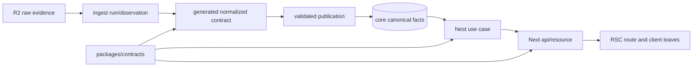

# eatbid 전체 기반 통합 설계

## 1. 목적

이미 구현된 데이터·계약·백엔드 기반과 새 Web 기반을 하나의 검증 가능한 흐름으로 연결한다. 이 작업의
완료 기준은 새 폴더가 생기는 것이 아니라 다음 흐름이 실제 코드와 테스트에서 닫히는 것이다.

```text
정부 원본 evidence
  → source parser
  → versioned canonical interchange
  → validated publication
  → canonical PostgreSQL
  → Nest application/public contract
  → Next resource API/RSC
```

기존 target architecture 전체를 한 work item에서 다시 구현하지 않는다. 독립된 변경 이유와 배포 위험을
가진 영역은 별도 Linear issue와 worktree로 나누되, 모든 issue가 이 문서의 같은 권위·식별자·검증 규칙을
사용한다. 현재 EAT-9는 통합 설계와 첫 Web 수직 슬라이스를 소유하고, 데이터·identity·live cutover는
겹치지 않는 후속 work item으로 실행한다.

## 2. 확인된 현재 상태

| 영역 | 실제 구현 | 남은 경계 |
|---|---|---|
| 의미 값 | Temporal Clock, exact money/rate/quantity/coordinate domain type과 정적 semantic gate | legacy Web의 `Date`/`number` 부채 제거 |
| portable 계약 | Zod registry → JSON Schema → generated Pydantic, 생성 drift gate | `recordType`과 `contractVersion` 대응의 registry 단일화 |
| dataplane | raw 보존, normalize/quarantine, frozen publication, project/replay repository | CLI composition, 정부 코드 release 수집, live source/R2/DB 실행 |
| canonical DB | 분리된 Drizzle schema/migration, code scheme/value/mapping, organization identifier | release membership, reconciliation, 좌표 observation, 후속 업무 aggregate |
| Nest | config, Effect runner, JSON logging, Problem Details, OpenAPI, DB boundary, auction read slice | identity/raw auth/global guard와 추가 canonical resource 계약 |
| Web | legacy Next dashboard와 theme 자산 | `@eatbid/contracts` 소비, resource API, canonical ID route, 구조 gate |
| secret | Infisical value authority ADR와 agent tooling wrapper | runtime/CI machine identity, ESO 전달, 환경별 proof |
| delivery | image build/scan/sign/attest와 dormant Argo workflow manifest | `main` 기준 PR gate, live CLI proof, product overlay cutover와 release promotion |

문서의 target state와 실행 가능한 현재 상태를 같은 것으로 보고하지 않는다. 특히 `dataplane` CLI는 현재
인자를 검증한 뒤 configuration exit를 반환하고, CronWorkflow와 product Argo composition은 의도적으로
dormant다.

## 3. 권위 분리

### 3.1 계약 권위

한 모델로 모든 계층을 생성하지 않는다. 같은 책임의 중복만 제거한다.

| 질문 | 유일한 권위 | 파생물/소비자 |
|---|---|---|
| eaT가 어떤 원본 shape를 보냈는가? | `apps/dataplane`의 reviewed source parser contract | raw evidence, known-column Pydantic, schema fingerprint와 parser fixture |
| 언어 간 normalized interchange는 무엇인가? | `packages/contracts` portable Zod registry | JSON Schema, generated Pydantic |
| public HTTP wire는 무엇인가? | `packages/contracts` operation과 request/response Zod | Nest validation/OpenAPI, Next runtime parse |
| 업무 의미와 불변식은 무엇인가? | `packages/domain`과 Nest application/domain | adapter별 변환 |
| PostgreSQL DDL은 무엇인가? | `packages/db`의 분리된 Drizzle schema | committed SQL migration |
| 현재 secret 값·버전·권한은 무엇인가? | Infisical | local `infisical run`, CI/Kubernetes의 좁은 전달기 |
| 비밀이 아닌 서비스 topology와 runtime config는 무엇인가? | Git의 환경별 manifest와 Zod config catalog | `API_URL`, service name, ingress routing |

source DTO, ingestion DTO, command DTO, public response와 DB row를 서로 `pick`해 우연히 결합하지 않는다.
같은 contract family 안에서만 Zod `pick`/`omit`/`safeExtend`를 사용하고, 최종 DTO는 atom → value → nested
resource → versioned operation 순서로 조립한다.

### 3.2 versioned ingestion envelope

portable registry entry는 metadata와 payload schema를 한 번만 소유하고 wire envelope를 만든다.

```ts
definePortableContract({
  id: 'EatbidIngestionAuctionV1',
  recordType: 'auction.v1',
  contractVersion: 'eatbid.ingestion.auction.v1',
  payloadSchema: normalizedAuctionV1PayloadSchema
})
```

helper는 `contractVersion` literal을 포함하는 최종 wire schema를 만들고 생성기는 schema와 함께 언어 중립
manifest를 결정적으로 생성한다. Python은 생성 manifest/model의 상수와 dispatch table을 사용하며 normalizer와
projector에 같은 문자열 literal을 반복하지 않는다.
DB normalization metadata의 `record_type`, payload의 `contractVersion`, projector parser 선택은 하나의
registry entry로 역추적돼야 한다. 알 수 없는 조합은 격리하고 canonical publication을 금지한다.

## 4. 수직 슬라이스 원칙



각 새 기능은 가능한 범위에서 `contract → adapter → storage/use case → public operation → consumer → UI`를
끝까지 통과한다. 미래 endpoint를 Web mock으로 발명하거나 DB table을 public DTO로 노출하지 않는다.
source가 아직 제공하지 않는 사실은 `unknown` 또는 명시적 blocker이며 이름·주소·제목 추론으로 채우지
않는다.

## 5. 실행 슬라이스

### 5.1 Contract spine hardening

첫 변경은 ingestion registry/manifest를 단일화한다. 기존 normalized auction fixture, Python generation,
canonical byte 검증과 `auction.v1` DB metadata를 새 manifest에 연결한다. eaT detail의 현재
`Mapping[str, str]`는 raw 보존 뒤 known column을 alias로 검증하는 source-row Pydantic 경계를 통과시키고,
column fingerprint는 upstream shape 변화 감지용으로 유지한다. source Pydantic이 알지 못하는 원본 필드를
없던 것으로 만들거나 raw evidence를 대체하지 않는다. 생성물은 check mode에서 tracked file을 수정하지 않고
Windows/Ubuntu에서 같은 논리 결과를 내야 한다.

### 5.2 Canonical auction Web slice

이미 존재하는 `GET /api/v1/auctions/{auctionId}`를 첫 end-to-end proof로 사용한다.

- Web은 `@eatbid/contracts/api/v1/auctions` 같은 browser-safe resource subpath를 직접 의존하고 package root를
  import하지 않는다. client export graph에는 Node generator, ingestion registry와 `@eatbid/domain` runtime이
  들어오지 않는다.
- canonical HTTP endpoint는 frontend 상수 파일이 아니라 `packages/contracts`의 resource-scoped operation
  registry가 소유한다. 하나의 framework-neutral semantic path definition에서 Nest adapter의
  controller/handler/version, OpenAPI template와 encoded Web request path를 파생한다.
- `api/_transport`만 raw `fetch`와 body decode를 수행한다.
- `api/auctions`가 operation descriptor, runtime response parse와 TanStack `queryOptions()`를 한 번 소유한다.
- RSC는 Nest를 직접 호출하며 자기 Next Route Handler를 우회 경로로 만들지 않는다.
- browser와 server entry는 같은 operation/schema를 쓰되 client-safe `index.ts`와 `server-only` `server.ts`를
  분리한다.
- Query `AbortSignal`은 실제 `fetch`까지 전달한다.
- bigint ID는 URL, query key와 wire에서 canonical decimal string으로 유지한다.

operation은 단순 URL 문자열이 아니라 method, version, path segment/parameter, path/query/body schema,
status별 response/Problem Details, `implementationOwner: 'server' | 'web'`와 `operationId`의 묶음이다.
`api/_transport`는 operation과 structured input만 받고 endpoint 문자열을 조립하지 않는다. query key는 HTTP
URL과 수명이 다른 cache identity이므로 operation path를 query key로 재사용하지 않는다.

현재 `packages/contracts`의 CommonJS 단일 root export와 ignored `dist`는 Web 소비 준비가 끝난 상태가 아니다.
첫 Web slice 전에 client-safe ESM subpath와 server/generator export를 분리하고, filtered Web dev, root
`turbo dev`, typecheck와 production build가 clean checkout에서 contract 선행 build/watch 없이 깨지지 않는
방식을 고정한다. browser bundle graph에는 지정한 resource operation/schema만 들어오는지 검사한다.

Nest와 Web의 소비 형태는 다음처럼 분리한다.

```text
packages/contracts framework-neutral operation
  ├─ Nest adapter → controllerPath / handlerPath / @Version
  ├─ OpenAPI adapter → openapiPath
  └─ Web transport → buildPath(validated path/query input)
```

`apps/server`와 `apps/web`의 canonical source에서 `/api/v1/...` literal을 직접 쓰면 repository endpoint
lint와 architecture gate가 실패한다. 같은 checker를 Web strict lint, Server architecture lint와 protected
branch CI가 호출한다. API origin은 contract 상수나 secret이 아니다. browser는 same-origin, RSC는 Git의
환경별 manifest/runtime config가 주입하고 Zod가 검증한 server-only `API_URL`을 쓰며 둘은 같은 relative
operation path를 소비한다. 인증 token과 비밀번호만 Infisical 전달 경계를 통과한다.

`/auctions/[auctionId]` 한 route에만 필요한 presentation은 route의 `_model`과 `_ui`에 둔다. 조회 화면 하나를
곧바로 `capabilities/view-auction`으로 승격하지 않는다. 두 route 이상에서 재사용되는 독립된 사용자 intent,
여러 resource를 묶는 command/orchestration, 독립 permission·feedback lifecycle이 생길 때만
`capabilities/<intent>`로 승격한다.

Next 화면 URL의 권위는 별도 상수 목록이 아니라 `app/` file-system route다. `typedRoutes: true`와
`next typegen && tsc --noEmit`이 `Route`, `PageProps`, `LayoutProps`, `RouteContext`를 생성·검증한다. 한 번 쓰는
정적 경로는 typed literal을 직접 사용하고, 여러 소비자가 만드는 동적 URL만 `apps/web/src/routing/<resource>.ts`
의 작은 builder로 추출한다. builder는 생성 `Route`에 할당 가능해야 하며 `as Route`로 우회하지 않는다.
route group과 parallel slot 이름은 공개 URL에 포함하지 않는다.

`/api/**` ingress는 Nest 전용이며 신규 Next `route.ts`는 기본 금지한다. webhook/callback처럼 Web이 실제
endpoint owner여야 하는 요구가 생기면 별도 ADR, `implementationOwner: 'web'`, `/api`와 겹치지 않는 공개
prefix와 명시적 ingress rule을 같은 변경에서 추가한다. Nest product API를 복제하는 BFF는 허용하지 않는다.

Server Action은 import 가능한 opaque POST mutation 함수이지 안정된 URL endpoint가 아니므로 route 상수
registry에 넣지 않는다. interactive client cache/optimistic update가 중심이면 resource의
`mutationOptions()`로 browser→Nest를 사용한다. progressive enhancement, RSC cache invalidation 또는
server-only cookie composition이 필요한 경우에만 Server Action이 같은 resource `server.ts`를 얇게 호출한다.
Action은 Zod input/output, serializable result와 성공 후 invalidation만 소유하고 DB, domain rule, 별도 command
DTO나 업무 로직을 소유하지 않는다.

### 5.3 정부 기준정보와 기관 reconciliation

시군구·학교·기관 문제는 이름 dictionary가 아니라 release와 evidence가 있는 canonical data로 해결한다.

1. MOIS/NEIS/eaT 기준정보 응답 또는 파일을 먼저 R2 raw evidence로 보존한다.
2. `CodeRelease`는 scheme, source version, publication/effective time, observation/content hash를 기록한다.
3. release membership은 각 `CodeValue`가 어느 release에 존재했는지 보존한다. label은 계속 별도
   observation이며 identity를 바꾸지 않는다.
4. 서로 다른 scheme은 승인된 `CodeMapping`과 유효기간·근거 없이는 비교하지 않는다.
5. eaT `PURR_CD`, NEIS school code 등은 `OrganizationIdentifier`로 같은 `Organization`에 연결할 수 있지만,
   자동 이름 병합은 금지한다. 미확정 후보는 ingest review/quarantine에 남긴다.
6. 동일 이름·동일 시군구인 서로 다른 기관과 이름이 바뀐 같은 기관을 각각 테스트한다.

초기 schema는 release/membership과 명시적 reconciliation에 필요한 최소 table만 추가한다. 모든 정부 코드
체계를 하나의 거대한 taxonomy나 EAV table로 일반화하지 않는다.

### 5.4 위치와 좌표

지역 중심점과 기관 위치는 다른 관측 대상이므로 polymorphic foreign key 하나로 합치지 않는다.

- 행정구역/코드 위치는 code-value coordinate observation이 소유한다.
- 학교·구매기관 위치는 organization coordinate observation이 소유한다.
- 두 observation 모두 좌표, CRS, source/release/evidence, 관측·유효 시각, 정확도 또는 resolution status를
  요구한다.
- CRS/provenance가 없는 기존 `sido|sigungu` 상수는 canonical로 승격하지 않는다.
- 확인되지 않은 66개 위치는 이름 geocoding으로 조용히 채우지 않고 `unknown` availability로 노출한다.

반경·polygon query가 제품 요구로 확인되기 전에는 PostGIS를 foundation dependency로 추가하지 않는다.
exact coordinate contract와 reviewed projection으로 먼저 닫는다.

### 5.5 Live dataplane와 Argo

각 CLI command는 실제 composition root에서 config, repository, source/R2 client와 pipeline stage를 조립한다.
placeholder success나 no-op command를 허용하지 않는다.

- local/dev는 `infisical run`이 command에 필요한 path만 주입한다.
- Kubernetes는 workload별 read-only identity와 namespace `SecretStore`/`ExternalSecret`을 통해 Infisical에서
  native Secret으로 단방향 전달한다.
- Git에는 secret 이름·key·Zod catalog와 ExternalSecret reference만 두고 값은 두지 않는다.
- manual Workflow smoke가 raw-first, 격리, publication atomicity, 재실행 멱등성과 종료 코드를 증명한 뒤에만
  live Argo CD source를 product overlay로 바꾼다.
- legacy CronJob 제거를 확인한 뒤 마지막으로 CronWorkflow suspend를 해제한다.

CLI local composition, secret delivery/Argo platform 설치, manual Workflow proof, product Argo CD source 전환과
live schedule 해제는 서로 다른 rollback point를 가진다. ESO 전달이 검증되기 전에 cluster Workflow를
실행하지 않고, manual proof 전에 product overlay나 schedule을 활성화하지 않는다.

### 5.6 Identity와 사용자 상태

공개 read 이외의 workspace/work-item command를 만들기 전에 Nest identity gate를 닫는다.

- Better Auth raw transport는 body parser보다 앞에서 원본 request semantics를 보존한다.
- provider subject는 `IdentitySubject`를 통해 내부 bigint `Principal`로 해소한다.
- global session guard와 명시적 public/optional metadata를 사용한다.
- workspace permission은 guard와 repository query constraint 양쪽에서 강제한다.
- auth rate limit은 PostgreSQL-backed multi-instance 저장소로 검증한다.
- auth secret은 Infisical의 runtime/server path에서만 주입된다.

인증/권한/감사 로그를 base Button이나 범용 Web provider에 넣지 않는다. Web capability action이 typed command
descriptor, permission view와 피드백 정책을 합성한다.

## 6. Legacy Web cutover

다음 표현은 target route에서 금지한다.

- `{시군구}|{학교명}` 학교 identity
- `${sido}|${sigungu}` 좌표 key
- bid number를 canonical auction route identity로 사용
- server fact를 localStorage에 복제해 업무 권위로 사용
- unchecked `res.json() as T`와 화면별 public DTO

기존 화면은 새 계약이 생기기 전까지 격리된 legacy route로 남을 수 있다. 대체 slice가 hard navigation,
loading/error/not-found, unknown/provenance와 canonical ID를 검증한 뒤에만 해당 legacy endpoint/type/storage를
삭제한다. 화면 디자인과 정보 구조는 사용자와 별도 기획하며 이 foundation 변경에서 임의로 재설계하지
않는다.

## 7. Git, CI/CD와 AI review

최종 canonical branch는 `main`이다.

- pull request to `main`: frozen install, architecture/contract/DB drift, TS/Python tests와 build를 실행하며
  image를 publish하지 않는다.
- push to `main`: 동일 검증을 통과한 SHA image를 build·scan·sign·attest하고 dev GitOps digest를 갱신한다.
- version tag: 이미 검증된 immutable digest만 production overlay로 승격한다. tag build를 새로 만들지 않는다.
- remote default branch, protection, required checks와 Cosign workflow identity를 `main`으로 함께 전환하기 전
  `master`를 삭제하지 않는다.

AI review는 결정적 lint/type/test를 대체하지 않는다. 저장소 공용 review command가 AGENTS/ADR, 변경 diff,
`packages/contracts`, 승인된 shared utility 지도를 Codex CLI에 제공하고 Claude/Codex 모두 같은 명령을
호출한다. 로컬 Husky는 `main` ref push나 명시적 opt-in에서 빠른 feedback을 줄 수 있지만 merge gate의
권위는 PR CI다. 초기에는 advisory로 오탐률을 기록하고, bounded prompt/version/timeout/failure policy와
우회 감사 로그가 검증된 뒤 required check 승격을 별도 결정한다.

## 8. 오류와 관측성

- raw/source 오류, contract mismatch, quarantine, dependency failure와 not-found를 다른 typed failure로 둔다.
- public Nest 오류는 RFC 9457 Problem Details와 안정된 `code`를 사용한다.
- malformed 2xx는 Web empty state가 아니라 contract failure다.
- abort는 사용자 오류 toast가 아니며 cancellation 상태를 유지한다.
- 모든 pipeline/core/API 결과는 observation/run/publication 또는 bounded provenance로 역추적한다.
- secret, raw payload, 사업자등록번호, 후보 투찰값과 query string은 기본 로그/telemetry에서 제외한다.

## 9. 테스트 전략

각 work item은 RED → GREEN → focused gate → full affected gate 순서를 따른다. 테스트 제목은 한국어다.

- contract: registry topology, envelope/version mismatch, JSON Schema/Pydantic drift, canonical bytes
- master data: cross-scheme same-code isolation, release/as-of, renamed/same-name organization, unresolved mapping
- coordinate: CRS/provenance/effective-time 필수, unknown 유지, 문자열 fallback 금지
- dataplane: raw write 전 publication 금지, quarantine, replay idempotency, real CLI exit/smoke
- Nest: Standard Schema request/response, Problem Details, least privilege, auth/session/workspace guard
- Web: malformed 2xx, Problem Details, abort, bigint max/overflow, Query Options reuse, RSC hard navigation
- routing: operation method/path 중복, Nest/OpenAPI/Web 파생 경로 일치, typed route builder와 존재하지 않는
  화면 URL rejection
- architecture/lint: API/path literal, operation ID·method/path 중복, Nest/OpenAPI/Web drift, import graph,
  raw fetch 위치, Drizzle DDL owner, 300줄 waiver와 legacy fingerprint 감소
- delivery: PR no-publish, signed digest promotion, Infisical/ESO 최소 scope, dormant→manual→schedule 순서

## 10. 실행 단위와 순서

하나의 거대한 diff 대신 다음 work item을 순서대로 실행한다. 첫 항목의 deterministic PR gate가 뒤의 모든
기반 변경을 보호한다.

1. `main` branch 전환과 publish 없는 deterministic PR required checks
2. ingestion registry/envelope와 eaT detail source-row boundary hardening
3. Web runtime upgrade와 clean-checkout dev/typecheck/build
4. browser-safe contract subpath와 framework-neutral HTTP operation registry
5. canonical auction walking skeleton
6. code release/membership ingestion
7. organization reconciliation과 coordinate observation
8. canonical organization/region API와 legacy school/map route cutover
9. dataplane CLI local composition과 signed image smoke
10. Infisical runtime identity, ESO 전달과 Argo platform 검증
11. manual Argo Workflow proof
12. product Argo CD overlay cutover와 마지막 schedule activation
13. Nest identity/workspace foundation
14. immutable tag promotion과 공용 AI review automation

각 item은 한 writing owner와 격리 worktree를 가진다. 선행 item의 committed contract를 소비하고 owned path가
겹치는 두 item을 병렬 작성하지 않는다. 외부 credential, cluster control plane 또는 GitHub setting이 필요한
단계는 저장소 검증을 먼저 끝낸 뒤 정확한 external mutation을 별도 승인·기록한다.

## 11. 완료 조건

- Python normalized model, Nest와 Next가 같은 versioned contract lineage를 증명한다.
- Web은 browser-safe contract subpath만 소비하고 clean checkout dev/typecheck/build와 bundle graph가 이를 증명한다.
- 첫 auction route가 canonical bigint ID와 Zod response parse로 end-to-end 동작한다.
- 기준정보/기관/좌표는 release·scheme·evidence 없이 publish되지 않는다.
- 신규 target route에 composite name identity나 unchecked public JSON이 없다.
- canonical endpoint literal은 operation registry 밖에 중복되지 않고 Next 화면 경로는 generated route type을
  통과한다.
- `/api/**`는 Nest가 소유하며 Web-owned public handler가 있다면 별도 prefix/ingress/owner contract가 일치한다.
- dataplane CLI가 실제 stage를 실행하고 manual Argo proof가 성공한다.
- Infisical이 runtime secret value authority이며 Git/Kubernetes에 병행 수기 secret 값 권위가 없다. 비밀이
  아닌 topology/config는 Git manifest와 검증된 runtime config가 소유한다.
- auth가 필요한 command 전에 principal/workspace guard와 DB constraint가 존재한다.
- `main`의 required deterministic checks가 green이고 production promotion은 version tag의 검증된 digest만 쓴다.
- 전체 legacy dashboard를 전환하지 않았으면 그 사실과 남은 endpoint를 명시한다.

## 12. 비목표

- 모든 legacy 화면의 동시 재디자인
- 이름 또는 외부 geocoder를 사용한 좌표 추측 backfill
- Zod에서 Drizzle DDL 또는 source Pydantic 전체를 생성
- source evidence가 없는 SupplierParty/BidSubmission/AwardDecision 사실 발명
- 자동 NeaT 투찰, 추천 투찰가와 예정가 예측
- 초기 PostGIS, Kafka, microservice, microfrontend 도입
- AI review를 deterministic test의 대체물로 사용

## 13. 검토한 대안

### 하나의 big-bang branch

계약, DDL, Python, Nest, Web, infra와 remote 설정이 한 rollback 단위가 된다. review evidence가 섞이고 한
writing owner가 지나치게 넓은 diff를 소유하므로 거부한다.

### frontend-first mock adapter

빠르게 화면을 만들 수 있지만 아직 없는 organization/region/analysis 계약을 Web이 발명하게 된다. legacy
문자열 key를 새 구조 안에 보존하므로 거부한다.

### 범용 schema/code generation framework

source, interchange, DB와 public API의 변화 이유가 다른데 하나의 meta-schema로 묶으면 각 계층의 표현력과
검토 가능성이 낮아진다. portable Zod registry와 좁은 생성 bridge만 유지한다.

### 검증된 수직 슬라이스

변경량은 여러 commit/work item으로 나뉘지만 매 단계가 실행 가능한 증거와 rollback point를 가진다. 이미
구현된 auction contract를 첫 proof로 재사용할 수 있어 이 방식을 채택한다.
