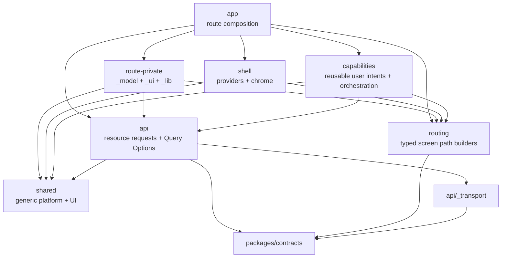

# eatbid 프론트엔드 모듈 아키텍처 설계

## 1. 목적

`apps/web`을 화면 파일과 직접 `fetch`의 집합이 아니라, 입찰 탐색에서 공고 검토와 분석으로 이어지는
하나의 Next.js 모듈러 애플리케이션으로 다시 세운다. 이 단계의 산출물은 제품 화면 재기획이 아니라
앞으로의 화면이 같은 계약, 같은 상태 소유권, 같은 의존 방향을 따르게 만드는 기반이다.

완료 후에도 Web은 하나의 deployable이다. 폴더 경계는 마이크로프론트엔드나 별도 런타임을 만들기 위한
것이 아니라 변경 이유와 소유자를 드러내기 위한 컴파일·리뷰 경계다.

## 2. 현재 관측

- `src/app`, `components`, `hooks`, `lib`, `types`에 업무 로직과 화면, 네트워크가 수평으로 흩어져 있다.
- Web은 `/api/open`, `/api/market`, `/api/schools`, `/api/rounds` 같은 폐기 예정 endpoint를 직접 호출한다.
- `packages/contracts`를 import하지 않고 `res.json() as T`, 수동 interface와 `any`로 응답을 신뢰한다.
- TanStack Query는 provider만 있고 제품 query option이나 hydration 경로는 없다.
- TanStack Form은 context만 있고 실제 제품 form은 없다. 문서는 제거된 template 예시를 설명한다.
- 분석 보드 1,017줄, 오늘 화면 656줄, 공고 상세 437줄처럼 view, 계산, network, persistence가 한 파일에
  결합돼 있다.
- 기존 `[bidNo]`, `{시군구}|{학교명}` route identity와 localStorage mark는 canonical bigint ID와
  `Workspace × SupplierParty × AuctionAttempt` grain을 표현하지 못한다.
- 현재 새 Server의 실행 가능한 공개 제품 계약은 `GET /api/v1/auctions/{auctionId}` 하나다. 시장 목록,
  분석 근거, work item과 후보값 command 계약은 아직 없다.
- 기존 전체 typecheck/lint는 이미 실패한다. 이 변경은 실패를 숨기지 않고 legacy baseline으로 동결해
  새 코드가 부채를 늘리지 못하게 한다.

## 3. 목표와 비목표

### 목표

1. route graph, app shell, 사용자 capability, resource별 API와 범용 shared code의 소유권을 나눈다.
2. 공용 Zod 계약을 실제 network fetch boundary에서 runtime parse한다.
3. 같은 endpoint를 여러 화면이 써도 capability끼리 역참조하지 않는 resource API와 Query Options를 둔다.
4. RSC, TanStack Query, URL, form, local UI state의 역할을 질문별로 고정한다.
5. import graph, 깊은 참조, 300줄 검토와 unchecked JSON을 기계적으로 막는다.
6. 현재 디자인 토큰과 shadcn/Base UI 자산을 보존하면서 행동·인증·로깅은 capability에서 합성한다.
7. 로딩, 상호작용과 비동기 행동을 공통 motion·feedback 계약으로 묶되 실제 업무 성공처럼 보이는
   거짓 피드백은 만들지 않는다.

### 비목표

- 없는 시장·분석·work-item Server 계약을 Web에서 추측해 만들지 않는다.
- Next Route Handler를 업무 BFF나 두 번째 진실 원천으로 만들지 않는다.
- 기존 이름 기반 좌표 상수를 canonical 위치 정보로 승격하지 않는다.
- 추천 투찰가, 자동 후보값 적용, 실제 NeaT 제출을 구현하지 않는다.
- 모든 legacy 화면을 폴더 이동만으로 한 번에 target-compliant라고 부르지 않는다.
- 마이크로프론트엔드, 별도 디자인 시스템 package, 전역 event bus를 도입하지 않는다.

## 4. 구조

```text
apps/web/src/
├─ app/                       # Next route graph와 route lifecycle만
│  └─ (workspace)/
│     ├─ market/page.tsx
│     ├─ auctions/[auctionId]/
│     │  ├─ _model/
│     │  ├─ _ui/
│     │  └─ page.tsx
│     └─ work-items/[workItemId]/analysis/page.tsx
├─ shell/                     # provider, navigation, chrome
│  ├─ providers/
│  ├─ navigation/
│  └─ ui/
├─ capabilities/              # 사용자가 수행하는 흐름
│  ├─ analyze-auction/
│  ├─ record-candidate/
│  └─ submit-bid/
├─ api/                       # Nest public API의 resource별 server-state 경계
│  ├─ _transport/             # status/problem/parse와 browser·server ingress
│  ├─ auctions/
│  │  ├─ get-auction.ts
│  │  ├─ queries.ts
│  │  ├─ index.ts             # client-safe public entry
│  │  └─ server.ts            # server-only public entry
│  ├─ analyses/
│  ├─ work-items/
│  └─ suppliers/
├─ routing/                   # 반복 동적 Next 화면 URL builder; API endpoint 아님
│  ├─ auctions.ts
│  └─ work-items.ts
└─ shared/                    # 범용 config, lib, UI primitive
   ├─ config/
   ├─ action/                   # resource-neutral action state와 주입 port
   ├─ lib/
   └─ ui/
```

`api`는 Nest public API의 server-state client이지 업무 권위가 아니다. 업무 불변식과 계산 권위는 계속
`packages/domain`, Nest application과 versioned mart에 있다. `packages/domain`과 혼동되는 frontend
`domains` layer는 만들지 않는다. 한 route에만 필요한 presentation model과 UI는 해당 segment의
`_model`/`_ui`가 소유한다. 독립된 사용자 intent와 여러 resource orchestration을 가진 흐름만 capability로
승격하고, 여러 소비자에 정말 공통인 resource selector만 해당 `api/<resource>`에 승격한다.

### 4.1 의존 방향



| 소유자 | 허용하는 내부 import | 금지 |
|---|---|---|
| `app` | `shell`, capability public entry, API resource public/server entry, 같은 route의 `_model`/`_ui`/`_lib` | API deep import, 업무 권위 계산 |
| `shell` | `shared`와 app이 주입한 serializable shell model | capability/API 소유, 제품 query |
| `capabilities/<x>` | `api/*` public entry, `shared` | 다른 capability 내부, `app`, `shell` |
| `api/<resource>` | `_transport`, `shared`, `@eatbid/contracts`, Query option API | 다른 resource 내부, `app`, `shell`, capability |
| `api/_transport` | 외부 HTTP 도구와 공통 Problem Details 계약 | 제품 endpoint, UI, query key |
| `routing/<resource>` | Next `Route` type과 `@eatbid/contracts` identifier atom | API operation path, network, UI, server state |
| `shared` | 외부 라이브러리와 자체 범용 primitive/port | 상위 layer, 제품 endpoint, permission/event catalog와 command 소유 |

표는 내부 project import를 제한한다. 각 layer는 자기 책임에 필요한 승인된 외부 toolkit을 직접 사용할 수
있지만 외부 package를 핑계로 내부 역방향 edge를 만들 수 없다.

cross-slice import는 resource `index.ts` 또는 명시적 `server.ts`만 통과한다. `index.ts`는 client-safe
공개 표면이며 `server.ts`를 재수출하지 않는다. 큰 barrel이 아니라 소비자가 필요한 작은 안정 표면으로
유지하고 같은 slice 내부는 실제 파일을 직접 import한다.

route는 metadata, RSC read/prefetch와 shell model 주입에 한해 API resource server entry를 직접 사용할 수
있다. 응답을 결합해 업무 판단을 하거나 화면 행동을 구현하면 capability로 옮긴다. shell은 session이나
workspace endpoint를 직접 읽지 않고 상위 layout이 검증해 전달한 serializable view만 렌더링한다.

### 4.2 route-local ownership

route에만 필요한 presentation, 조합과 interactive leaf는 해당 segment의 `_model`/`_ui`/`_lib`에 둔다.
두 route에서 쓰인다는 사실만으로 capability를 만들지 않는다. 독립된 사용자 intent, command/permission/
feedback lifecycle 또는 여러 resource orchestration을 가지면 capability로 승격하고, resource-neutral
utility는 `shared`, server-state selector는 `api/<resource>`로 옮긴다. 상위 layout으로 옮기는 기준도
“여러 곳에서 쓴다”가 아니라 shell이 소유해야 할 lifecycle인가다.

Parallel Route `@slot`은 독립 panel이 한 URL에서 동시에 보이고 각 panel이 별도 loading/error/URL
lifecycle을 가질 때만 쓴다. 코드 분류를 위해 slot을 만들지 않으며 모든 slot에는 `default.tsx`를 둔다.

## 5. 데이터와 계약

### 5.1 Web consumer adapter 배치

operation method/path와 request/response schema의 권위는 `packages/contracts`, endpoint 구현 권위는
Nest module에 있다. Web은 package root가 아니라 browser-safe resource subpath만 import한다. 같은 canonical
auction endpoint를 여러 capability가 호출할 수 있으므로 Web의
`api/auctions`는 다음 consumer adapter를 한 번만 배치·소유한다.

- `auctionV1Operations.find`가 단일 semantic path에서 파생한 browser path builder
- `auctionIdPathSchema`의 route/argument 검증
- `auctionV1ResponseSchema`의 runtime parse
- browser same-origin과 RSC internal origin이 같은 parser를 쓰는 `getAuction`
- `auctionQueries.detail(auctionId)` Query Options와 canonical query key

command adapter와 `mutationOptions()`도 해당 resource API가 소유한다. form draft, 권한 확인, 사용자
피드백과 여러 resource를 묶는 action orchestration은 capability가 소유한다. capability A의 query를
capability B가 import하지 않고 API resource끼리도 직접 import하지 않는다.

operation descriptor는 method, version, path segment/parameter, path/query/body schema, status별 response와
Problem Details, implementation owner와 `operationId`를 함께 소유한다. 하나의 framework-neutral path
definition에서 Nest adapter path/version, OpenAPI template와 encoded Web request path를 파생한다. frontend 전용 `ENDPOINTS` object와
`apps/server`/`apps/web`의 `/api/v1/...` literal은 만들지 않는다.

현재 CommonJS root barrel과 ignored build output은 client 계약 경계로 간주하지 않는다. client-safe ESM
subpath, server/generator export와 clean-checkout dev/typecheck/build lane을 먼저 만들고 client graph에
ingestion registry, Node generator나 `@eatbid/domain` runtime이 섞이지 않는지 검사한다.

### 5.2 transport

`api/_transport`만 raw `fetch`와 `Response` body decode를 수행하며 HTTP status, RFC 9457 Problem Details,
JSON decode, `AbortSignal` 전달을 담당한다. endpoint path나 product DTO를 알지 못한다. resource는 raw
network API를 우회하지 않고 승인된 request adapter에 operation descriptor의 Zod schema를 주입해
`unknown` response를 parse한다. malformed 2xx는 empty state가 아니라 계약 오류다.

브라우저는 same-origin `/api/v1` ingress를 사용한다. RSC는 Git의 환경별 runtime topology가 주입하고 Zod가
검증한 non-secret `API_URL`의 내부 Server origin을 사용한다. Infisical은 여기에 필요한 인증 secret만 소유한다.
두 경로 모두 같은 operation descriptor와 response schema를 사용한다. client-safe `index.ts`와
`server-only`인 `server.ts`를 분리하고 server origin, cookie 전달과 Next cache option을 client graph에
재수출하지 않는다.

### 5.3 Next 화면 route

Next 화면 URL의 권위는 `app/` file-system route다. `typedRoutes: true`와 clean checkout의
`next typegen && tsc --noEmit`으로 생성한 `Route`, `PageProps`, `LayoutProps`, `RouteContext`를 사용한다.
정적 one-off path는 typed literal을 직접 사용하고 반복되는 동적 path만 `src/routing/<resource>.ts`의 작은
builder로 추출한다. exhaustive `ROUTES` mirror, route group/slot 이름의 URL 노출, 존재하지 않는 placeholder,
`as Route` cast를 금지한다.

`/api/**` ingress는 Nest 전용이므로 신규 Next `route.ts`는 기본 금지한다. Web-owned public handler가 실제로
필요하면 별도 ADR, `implementationOwner: 'web'`, `/api`와 겹치지 않는 prefix와 ingress rule을 같은 변경에서
둔다. Server Action의 opaque POST transport는 URL 상수로 취급하지 않는다.

### 5.4 Query Options와 mutation transport

별도 Query Key Factory package는 추가하지 않는다. TanStack Query의 `queryOptions()`로 key와 fetcher를
같이 정의한다.

```ts
export const auctionQueries = {
  all: () => ['auction'] as const,
  detail: (auctionId: string) => queryOptions({
    queryKey: [...auctionQueries.all(), 'detail', { auctionId }] as const,
    queryFn: ({ signal }) => getAuction({ auctionId, signal })
  })
};
```

invalid response는 cache에 들어가지 않는다. mutation은 해당 resource key를 invalidate/update하며 화면
문자열 key를 직접 만들지 않는다.

interactive client cache, optimistic update나 취소가 중심인 command는 resource `mutationOptions()`로
browser→Nest를 사용한다. progressive enhancement, RSC cache invalidation 또는 server-only cookie 조합이
필요할 때만 Server Action이 같은 resource `server.ts`를 호출한다. Action은 Zod input/output, serializable
result와 성공 뒤 invalidation만 소유하며 DB/domain/business logic이나 별도 command DTO를 두지 않는다.

## 6. 렌더링과 상태 소유권

| 질문 | 소유자 |
|---|---|
| route, metadata, loading/error/not-found, RSC composition | Next `app` |
| 최초 read와 정적/서버 중심 화면 | RSC + API resource server entry |
| 상호작용 중 refetch/cache/hydration | TanStack Query |
| 공유 가능한 filter/sort/pagination/tab | `nuqs` URL state |
| command draft와 validation | TanStack Form + Zod command contract |
| 잠깐 열린 popover/hover/선택 | local React state |
| theme, query client, toaster, navigation chrome | shell |
| 인증된 사용자·workspace 권위 | Nest API; shell은 검증된 session view만 제공 |
| 깊은 client-owned 편집 state | 실제 필요가 입증된 capability-local Zustand |

Server Component를 기본으로 하고 browser API, event handler, form 또는 Query subscription이 필요한
leaf만 Client Component로 만든다. Server→Client props는 public wire 또는 작은 serializable
presentation model만 허용한다. Date, bigint, class instance를 넘기지 않는다.

`useEffect`는 외부 시스템 동기화에만 쓴다. interaction은 event handler, derived state는 render에서
계산한다. React `useEffectEvent`는 effect 안의 최신 비반응 로직에만 쓰며 dependency를 숨기는 도구로
사용하지 않는다.

### 6.1 로딩과 오류 경계

동일 화면의 실제 content와 fallback은 같은 layout geometry를 공유한다. `shared/ui/Skeleton`은 색과
motion을 제공하는 atom이고, shared skeleton pattern은 목록·문단·카드처럼 업무를 모르는 반복 형태만
소유한다. route 전용 `ScreenSkeleton`이 최종 화면 구조의 단일 fallback 권위이며 실제 화면과
`ScreenFrame`을 공유한다. `loading.tsx`는 skeleton markup을 직접 만들지 않고 해당 route의
`ScreenSkeleton` 하나만 반환한다.

- Next `loading.tsx`는 hard load와 route 전환의 첫 경계를 소유하고 shell/header/sidebar는 유지한다.
- React `Suspense`는 server streaming panel을 나누고, `@suspensive/react`는 client async/error/delay
  조합에만 사용한다.
- client fallback은 짧은 응답의 깜박임을 막도록 기본 200ms `Delay`를 사용할 수 있지만 route
  `loading.tsx`에는 지연을 넣지 않는다.
- 검색·필터·페이지 이동과 refetch는 기존 데이터를 유지하며 skeleton으로 덮지 않는다.
- mutation은 skeleton이 아니라 실행한 버튼의 pending/progress로 나타낸다.
- route/server 오류는 Next `error.tsx`, client panel 오류는 Suspensive ErrorBoundary와
  QueryErrorResetBoundary가 소유한다. ErrorBoundary가 바깥, Suspense가 안쪽이다.
- abort는 사용자 오류나 toast로 표시하지 않는다. 입력 오류는 inline, 401은 인증 UI, 403은 권한
  사유, 404는 not-found, 일시적 network/503은 retry, malformed contract/500은 상위 경계와 telemetry로
  보낸다.

loading region 하나에만 `aria-busy`와 한국어 status를 제공하고 내부 skeleton 조각은 `aria-hidden`으로
둔다. reduced-motion에서는 pulse, shimmer와 이동 애니메이션을 제거한다. 모든 화면에 쓰는 하나의
`PageSkeleton`, `PageContainer isLoading`, 전역 Suspensive screen fallback과 의미 없는 fallback은 만들지
않는다. `@suspensive/react-query`는 TanStack Query v5와 역할이 겹치고 suspense query cancellation이
제한되므로 foundation 기본값으로 채택하지 않는다.

### 6.2 체감 속도

빠르게 느껴지는 UI는 긴 장식 animation이 아니라 입력 순간의 피드백과 실제 대기 제거로 만든다.
Next Link의 production prefetch를 기본으로 두고, 기본 scheduler가 부족하다는 측정이 있는 중요한 동적
route만 hover/touch intent prefetch를 추가한다. 되돌릴 수 있는 저장·필터 같은 action은 계약과 rollback이
있을 때 optimistic update를 허용하지만, 후보값 확정이나 향후 외부 투찰로 이어지는 고위험 action은
optimistic success를 금지한다. 사용자가 본 성공 상태는 항상 Server 응답 뒤에 확정한다.

## 7. UI, theme, 인증과 로깅

- 기존 Tailwind CSS semantic token, theme CSS와 shadcn/Base UI primitive를 보존한다.
- token 값의 runtime 권위는 CSS custom property다. JSON과 CSS를 사람이 이중 관리하지 않는다.
  외부 디자인 도구용 JSON이 실제 필요해지면 JSON→CSS 단방향 생성과 drift gate를 먼저 만든다.
- Query/Mutation 전역 오류는 QueryClient cache callback과 `meta` 정책으로 toaster/Sentry에 연결한다.
  사용자에게 보여야 하는 실패를 무조건 전역 toast로 바꾸지 않는다.
- telemetry에는 사업자등록번호, 투찰 후보값, query string과 원본 payload를 기본 수집하지 않는다.
  Sentry `sendDefaultPii`와 sampling은 운영·개인정보 결정 전까지 보수적으로 설정한다.

### 7.1 motion token과 primitive

motion runtime SSOT는 `styles/tokens/motion.css`의 semantic CSS custom property다. JSON 사본이나
component-local millisecond literal을 만들지 않는다.

| token | 기본값 | 용도 |
|---|---:|---|
| `--motion-duration-press` | 70ms | 버튼·토글을 누르는 순간 |
| `--motion-duration-state` | 110ms | hover, 색상과 press 해제 |
| `--motion-duration-enter` | 150ms | menu, popover와 짧은 확장 |
| `--motion-duration-panel` | 240ms | drawer, toast와 드문 theme 전환 |

productive standard/entrance/exit easing도 같은 파일이 소유한다. 반복 업무 동작에 400ms 이상, bounce와
elastic spring을 사용하지 않는다. focus ring은 기다리지 않고 즉시 나타나며 reduced-motion에서는
transform과 layout motion을 제거하되 색·focus·pending 같은 상태 정보는 유지한다.

`shared/ui/Button`은 시각 variant, 접근성, disabled/focus와 공통 press feedback을 한 번 소유한다. 기본
action button은 hover 색상 110ms와 press/release transform 70/110ms를 자동 상속한다. link, navigation,
popup trigger, 반복 table row와 dense toolbar처럼 위치 이동이 잡음이나 anchor 오차를 만드는 primitive는
stable wrapper 또는 compound variant가 quiet interaction을 한 번 소유한다. 화면 호출부가
`active:scale-*`, `duration-*`, `transition-all`이나 Motion component를 직접 추가하지 않는다.

`shared/ui/LoadingButton`은 Button을 감싸 spinner, 고정된 label geometry, `aria-busy`, live status와 중복
실행 방지만 제공한다. pending/disabled 중에도 Base UI `focusableWhenDisabled`와 `aria-describedby`로 focus,
tab 순서와 사용자 안전 사유를 보존한다. auth, permission, command와 telemetry를 import하지 않는다.
수동 label은 움직이지 않고 form label은 focus/error 색만 전환한다. badge/value 변화는 짧은
crossfade만 허용한다.

Base UI state attribute와 취소 가능한 CSS transition을 primitive 기본값으로 사용한다. 현재 사용되지 않는
`motion` package는 제거하고 drag/reorder/shared-layout처럼 CSS로 표현하기 어려운 실제 요구가 생길 때
capability-local로 최신 compatible version과 lazy feature loading을 재검토한다. React canary
`ViewTransition`과 Motion alpha API는 foundation에 넣지 않는다.

### 7.2 action 합성과 접근 제어

업무 action은 다음 방향으로 조립한다.

```text
capability command component
  → capability policy + mutation + feedback + typed telemetry event
  → resource-neutral action controller
  → shared LoadingButton
  → shared Button
  → Nest Guard/policy + server audit
```

`shared/action`은 `ready | pending | disabled` 같은 action state, `execute`, 안전한 disabled reason과
shell이 주입할 access/telemetry port만 정의한다. session fetch, permission catalog, event catalog와 제품
command를 알지 못한다. shell provider는 app layout이 전달한 검증된 session view와 로그인 prompt/telemetry
adapter를 port에 결합한다. capability는 API resource public entry에서 얻은 contract-inferred permission
type, 자기 policy와 event descriptor를 소유하고 action state를 명시적으로 LoadingButton에 연결한다.
policy, command, feedback와 telemetry를 하나의 만능 descriptor나 자유 형식 options object로 합치지
않으며 서로 다른 변경 이유를 가진 작은 값과 port로 유지한다.

인증·권한·analytics/logging을 base Button의 `requireAuth`, `permission`, `track` prop으로 추가하거나 HOC로
숨기지 않는다. 재사용할 업무 intent는 `SaveCandidateButton` 같은 명시적 capability component가 되며,
다른 화면은 이 public component를 소비한다. 단순 close, tab, local filter처럼 command/permission/
feedback lifecycle이 없는 UI는 Button을 직접 사용한다.

접근 정책은 다음을 기본값으로 한다.

- route 전체가 인증을 요구하면 Server layout/page 경계에서 session을 검증하고 미인증 content를 먼저
  렌더링한 뒤 client redirect하지 않는다.
- 비로그인 사용자: discoverable action은 보여 주고 click 시 전역 로그인 prompt를 요청한다.
- 로그인했지만 권한 없음: 기본은 disabled와 사용자 안전 사유이며 기능 존재가 민감할 때만 숨긴다.
- 허용: mutation을 실행하되 Nest Guard가 같은 권한을 다시 강제한다.
- 렌더 뒤 session 만료로 받은 401은 로그인 prompt, 403은 재시도 없는 권한 사유로 처리한다.

클라이언트 access decision은 UX일 뿐 보안 권위가 아니다. 실제 권한, tenant/workspace 범위와 command
허용 여부는 Nest Guard/application policy가 결정한다. protected command의 사용자·대상·결과 감사 기록도
Server interceptor/application audit가 권위이며 client event로 대체하지 않는다.

### 7.3 telemetry와 action feedback

base Button은 모든 click을 수집하지 않는다. capability는 `requested | succeeded | failed`처럼 업무 의미가
있는 typed event만 자기 event catalog에서 발행하고 raw `track('문자열')`을 화면에 쓰지 않는다. event
metadata는 allowlist 방식이며 사업자등록번호, 후보값, query string, 원본 DTO와 자유 형식 object를 받지
않는다. 전역 telemetry sink는 전송과 공통 context만 소유하고 이벤트의 업무 의미를 만들지 않는다.

action feedback은 physical press, pending, confirmed result를 서로 다른 상태로 유지한다. 눌림 animation은
성공을 뜻하지 않는다. reversible mutation만 optimistic state를 허용하고 고위험 action은 press 직후
stable pending으로 전환한 뒤 Server가 확인한 성공/실패를 표시한다. auth/permission 실패, abort와
validation 실패를 하나의 전역 toast로 평탄화하지 않는다.

## 8. 도구 선택

| 항목 | 결정 |
|---|---|
| Next.js | `16.3.4` exact로 올리고 `typedRoutes: true` 채택 |
| React | 호환 stable `19.2.8` exact |
| Tailwind | v5를 기다리지 않고 현재 stable v4 lane 유지; manifest를 resolved v4.3.3과 일치 |
| TanStack Query | `5.102.8`, resource API 소유 `queryOptions()`와 signal 전달 |
| TanStack Form | v2 `2.0.0-alpha.2`는 foundation 기본값으로 채택하지 않음; stable v1 `1.33.5` 유지 |
| Suspensive | `@suspensive/react` `3.21.3` exact만 client async delay/error composition에 채택; react-query adapter는 보류 |
| Motion | 현재 unused dependency 제거; drag/reorder/shared-layout 요구와 bundle evidence가 생길 때만 재도입 |
| React Compiler | `babel-plugin-react-compiler@1.0.0`, annotation mode와 opt-in 0개로 시작; 첫 후보부터 동작·비교 성능 gate |
| Component interaction tests | Testing Library + user-event + Happy DOM을 Web-local Bun preload로 고정; keyboard/focus를 실제 동작으로 검증 |
| Browser interaction tests | Playwright로 loading boundary, press/pending, reduced-motion, auth/permission action을 실제 browser에서 검증 |
| Rust React Compiler | experimental이므로 보류 |
| Cache Components | route/Suspense/self-host cache audit 전 전역 활성화 보류 |
| Immer | 반복되는 깊은 client-owned 편집 state가 확인될 때만 capability-local 도입 |
| es-toolkit | 실제 반복 utility와 bundle 근거가 있을 때 좁게 도입; native/기존 helper 대체 자체가 목표가 아님 |

TanStack Form v2 alpha에는 persistence와 submit meta가 아직 없으므로, 사용자 후보값처럼 장기 draft와
여러 submit intent가 필요한 핵심 form의 기반으로 쓰지 않는다. 실험하려면 별도 issue에서 adapter 뒤에
exact pin하고 v1과의 rollback seam을 둔다.

## 9. 전환 순서

1. 새 import/size/unchecked-fetch gate와 현재 legacy baseline을 만든다.
2. `api/_transport`와 `api/auctions`에 canonical 단건 공고 fetch/query path를 만든다.
3. `/auctions/[auctionId]`의 얇은 RSC route와 route-local `_model`/`_ui` walking skeleton을 만든다.
4. provider, theme, toaster와 navigation chrome을 동작 보존 상태로 `shell`에 옮긴다.
5. motion token, Button/LoadingButton과 route `ScreenFrame`/`ScreenSkeleton` 규약을 먼저 세운다.
6. session/permission contract가 생기면 action/access port를 shell adapter에 결합하고 첫 protected capability로
   401/403, pending과 server enforcement를 수직 검증한다.
7. market list 계약이 생기면 `browse-market`을 연결하고 link identity를 `auctionId`로 바꾼다.
8. versioned analysis evidence 계약 뒤 `analyze-auction`을 연결한다.
9. workspace/supplier/work-item/candidate command 계약 뒤 빈 후보값 form과 mutation을 연결한다.
10. slice가 대체될 때마다 retired fetch, composite route ID, local mark와 `@eatbid/shared` 소비를 삭제한다.

기존 화면을 새 폴더로 이동하는 것만으로 migration 완료라고 판정하지 않는다. 각 slice는 public contract,
runtime parse, identity, error/empty/stale UI, import gate와 검증 evidence를 함께 통과해야 한다.

## 10. 품질과 완료 조건

- 신규·변경 테스트명은 한국어다.
- 300줄 초과 source는 responsibility split 또는 이유·owner·다음 split trigger가 있는 waiver를 요구한다.
- 신규 `res.json() as T`, public 응답 수동 interface, `any`, client-side domain calculation authority를 거부한다.
- contract fixture, malformed 2xx, Problem Details, abort, bigint 최대값/overflow를 테스트한다.
- route hard navigation, loading/error/not-found와 hydration을 검증한다.
- `loading.tsx`의 직접 skeleton markup, 공통 `PageContainer isLoading`, refetch skeleton과 전역 screen
  fallback을 거부한다.
- Button의 `transition-all`, component-local duration/press class, base Button의 auth/session/telemetry import와
  raw 화면 telemetry event를 거부한다.
- 일반/reduced-motion에서 press, focus, loading geometry를 검증하고 비로그인/권한 없음/허용/session 만료
  action flow와 Server 401/403 enforcement evidence를 남긴다.
- 기존 전체 lint/typecheck 실패는 별도 debt ledger로 남기되 변경 파일과 새 architecture gate는 green이어야 한다.
- protected branch의 full typecheck/lint/build가 green이 되기 전 production-ready라고 주장하지 않는다.

## 11. 검토한 대안

### Full Feature-Sliced Design

layer 사고방식은 유용하지만 Next `app`과 FSD `pages`, `widgets`, `features`를 모두 도입하면 현재 규모에서
용어와 public barrel이 늘어난다. route graph는 Next에 두고 capability/resource API 경계만 채택한다.

### route/parallel slot이 곧 module

URL lifecycle과 코드 소유권이 결합돼 hard navigation, default slot, 재사용에서 문제가 생긴다. slot은
동시 panel UI가 실제로 필요한 마지막 routing primitive로만 쓴다.

### 전역 store와 Query로 모든 상태 통일

URL, server cache, form draft, hover state의 수명과 권위가 다르다. 하나로 합치면 invalidation과 persistence가
숨은 진실 원천이 되므로 상태 종류별 owner를 유지한다.

### 화면별 `api/types/service/queries`

같은 endpoint가 여러 화면에서 중복되거나 feature 간 역참조가 생긴다. canonical resource gateway는
top-level `api/<resource>`가 한 번 소유하고 capability는 조합만 한다.

### 별도 frontend `domains` layer

resource ownership 사고방식은 유효하지만 이미 `packages/domain`이 업무 불변식의 권위라 같은 이름이
두 번째 domain authority로 오해되기 쉽다. `api/<resource>`를 server-state 소비 경계로 명명하고 업무
권위는 만들지 않는다.

### base Button에 auth, permission과 logging prop 추가

사용은 짧아 보이지만 모든 primitive를 session/router/telemetry에 결합하고 client boundary로 만든다. client
permission이 실제 보안처럼 보이며 모든 click이 의미 없는 event가 된다. 범용 Button/LoadingButton은
feedback만 소유하고 명시적 capability command component가 policy와 실행을 합성한다.

### 모든 상호작용을 Motion component로 구현

간단한 hover/press/popup 전환까지 JavaScript animation lifecycle과 client bundle에 결합된다. Base UI
state attribute와 CSS transition을 기본으로 하고 Motion은 drag, reorder와 shared layout처럼 중단 가능
CSS transition만으로 의미를 보존하기 어려운 사례에만 다시 도입한다.

## 12. 판단 근거

- [Next.js Prefetching](https://nextjs.org/docs/app/guides/prefetching)
- [React 19.2](https://react.dev/blog/2025/10/01/react-19-2)
- [React Suspense](https://react.dev/reference/react/Suspense)
- [Suspensive React Suspense](https://suspensive.org/en/docs/react/Suspense)
- [Suspensive Delay](https://suspensive.org/en/docs/react/Delay)
- [TanStack Query Suspense](https://tanstack.com/query/latest/docs/framework/react/guides/suspense)
- [Base UI Animation](https://base-ui.com/react/handbook/animation)
- [Base UI Button](https://base-ui.com/react/components/button)
- [Carbon productive motion](https://carbondesignsystem.com/elements/motion/overview/)
- [W3C reduced motion technique](https://www.w3.org/WAI/WCAG21/Techniques/css/C39.html)
- [Linear design refresh](https://linear.app/now/behind-the-latest-design-refresh)
